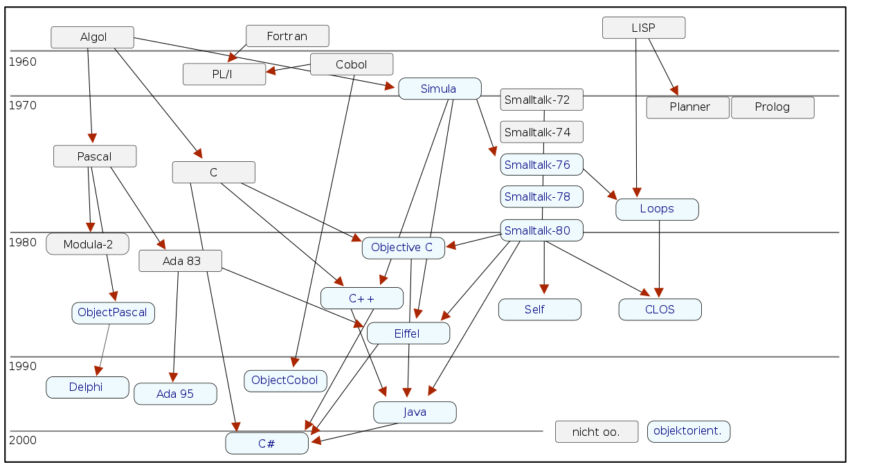

<!--

author:   Sebastian Zug & Georg Jäger
email:    sebastian.zug@informatik.tu-freiberg.de & Georg.Jaeger@informatik.tu-freiberg.de
version:  0.0.1
language: de
narrator: Deutsch Female

import: https://raw.githubusercontent.com/LiaTemplates/Rextester/master/README.md

-->

# Vorlesung I - Einführung

**Wie weit waren wir noch gekommen ... ein Rückblick auf die Veranstaltung Softwareentwicklung?**

Ausgehend von der Einführung in C# haben wir uns mit:

+ den Grundlagen der Objektorientierten Programmierung
+ der Modellierung von konkreten Anwendungen
+ der Koordination des Entwicklungsprozesses - Testen von Software, Versionsmanagement
+ einer Einführung in die nebenläufige Programmierung

beschäftigt.

**Warum sollten wir uns nun mit einer weiteren Programmiersprache beschäftigen? Welche Möglichkeiten eröffnen sich draus?**

 C++ ermöglicht sowohl die effiziente und maschinennahe Programmierung als auch eine Programmierung auf hohem Abstraktionsniveau. Der Standard definiert auch eine Standardbibliothek, zu der verschiedene Implementierungen existieren. Entsprechend findet C++ sowohl auf der Systemprogrammierungsebene, wie auch der Anwendungsentwicklung Anwendung.

## C++ vs ...

<!-- width="100%" -->
Darstellung der Entwicklung von Programmiersprachen [^1]

[^1]: Nepomuk Frädrich, Historie der objektorientierten Programmiersprachen, Wikimedia https://commons.wikimedia.org/wiki/File:History_of_object-oriented_programming_languages.svg

### ... C

C++ kombiniert die Effizienz von C mit den Abstraktionsmöglichkeiten der objektorientierten Programmierung. C++ Compiler können C Code überwiegend kompilieren, umgekehrt funktioniert das nicht.

| Kriterium             | C                              | C++                                                         |
|:----------------------|:-------------------------------|:------------------------------------------------------------|
| Programmierparadigma  | Prozedural                     | Procedural, objektorientiert, funktional                    |
| Kapselung             | keine                          | Integration von Daten und Funktionen in structs und Klassen |
| Überladen             | nein                           | Funktions- und Operatorüberladung                           |
| Programmierung        | Präprozessor, C, Assemblercode | Präprozessor, C, C++, Assemblercode, Templates              |
| Konzept von Zeigern   | Pointer                        | (Smart-) Pointer, Referenzen                                |
| Integrationsfähigkeit | gering                         | hoch (namespaces)                                           |

Beispiel für eine C++ Implementierung eines `struct` mit den entsprechenden  Möglichkeiten, die C++ bereit hält.

```cpp                     structExample.cpp
#include <iostream>

struct Student{
  std::string name;
  int matrikel;
  void printCertificate(std::string topic);
};

void Student::printCertificate(std::string topic){
  std::cout << name << " passed " << topic;
}

int main()
{
  Student Humboldt {"Alexander Humboldt", 1798};
  Humboldt.printCertificate("Softwareentwicklung");
  return 0;
}
```
@Rextester.CPP

```cpp                     structExample.c
#include<stdio.h>
#include<string.h>

typedef struct student student;

typedef struct student {
  char name[25];
  int matrikel;
  void (*print)(student *self, char *label);
} student;


void printCertificate(student * self, char* label){

  printf("%s passed %s", self->name, label);
}

int main()
{
  student Humboldt;
  strcpy(Humboldt.name, "Alexander von Humboldt");
  Humboldt.matrikel = 1798;
  Humboldt.print = &printCertificate;
  (Humboldt.print)(&Humboldt, "Softwareentwicklung");
  return 0;
}
```
@Rextester.C

> *"Encapsulation is pretty easy, polymorphism is doable - but inheritence is tricky"* [ Martin Beckett, www.stackoverflow.com]

### ... C#

Im Vergleich zwischen C++ und C# ergeben sich folgende Unterschiede / Gemeinsamkeiten

| Aspekt                    | C++                                                                                                                       | C#                                                                                                                                         |
|:--------------------------|:--------------------------------------------------------------------------------------------------------------------------|:-------------------------------------------------------------------------------------------------------------------------------------------|
| Entwicklung               | ab 1979 von Bjarne Stroustrup, Standardisierung 1998, aktueller Stand C++17 (von vielen Compilern noch nicht unterstützt) | ab 2001 von Microsoft  entwickelt, ab 2003 ISO genormt                                                                                     |
| Kompilierung              | Programmcode wird auf spezifischen Maschinencode abgebildet                                                               | C# Compiler generiert übergreifende Coderepräsentation  Common Intermediate Language (CLI)                                                 |
| Ausführungsumgebung       | Unmittelbar auf Prozessorebene                                                                                            | in Laufzeitumgebung Common Language Runtime (CLR), die einen Just-in-Time-Compiler umfasst der die Übersetzung in Maschinencode übernimmt. |
| Plattformen               | Compiler für jedwede Architektur und Betriebssysteme                                                                      | setzt .NET Ausführungsumgebung voraus                                                                                                      |
| Speicher Management       | Kein Speichermanagement                                                                                                   | die CLR umfasst unter anderem einen Garbage Collector                                                                                      |
| Verwendung von Pointern   | Elementarer Bestandteil des Programmierkonzepts                                                                           | nur im `unsafe` mode                                                                                                                       |
| Objektorientierung        | Fokus auf objektorientierte Anwendungen                                                                                   | pur objektorientiert                                                                                                                       |
| Vererbung                 |                                                                                                                           | alle Objekte erben von einer Basisklasse `object`                                                                                          |
|                           | unterstützt Mehrfachvererbung  (ersetzt Interfaces)                                                                       | keine Mehrfachvererbung                                                                                                                    |
| Standard Zugriffsattribut | `public` für structs, `private` für Klassen                                                                               | `private`                                                                                                                                  |
|                           |                                                                                                                           |                                                                                                                                            |

## Elemente der Sprache C++

An dieser Stelle wir keine klassische Einführung in C/C++ erfolgen, vielmehr sei dabei auf die einschlägigen Tutorials und Literaturbeispiele verwiesen, die in Eigenregie zu erarbeiten sind. An dieser Stellen werden die Basiskonzept in einem groben Überblick und anhand von Beispielen eingeführt.

**C++11 Schlüsselworte**

Die Sprache C++ verwendet nur etwa 60 Schlüsselwörter („Sprachkern“), manche werden in verschiedenen Kontexten (static, default) mehrfach verwendet.

| Bedeutung                | Inhalt               | Schlüsselwort                                              |
|:-------------------------|:---------------------|:-----------------------------------------------------------|
| Grunddatentypen          | Wahrheitswerte       | bool, true, false                                          |
|                          | Zeichen und Zahlen   | char, char16_t, char32_t, wchart_t                         |
|                          | Zahlen               | int, double, float                                         |
|                          | weitere              | auto, enum , void                                          |
| Modifizierer             | Platzbedarf          | long, short                                                |
|                          | Vorzeichen           | signed, unsigned                                           |
|                          | Manipulierbarkeit    | const, constexpr, mutable, volatile                        |
| Zusammengesetzte Typen   | Klassen, Strukturen  | class, struct, union, explicit, this, virtual              |
|                          | Zugriffsrechte       | friend, private, protected, public                         |
| Typinformationen         |                      | alignof, decltype, sizeof, typeid, typename                |
|                          |                      | const\_cast, dynamic\_cast, reinterpret\_cast, static_cast |
| Ablaufsteuerung          | Schleifen            | do, for, while                                             |
|                          | Verzweigungen        | if, else, default, switch, case                            |
|                          | Sprünge              | break, continue, goto                                      |
|                          | Ausnahmebehandlungen | catch, noexcept, static\_assert, throw, try                |
| Assemblercode            |                      | asm                                                        |
| Speicherhandling         |                      | delete, new, nullptr                                       |
| Funktionen               |                      | inline, operator, return                                   |
| Namensbereiche und Alias |                      | namespace, using, typedef                                  |
| Schablonen               |                      | template                                                   |


### Variablen

**Datentypen**

| Kategorie      | Bezeichner                          | Bemerkung                                                      |
|:---------------|:------------------------------------|:---------------------------------------------------------------|
| Ganzzahl       | `int`, `short`, `long`, `long long` | jeweils als `signed` und `unsigned`                            |
| Fließkomma     | `double`, `float`, `long double`    |                                                                |
| Wahrheitswerte | `bool`                              |                                                                |
| Zeichentypen   | `char`, `char16_t`, `char32_t`      | Die Größe von `char` entspricht dem kleinsten Ganzzahldatentyp |
| Referenzen     | Indirektion mit `&`                 |                                                                |
| Zeiger         | Indirektion mit `*`                 |                                                                |

Auf die realisierten Größen kann mit zwei Klassen der StandardBibliothek zurückgegriffen werden.

1. `climits.h` definiert ein Set von Makrokonstanten, die die zugehörigen Werte umfassen. Unter C++ wird diese Bibliothek mit `climits.h` eingebettet, da `limits` durch einen eignen namespace besetzt ist [Link mit Übersicht](http://www.cplusplus.com/reference/climits/)
2. `numeric_limits.h` spezifiziert Templates für die Bereitstellung der entsprechenden Grenzwerte und ist damit deutlich flexibler.

```cpp                     Hello.cpp
// numeric_limits example
#include <iostream>     // std::cout
#include <limits>       // std::numeric_limits
#include <climits>

int main () {
  std::cout << "Bits for char: " << CHAR_BIT << '\n';
  std::cout << "Minimum value for char: " << CHAR_MIN << '\n';
  std::cout << "Maximum value for char: " << CHAR_MAX << '\n';
  std::cout << "----------------------------------------------------\n";
  std::cout << std::boolalpha;
  std::cout << "Minimum value for int: " << std::numeric_limits<int>::min() << '\n';
  std::cout << "Maximum value for int: " << std::numeric_limits<int>::max() << '\n';
  std::cout << "int is signed: " << std::numeric_limits<int>::is_signed << '\n';
  std::cout << "Non-sign bits in int: " << std::numeric_limits<int>::digits << '\n';
  std::cout << "int has infinity: " << std::numeric_limits<int>::has_infinity << '\n';
  return 0;
}
```
@Rextester.CPP

**Deklaration, Definition und Initialisierung**

In der aufgeregten Diskussion werden die folgenden Punkte häufig vermengt, daher noch mal eine Wiederholung:

+ Deklaration ... Spezifikation einer Variablen im Hinblick auf Typ und Namen gegenüber dem Compiler
+ Definition ... Anlegen von Speicher für die Variable
+ Initialisierung ... Zuweisung eines Anfangswertes

```cpp                     Hello.cpp
#include <iostream>

int main()
{
    int index{};
    std::cout << index << std::endl;
    return 0;
}
```
@Rextester.CPP

| Anweisung              | Wirkung                                                    |
|:-----------------------|:-----------------------------------------------------------|
| `int i`                | Definition und Deklaration der Variablen i                 |
| `extern int i`         | Deklaration einer Variablen i                              |
| `int i; i = 1;`        | Initialisierung nach Deklaration                           |
| `const int number = 1` | Deklaration und Initialisierung einer konstanten Variablen |

Bei unveränderlichen Werten muss die Initialisierung immer unmittelbar mit der
Definition und Deklaration erfolgen.

In C++11 wurde die Initialisierung, die sich bisher für verschiedenen Kontexte unterschied, vereinheitlicht. Sie kennen die Angabe von Initialisierungswerten mittels `{}` bereits von arrays unter C.

```c
int numbers[] = { 1, 2, 4, 5, 9 };
```

| Anweisung             | Bedeutung                                   |
|:----------------------|:--------------------------------------------|
| `int i{};`            | uninitialisierter Standardtyp               |
| `int j{10};`          | initialisierter Standardtyp                 |
| `int a[]{1, 2, 3, 4}` | aggregierte Initialisierung                 |
| `X x1{};`             | Standardkonstruktor eine individuellen Typs |
| `X x2{1,2};`          | Parameterisierter Konstruktor               |
| `X x4{x3};`           | Copy-Konstruktor                            |

> auto Initalisierung

**Zeichenketten und Strings**

Aus historischen Gründen kennt C++ zwei Möglichkeiten Zeichenketten darzustellen:

+ `const char *` aus dem C-Kontext und  
+ `std::string` die Darstellung der Standardbibliothek

Für die Ausgabe einer nicht veränderlichen Zeichenkette arbeitet man

### Streams

**Grundlagen**

```cpp                     Hello.cpp
#include <iostream>

int main()
{
    const char * text = "some Unicode text òàäßèö逧";
      std::cout << sizeof(text) << std::endl;
    for (int i=0; i<sizeof(text); i++){
      std::cout << text[i] << std::endl;
    }
    std::cout << text;
    return 0;
}
```
@Rextester.CPP

**Diskussion cout vs. printf**


## Was passiert mit "Hello World"?

```cpp                     Hello.cpp
#include <iostream>

int main()
{
    std::cout << "Hello, World!";
    return 0;
}
```
@Rextester.CPP

<!--
style="width: 60%; max-width: 860px; display: block; margin-left: auto; margin-right: auto;"
-->
````ascii

  +-------------------+       
  | Helloworld.cpp    |        
  +-------------------+        
           |
     C Präprozessor     
           |
     C++/C Compiler
           |
           v
  +-------------------+        
  | ObjectFile.o      |          
  +-------------------+
           |
        Linker
           |
           v
  +-------------------+        
  | Ausführbare Datei |          
  +-------------------+

````

```
g++ Hello.cpp -o Hello // Realisiert die gesamte Kette in einem Durchlauf
ldd Hello
g++ -E Hello.cpp -o Hello.ii // Stellt die Präprozessorausgabe bereit
wc -l Hello.ii
g++ -S Hello.cpp -o Hello.S // Stellt den Assemblercode bereit
g++ -c Hello.cpp -o Hello.o // Generiert das Objektfile für HelloWorld.cpp
```

**Schritt 1 - Präprozessor**
+ Guarded Headers

**Schritt 2 - Kompiler**
 > Woher kennt der Compiler meine CPU-Spezifikation?

https://godbolt.org/

**Schritt 3 - Linker**

> Erweiterung auf mehrere Dateien
