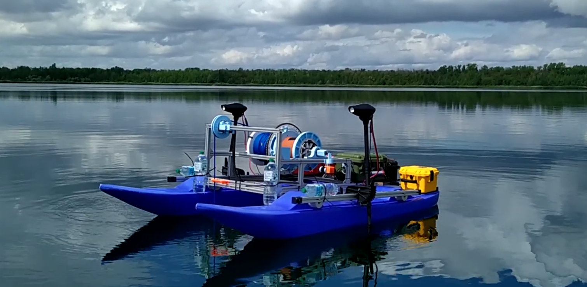

<!--

author:   Sebastian Zug & Georg Jäger
email:    sebastian.zug@informatik.tu-freiberg.de & Georg.Jaeger@informatik.tu-freiberg.de
version:  0.1.3
language: de
narrator: Deutsch Female

import:   https://raw.githubusercontent.com/TUBAF-IfI-LiaScript/VL_SoftwareprojektRobotik/main/config.md
  
-->

[](https://liascript.github.io/course/?https://raw.githubusercontent.com/TUBAF-IfI-LiaScript/VL_SoftwareprojektRobotik/master/00_Einfuehrung.md#1)

# Einführung

| Parameter            | Kursinformationen                                                                                                                                                                                |
| -------------------- | ------------------------------------------------------------------------------------------------------------------------------------------------------------------------------------------------ |
| **Veranstaltung:**   | @config.lecture                                                                                                                                                                                  |    
| **Semester**         | @config.semester                                                                                                                                                                                 |
| **Hochschule:**      | `Technische Universität Freiberg`                                                                                                                                                                |
| **Inhalte:**         | `Abgrenzung und einordnung`                                                                                                                                                                      |
| **Link auf GitHub:** | [https://github.com/TUBAF-IfI-LiaScript/VL_SoftwareprojektRobotik/blob/master/00_Einfuehrung.md](https://github.com/TUBAF-IfI-LiaScript/VL_SoftwareprojektRobotik/blob/master/00_Einfuehrung.md) |
| **Autoren**          | @author                                                                                                                                                                                 |


--------------------------------------------------------------------------------

## Ausgangspunkt


                  {{0-1}}
******************************************

**Wie weit waren wir noch gekommen ... ein Rückblick auf die Veranstaltung Softwareentwicklung?**

Ausgehend von der Einführung in C# haben wir uns mit:

+ den Grundlagen der Objektorientierten Programmierung
+ der Modellierung von konkreten Anwendungen
+ der Koordination des Entwicklungsprozesses - Testen von Software, Versionsmanagement
+ einer Einführung in die nebenläufige Programmierung

beschäftigt.

******************************************

                  {{1-2}}
******************************************

**Warum sollten wir uns nun mit einer weiteren Programmiersprache beschäftigen? Welche Möglichkeiten eröffnen sich draus?**

| Merkmal                     | **C#**                                      | **C++**                                    | **Python**                                    |
|-----------------------------|---------------------------------------------|--------------------------------------------|-----------------------------------------------|
| **Typisierung**              | Statisch typisiert                          | Statisch typisiert                         | Dynamisch typisiert                           |
| **Syntax**                   | Einfacher als C++, strenger als Python      | Komplex und streng                        | Sehr einfach und lesbar                       |
| **Kompilierung**             | Kompiliert in Intermediate Language (IL), läuft auf der .NET-Plattform | Direkt in Maschinencode (plattformabhängig)| Interpretiert, keine Kompilierung notwendig   |
| **Leistung**                 | Hoch, aber etwas langsamer als C++          | Sehr hoch, direkte Hardwarezugriffe        | Langsamer als C++ und C#, aber gut für Prototyping |
| **Speicherverwaltung**       | Automatisch (Garbage Collection)            | Manuell (mit `new` und `delete`)           | Automatisch (Garbage Collection)              |
| **Plattform**                | Primär für Windows, .NET Core erlaubt Cross-Platform | Plattformabhängig, muss neu kompiliert werden | Plattformunabhängig (Python-Interpreter erforderlich) |
| **Anwendungsbereiche**       | Desktop-, Web- und Unternehmensanwendungen  | Systemprogrammierung, Spiele, Echtzeitanwendungen | Webentwicklung, Datenanalyse, KI, Skripting   |
| **Leistungsoptimierung**     | Möglich, aber eingeschränkter als C++       | Hohe Optimierung durch direkten Speicherzugriff | Eingeschränkte Leistung, eher für hohe Entwicklungsproduktivität geeignet |
| **Bibliotheken**             | Umfassende .NET-Bibliotheken                | Große Auswahl, besonders für Systeme nahe an der Hardware | Sehr umfangreich, insbesondere für Datenanalyse, KI, Webentwicklung |
| **Speicherzugriff**          | Abstrakt, wenig direkte Speicherverwaltung  | Direkter Speicherzugriff (Zeiger, Referenzen) | Keine direkte Speicherverwaltung              |
| **Lernkurve**                | Moderat                                     | Steil, vor allem wegen Speicherverwaltung   | Einfach, oft als Einstiegssprache verwendet   |
| **Parallelität/Multithreading**| Unterstützt durch das .NET Framework        | Komplexere Implementierung, aber möglich    | Unterstützt, jedoch durch den GIL (Global Interpreter Lock) eingeschränkt |
| **Garbage Collection**       | Ja                                          | Nein                                       | Ja                                            |
| **OOP-Unterstützung**        | Vollständig objektorientiert                | Unterstützt OOP, aber auch prozedural      | Vollständig objektorientiert, aber flexibel   |
| **Echtzeitanwendungen**      | Weniger geeignet                            | Sehr gut geeignet                          | Selten verwendet                              |

******************************************

                  {{2-3}}
******************************************

**Worin unterscheidet sich diese Projektarbeit von unserem Softwareentwicklungsprojekt**

+ Teamgröße und Koordinationsaufwand (!)
+ Laufzeit des Projektes
+ Komplexität der Aufgaben
+ ...

******************************************

## Einordnung und Abgrenzung 

> A robot is a machine—especially one programmable by a computer—capable of carrying out a complex series of actions automatically. (Definition of `robot`. Oxford English Dictionary)

 von 1921")

### Unterscheidung 

**Welche Robotersysteme kommen in Ihren Unternehmen vor?**

<!-- data-type="none" -->
| **Kriterium**                | **Optionen**                                                  |
| ---------------------------- | ------------------------------------------------------------- |
| **Art der Steuerung**        | <span style="color:blue">autonom</span>, teleoperiert, hybrid |
| **Bewegungsfähigkeit**       | stationär, <span style="color:blue">mobil</span>              |
| **Anwendungsbereich**        | Industrie, Verkehr, Medizin ...                               |
| **Erscheinung**              | Humanoid, Nicht-humanoid                                      |
| **Energieversorgung**        | Autark, Batterien, Kabelgebunden                              |
| **Interaktionsfähigkeit**    | Kooperativ, Isoliert                                          |
| **Komplexität der Umgebung** | Niedrig, Hoch                                                 |
| **Sensorik und Wahrnehmung** | Einfach, <span style="color:red">Komplex</span>               |
| **Größe**                    | Mikroroboter, Makroroboter                                    |
| ...                          | ...                                                           |


### Bedeutung 

??[IFrame](https://books.google.com/ngrams/graph?content=Autonomous+Vehicle%2CAutonomous+Robot&year_start=1900&year_end=2022&corpus=en&smoothing=3 "Ngram Analyse der Begriffe Autonomous Vehicle und Autonomous Robot")

??[IFrame](https://books.google.com/ngrams/graph?content=artificial+intelligence%2Crobot%2CMachine+Learning%2C+deep+learning&year_start=1900&year_end=2022&corpus=en&smoothing=3 "Ngram Analyse der Begriffe Artificial Intelligence, Robot, Machine Learning und Deep Learning")

## Herausforderungen bei der Umsetzung 

Welche technologischen Herausforderungen gilt es bei der Umsetzung von mobilen Robotersystemen zu meistern?

+ **Technologische Herausforderungen**

   - Robuste, hinreichend präzise Positionierung
   - Umgebungskartierung (SLAM)
   - Hindernisidentifikation und - umgehung
   - Echtzeit-Umsetzung von Teilverhalten
   - Energieeffizienz
   - veränderliche Kommunikationsbedingungen
   - ...

+ **Wirtschaftliche Herausforderungen**

   - Wirtschaftlichkeit
   - Marktreife
   - ...

+ **Soziale und rechtliche Herausforderungen**

    - Sicherheitsanforderungen
    - Regulatorische Rahmenbedingungen
    - Ethik und Datenschutz
    - Arbeitsplatzverdrängung
    - ...

> Welche dieser Probleme sehen Sie als relevant bei den zwei Szenarien Lieferroboter und Aquatischer Roboter? 




## Ebenen eines Robotersystems / Teilkomponenten 

                   {{0-1}}
*************************************************

```ascii
                    Statusmeldungen 
     Nutzereingaben  ^                                       
                 |   |
Befehle          v   |
            +-----------------------+
            | Handlungsplanung      |  "$Strategie   $"
            +-----------------------+
                 |   ^     | | |        Folge von Aktionen     
                 v   |     v v v
            +-----------------------+
            | Ausführung            |  "$Taktik$    "           
            +-----------------------+
                     ^      | | |       Geplante Trajektorie,
Status               |      v v v       Verhalten
            +-----------------------+
            | Reaktive Überwachung  |  "$Ausführung$        "
            +-----------------------+
Sensordaten-    ^ ^ ^        | | |      Steuerbefehle an den 
erfassung       | | |        v v v      Aktuator 
            +----------+ +----------+
            | Sensoren | | Aktoren  |                               
            +----------+ +----------+
                  ^           |
                  |           v      
            .-----------------------.
            | Umgebung              |
            .-----------------------.                                                                                .
```


*************************************************

                   {{1-2}}
*************************************************

```ascii
                    Statusmeldungen 
     Nutzereingaben  ^                                                           
                 |   |                                                   Kommunikation, Nutzerschnittstellen
Befehle          v   |                                                                     
            +-----------------------+                                                                 
            | Handlungsplanung      |  "$Strategie   $"                  Verhaltensmodell                        
            +-----------------------+                                                                 
                 |   ^     | | |        Folge von Aktionen                                                      
                 v   |     v v v                                                                 
            +-----------------------+                                                                 
            | Ausführung            |  "$Taktik$    "                    Weltmodell, Handungsmuster Kontexterkennung
            +-----------------------+                                                                 
                     ^      | | |       Geplante Trajektorie,                                                        
Status               |      v v v       Verhalten                                                                 
            +-----------------------+                                                                 
            | Reaktive Überwachung  |  "$Ausführung$        "            Regelung, Energiemanagement                  
            +-----------------------+                                    Notaus-Erkennung                             
Sensordaten-    ^ ^ ^        | | |      Steuerbefehle an den                                             
erfassung       | | |        v v v      Aktuator                                                                  
            +----------+ +----------+                                                                 
            | Sensoren | | Aktoren  |                                    Hardwaretreiber                          
            +----------+ +----------+                                                                 
                  |           |                                                                 
                  v           v                                                                       
            .-----------------------.                                                                 
            | Umgebung              |                                                                 
            .-----------------------.                                                                                .
```


> Wer soll das denn alles implementieren?

*************************************************


                                  {{2-3}}
********************************************************************************

<!-- width="80%" -->
Comic auf der Webseite der Firma Willow Garage, das die individuellen Frameworks
für die Robotikentwicklung adressiert. [^2]

[^2]: Willow Garage, http://www.willowgarage.com/blog/2010/04/27/reinventing-wheel, 2010

********************************************************************************
