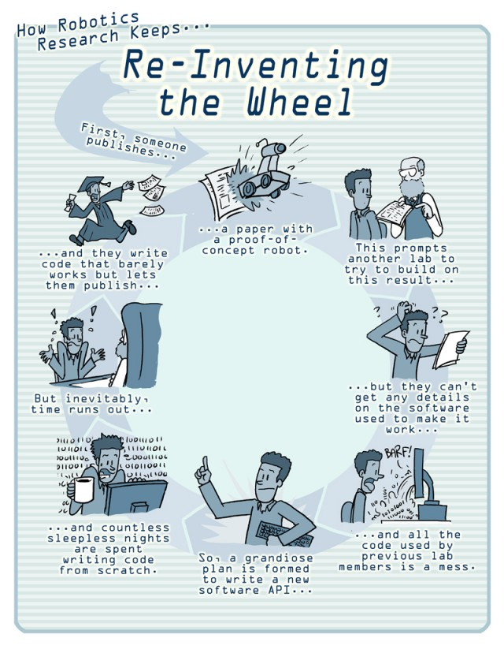

<!--

author:   Sebastian Zug & Georg Jäger & Copilot
email:    sebastian.zug@informatik.tu-freiberg.de & Georg.Jaeger@informatik.tu-freiberg.de
version:  0.1.4
language: de
narrator: Deutsch Female

import:   https://raw.githubusercontent.com/TUBAF-IfI-LiaScript/VL_SoftwareprojektRobotik/refs/heads/master/config.md
  
-->

[](https://liascript.github.io/course/?https://raw.githubusercontent.com/TUBAF-IfI-LiaScript/VL_SoftwareprojektRobotik/refs/heads/master/00_Einfuehrung/00_Einfuehrung.md)

# Einführung

<!-- data-type="none" -->
| Parameter            | Kursinformationen                                                                                             |
| -------------------- | ------------------------------------------------------------------------------------------------------------- |
| **Veranstaltung:**   | @config.lecture                                                                                               |
| **Semester**         | @config.semester                                                                                              |
| **Hochschule:**      | `Technische Universität Freiberg`                                                                             |
| **Inhalte:**         | `Einführung in die mobile Robotik`                                                                            |
| **Link auf GitHub:** | https://github.com/TUBAF-IfI-LiaScript/VL_SoftwareprojektRobotik/blob/master/00_Einfuehrung/00_Einfuehrung.md |
| **Autoren**          | @author                                                                                                       |


--------------------------------------------------------------------------------

**Zielstellung der heutigen Veranstaltung**

+ Grundlegende Begriffe und Definitionen der Robotik verstehen
+ Klassifikation von Robotersystemen anhand verschiedener Kriterien
+ Herausforderungen bei der Entwicklung autonomer mobiler Roboter kennenlernen
+ Systemarchitektur eines Roboters (Sense-Think-Act-Paradigma) verstehen
+ Motivation für den Einsatz von ROS 2 nachvollziehen

--------------------------------------------------------------------------------

## Was ist ein Roboter?

    --{{0}}--
Die Geschichte der Robotik ist faszinierend und reicht weit zurück. Bereits 1921, also vor über 100 Jahren, wurden in Filmen wie "The Mechanical Man" mechanische Wesen dargestellt, die autonom handeln können. Diese frühen Visionen haben die Entwicklung der modernen Robotik maßgeblich beeinflusst.

Das Wort wurde 1920 vom Schriftsteller Karel Čapek geprägt. Seine Bedeutung hat sich aber im Laufe der Zeit gewandelt und ist gleichzeitig vielschichtig.

 von 1921")

Es gibt keine einheitliche Definition des Begriffes Roboter. Die offiziellen Definitionen gehen weit auseinander. 

> **Definition nach VDI-Richtlinie 2860**: „Industrieroboter sind universell einsetzbare Bewegungsautomaten mit mehreren Achsen, deren Bewegungen hinsichtlich Bewegungsfolge und Wegen bzw. Winkeln frei (d. h. ohne mechanischen bzw. menschlichen Eingriff) programmierbar und gegebenenfalls sensorgeführt sind. Sie sind mit Greifern, Werkzeugen oder anderen Fertigungsmitteln ausrüstbar und können Handhabungs- und/oder Fertigungsaufgaben ausführen.“

> **Definition nach Robotic Industries Association (RIA)**: „A robot is a reprogrammable, multifunctional manipulator designed to move material, parts, tools or specialized devices through variable programmed motions for the performance of a variety of tasks“

> **Japan Robot Association (JRA)**
>
> - Manual Manipulator: Handhabungsgerät, das kein Programm hat, sondern direkt vom Bediener geführt wird,
> - Fixed Sequence Robot: Handhabungsgerät, das wiederholt nach einem konstanten Bewegungsmuster arbeitet. Das Ändern des Bewegungsmusters ist relativ aufwendig,
> - Variable Sequence Robot: Handhabungsgerät, wie vorher beschrieben, jedoch mit der Möglichkeit, den Bewegungsablauf schnell und problemlos zu ändern,
> - Playback Robot: Der Bewegungsablauf wird diesem Gerät einmal durch den Bediener vorgeführt und dabei im Programmspeicher gespeichert. Mit der im Speicher enthaltenen Information kann der Bewegungsablauf beliebig wiederholt werden,
> - Numerical Control Robot: Dieses Handhabungsgerät arbeitet ähnlich wie eine NC-gesteuerte Maschine. Die Information über den Bewegungsablauf wird dem Gerät über Taster, Schalter oder Datenträger zahlenmäßig eingegeben,
> - Intelligent Robot: Diese höchste Roboterklasse ist für Geräte gedacht, die über verschiedene Sensoren verfügen und damit in der Lage sind, den Programmablauf selbsttätig den Veränderungen des Werkstücks und der Umwelt anzupassen.


## Klassifikation von Robotersystemen

    --{{0}}--
Roboter lassen sich anhand verschiedener Kriterien klassifizieren. Diese Unterscheidungsmerkmale helfen uns, die Vielfalt der Robotersysteme zu verstehen und ihre spezifischen Anforderungen zu erkennen. In dieser Veranstaltung konzentrieren wir uns vor allem auf autonome, mobile Roboter mit komplexer Sensorik.

**Welche Robotersysteme kennen Sie aus Ihrer Praxis?**

<!-- data-type="none" -->
| **Kriterium**                | **Optionen**                                                  |
| ---------------------------- | ------------------------------------------------------------- |
| **Art der Steuerung**        | <span style="color:blue">autonom</span>, teleoperiert, hybrid |
| **Bewegungsfähigkeit**       | stationär, <span style="color:blue">mobil</span>              |
| **Anwendungsbereich**        | Industrie, Verkehr, Medizin ...                               |
| **Erscheinung**              | Humanoid, Nicht-humanoid                                      |
| **Energieversorgung**        | Autark, Batterien, Kabelgebunden                              |
| **Interaktionsfähigkeit**    | Kooperativ, Isoliert                                          |
| **Komplexität der Umgebung** | Niedrig, Hoch                                                 |
| **Sensorik und Wahrnehmung** | Einfach, <span style="color:red">Komplex</span>               |
| **Größe**                    | Mikroroboter, Makroroboter                                    |
| ...                          | ...                                                           |

    --{{0}}--
In dieser Veranstaltung konzentrieren wir uns primär auf autonome, mobile Roboter, die in komplexen Umgebungen agieren müssen. Diese Systeme stellen besondere Anforderungen an Sensorik, Datenverarbeitung und Entscheidungsfindung.

## Relevanz und Bedeutung mobiler Roboter

    --{{0}}--
Die Bedeutung mobiler Roboter hat in den letzten Jahrzehnten massiv zugenommen. Dies lässt sich anhand der Häufigkeit von Begriffen in wissenschaftlichen Publikationen nachvollziehen. Die folgenden Grafiken zeigen die Entwicklung der Begriffe "Autonomous Vehicle" und "Autonomous Robot" sowie verwandter KI-Themen. 

??[IFrame](https://books.google.com/ngrams/graph?content=Autonomous+Vehicle%2CAutonomous+Robot&year_start=1900&year_end=2022&corpus=en&smoothing=3 "Ngram Analyse der Begriffe Autonomous Vehicle und Autonomous Robot")

??[IFrame](https://books.google.com/ngrams/graph?content=artificial+intelligence%2Crobot%2CMachine+Learning%2C+deep+learning&year_start=1900&year_end=2022&corpus=en&smoothing=3 "Ngram Analyse der Begriffe Artificial Intelligence, Robot, Machine Learning und Deep Learning")

    --{{0}}--
Besonders auffällig ist der exponentielle Anstieg ab den 2010er Jahren, der mit Fortschritten im Machine Learning und Deep Learning zusammenfällt. Diese Technologien sind heute unverzichtbare Werkzeuge für autonome Robotersysteme.

## Herausforderungen bei der Entwicklung mobiler Roboter

    --{{0}}--
Die Entwicklung autonomer mobiler Roboter ist eine hochkomplexe Aufgabe, die Herausforderungen auf mehreren Ebenen mit sich bringt. Schauen wir uns diese systematisch an. 


**Welche technologischen Herausforderungen müssen wir bei mobilen Robotersystemen meistern?**

    --{{0}}--
Auf der technologischen Ebene stehen wir vor fundamentalen Problemen: Wie kann ein Roboter seine Position präzise bestimmen? Wie erstellt er eine Karte seiner Umgebung? Wie erkennt und umfährt er Hindernisse? All diese Fragen werden wir im Verlauf dieser Veranstaltung adressieren.

                  {{0-4}}
*******************************************************************************

**Technologische Herausforderungen**

+ Robuste, hinreichend präzise **Positionierung**
+ **Umgebungskartierung** (SLAM - Simultaneous Localization and Mapping)
+ **Hindernisidentifikation** und -umgehung
+ **Echtzeit-Umsetzung** von Teilverhalten
+ **Energieeffizienz** für längere Betriebszeiten
+ Umgang mit **veränderlichen Kommunikationsbedingungen**

*******************************************************************************

    --{{1}}--
Neben der technischen Realisierbarkeit müssen Robotersysteme auch wirtschaftlich sinnvoll sein. Die Entwicklungskosten müssen sich durch den Nutzen rechtfertigen lassen, und die Systeme müssen marktreif sein.

                  {{1-4}}
*******************************************************************************

**Wirtschaftliche Herausforderungen**


+ **Wirtschaftlichkeit**: Kosten-Nutzen-Verhältnis
+ **Marktreife**: Zuverlässigkeit für den produktiven Einsatz
+ **Skalierbarkeit**: Vom Prototyp zur Serie

*******************************************************************************


    --{{2}}--
Schließlich dürfen wir die gesellschaftlichen Aspekte nicht vergessen. Autonome Systeme müssen sicher sein, rechtlichen Vorgaben entsprechen und von der Gesellschaft akzeptiert werden. Ethische Fragen wie der Umgang mit Datenschutz oder potenzielle Arbeitsplatzverdrängung sind hochrelevant.

                  {{2-4}}
*******************************************************************************

**Soziale und rechtliche Herausforderungen**

+ **Sicherheitsanforderungen**: Schutz von Menschen und Infrastruktur
+ **Regulatorische Rahmenbedingungen**: Gesetze und Normen
+ **Ethik und Datenschutz**: Verantwortungsvoller Umgang mit Daten
+ **Gesellschaftliche Akzeptanz**: Arbeitsplatzverdrängung, Vertrauen

*******************************************************************************

    --{{3}}--
Betrachten wir zwei konkrete Beispiele aus der Praxis: einen Lieferroboter für städtische Umgebungen und einen aquatischen Roboter für Gewässerüberwachung. Welche der genannten Herausforderungen sind jeweils besonders relevant?

                  {{3-4}}
*******************************************************************************

> **Diskussion:** Welche dieser Herausforderungen sehen Sie als besonders relevant für folgende Szenarien?
> 
> 1. **Lieferroboter** in einer Fußgängerzone
> 2. **Aquatischer Roboter** zur Gewässerüberwachung 


*******************************************************************************

## Systemarchitektur: Das Sense-Think-Act-Paradigma

    --{{0}}--
Wie ist nun ein autonomer Roboter aufgebaut? Die klassische Architektur folgt dem Sense-Think-Act-Paradigma, das sich in drei hierarchische Ebenen gliedert. Auf der untersten Ebene finden wir die reaktive Überwachung, die in Echtzeit auf Sensordaten reagiert. Darüber liegt die Ausführungsebene, die taktische Entscheidungen trifft. An der Spitze steht die Handlungsplanung, die strategische Ziele verfolgt. 
Diese Darstellung zeigt die grundlegende Dreischichten-Architektur. Sensoren erfassen Daten aus der Umgebung, die reaktive Überwachung verarbeitet diese in Echtzeit und generiert direkte Steuerbefehle an die Aktoren. Diese Ebene arbeitet mit sehr kurzen Reaktionszeiten.


                   {{0-1}}
*************************************************

```ascii
                    Statusmeldungen 
     Nutzereingaben  ^                                       
                 |   |
Befehle          v   |
            +-----------------------+
            | Handlungsplanung      |  "$Strategie   $"
            +-----------------------+
                 |   ^      | | |       Folge von Aktionen     
                 v   |      v v v
            +-----------------------+
            | Ausführung            |  "$Taktik$    "           
            +-----------------------+
                     ^      | | |       Geplante Trajektorie,
Status               |      v v v       Verhalten
            +-----------------------+
            | Reaktive Überwachung  |  "$Ausführung$        "
            +-----------------------+
Sensordaten-    ^ ^ ^       | | |       Steuerbefehle an den 
erfassung       | | |       v v v       Aktuator 
            +----------+ +----------+
            | Sensoren | | Aktoren  |                               
            +----------+ +----------+
                  ^           |
                  |           v      
            .-----------------------.
            | Umgebung              |
            .-----------------------.                                                                                .
```

*************************************************

    --{{1}}--
In der erweiterten Darstellung sehen wir, welche konkreten Aufgaben auf den einzelnen Ebenen anfallen. Die reaktive Überwachung kümmert sich um Regelung und Energiemanagement. Die Ausführungsebene verwaltet das Weltmodell und erkennt Kontexte. Die Handlungsplanung entwickelt Verhaltensmodelle und kommuniziert mit dem Nutzer.
Auf der rechten Seite sehen Sie die konkreten Implementierungsaspekte: Hardwaretreiber, Regelungsalgorithmen, Weltmodelle und Verhaltensplanung. Diese Komplexität macht deutlich: Ein vollständiges Robotersystem zu entwickeln ist eine enorme Aufgabe!

                   {{1-3}}
*************************************************

```ascii
                    Statusmeldungen 
     Nutzereingaben  ^                                                           
                 |   |                                                   Kommunikation, Nutzerschnittstellen
Befehle          v   |                                                                     
            +-----------------------+                                                                 
            | Handlungsplanung      |  "$Strategie   $"                  Verhaltensmodell                        
            +-----------------------+                                                                 
                 |   ^      | | |       Folge von Aktionen                                                      
                 v   |      v v v                                                                 
            +-----------------------+                                                                 
            | Ausführung            |  "$Taktik$    "                    Weltmodell, Handungsmuster Kontexterkennung
            +-----------------------+                                                                 
                     ^      | | |       Geplante Trajektorie,                                                        
Status               |      v v v       Verhalten                                                                 
            +-----------------------+                                                                 
            | Reaktive Überwachung  |  "$Ausführung$        "            Regelung, Energiemanagement                  
            +-----------------------+                                    Notaus-Erkennung                             
Sensordaten-    ^ ^ ^       | | |       Steuerbefehle an den                                             
erfassung       | | |       v v v       Aktuator                                                                  
            +----------+ +----------+                                                                 
            | Sensoren | | Aktoren  |                                    Hardwaretreiber                          
            +----------+ +----------+                                                                 
                  |           |                                                                 
                  v           v                                                                       
            .-----------------------.                                                                 
            | Umgebung              |                                                                 
            .-----------------------.                                                                                .
```


    --{{2}}--
Und genau hier stellt sich die entscheidende Frage: Wer soll das alles implementieren? Muss jedes Forschungsteam, jedes Unternehmen, jeder Entwickler wirklich das Rad neu erfinden?

      {{2}}
> **Zentrale Frage:** Wer soll das denn alles implementieren?

*************************************************

## Warum ROS? Das "Rad nicht neu erfinden"

    --{{0}}--
Genau an diesem Punkt kommt das Robot Operating System ins Spiel. ROS ist nicht wirklich ein Betriebssystem im klassischen Sinne, sondern ein Framework, das Standardlösungen für wiederkehrende Robotik-Probleme bereitstellt. Statt alles von Grund auf neu zu entwickeln, können Entwickler auf eine riesige Bibliothek von Werkzeugen und Algorithmen zurückgreifen.
Dieser Comic von Willow Garage, dem ursprünglichen Entwickler von ROS, bringt das Problem auf den Punkt: Ohne ein gemeinsames Framework entwickelt jeder sein eigenes System, seine eigenen Treiber, seine eigenen Algorithmen. Das ist ineffizient, fehleranfällig und behindert den wissenschaftlichen Fortschritt.

<!-- width="50%" -->


    --{{1}}--
ROS 2, die aktuelle Version, die wir in dieser Veranstaltung nutzen werden, bietet eine moderne, produktionsreife Plattform mit Echtzeit-Fähigkeiten, verbesserter Sicherheit und Unterstützung für verschiedene Betriebssysteme.

                        {{1-2}}
******************************************************

**ROS 2 bietet:**

+ **Standardisierte Kommunikation** zwischen Komponenten (Topics, Services, Actions)
+ **Wiederverwendbare Pakete** für Sensoren, Navigation, Bildverarbeitung, etc.
+ **Werkzeuge** zur Visualisierung, Datenaufzeichnung und Analyse
+ **Community-Support** mit tausenden von Entwicklern weltweit
+ **Echtzeit-Fähigkeiten** und **Sicherheit** (im Gegensatz zu ROS 1)

******************************************************

## Ausblick: Die nächsten Schritte

    --{{0}}--
In der nächsten Vorlesung, die heute Nachmittag stattfindet, werden wir uns intensiv mit der Sensorik mobiler Roboter beschäftigen. Sie werden verstehen, wie Roboter ihre Umgebung wahrnehmen und welche Sensoren dafür zum Einsatz kommen.

**Was kommt als nächstes?**

VL 2: Sensorik mobiler Roboter (heute Nachmittag!)
==========================

In der zweiten Vorlesung lernen Sie:

+ **Propriozeptive Sensoren**: Odometrie, IMU (Wie weiß der Roboter, wo er ist?)
+ **Exterozeptive Sensoren**: GPS/GNSS, Lidar, Ultraschall (Wie nimmt er die Umgebung wahr?)
+ **Kamerasysteme**: Mono, Stereo, RGB-D (Wie "sieht" ein Roboter?)
+ **Fehlerquellen und Unsicherheiten**: Warum ist Sensorik nie perfekt?

## Zusammenfassung

    --{{0}}--
Fassen wir die wichtigsten Punkte dieser Einführungsvorlesung zusammen:

**Was haben wir gelernt?**

+ Roboter sind **computergesteuerte Maschinen**, die **komplexe Aktionen automatisch** ausführen
+ Robotersysteme lassen sich anhand **vieler Kriterien klassifizieren** (Autonomie, Mobilität, Sensorik, etc.)
+ Die Entwicklung mobiler Roboter bringt **technologische, wirtschaftliche und soziale Herausforderungen** mit sich
+ Die **Systemarchitektur** folgt dem **Sense-Think-Act-Paradigma** mit drei Ebenen
+ **ROS 2** ermöglicht es uns, **auf vorhandenen Lösungen aufzubauen** statt alles neu zu entwickeln

    --{{1}}--
Damit sind Sie gut vorbereitet für die nächste Vorlesung zur Sensorik. Ich freue mich auf die gemeinsame Reise durch die faszinierende Welt der mobilen Robotik!

      {{1}}
> **Vorbereitung für VL 2:** Überlegen Sie sich, welche Sensoren Sie aus dem Alltag kennen (Smartphone, Auto, Haushaltsgeräte). Welche Prinzipien könnten diese nutzen?

## Weiterführende Ressourcen

    --{{0}}--
Für Interessierte hier noch einige Ressourcen zur Vertiefung:

**Literatur und Links:**

+ [ROS 2 Documentation](https://docs.ros.org/) - Offizielle ROS 2 Dokumentation
+ [The Robotics Back-End](https://roboticsbackend.com/) - Tutorials und Praxisbeispiele
+ [RoboCup](https://robocup.de/) - RoboCup-Wettbewerbe und -Teams

## Forschung und Praxis

    --{{0}}--
Abschließend noch ein Hinweis: Die Vorlesung vermittelt Grundlagen, aber die eigentliche Forschungs- und Entwicklungsarbeit beginnt erst danach. Im verlinkten Dokument finden Sie Beispiele aktueller Forschungsprojekte.

https://github.com/TUBAF-IfI-LiaScript/VL_SoftwareprojektRobotik/blob/master/00_Einfuehrung/images/ROSE2024_Chemnitz.pdf