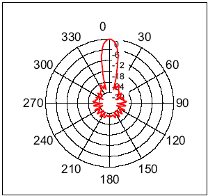
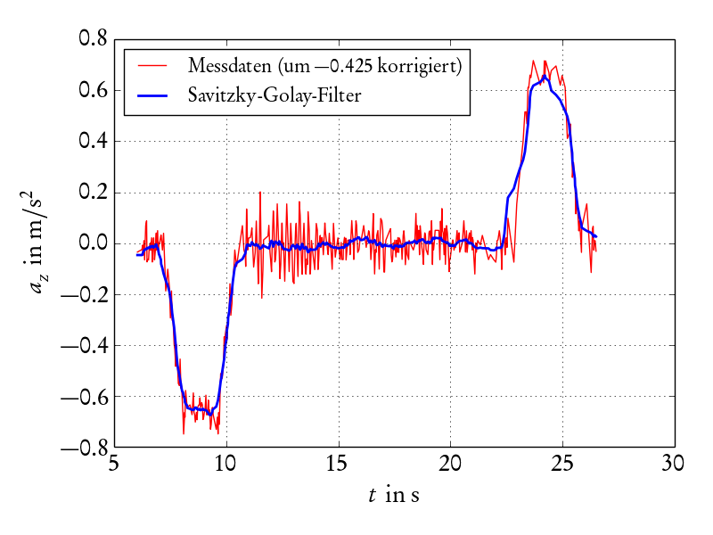
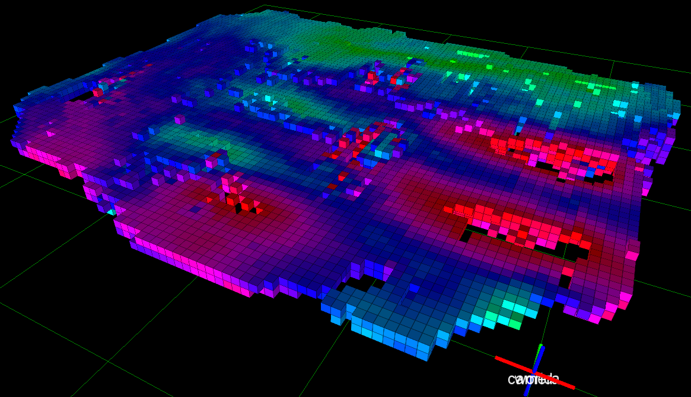

<!--

author:   Sebastian Zug & Georg Jäger & Copilot
email:    sebastian.zug@informatik.tu-freiberg.de & Georg.Jaeger@informatik.tu-freiberg.de
version:  0.2.0
language: de
narrator: Deutsch Female

import: https://github.com/liascript/CodeRunner
        https://raw.githubusercontent.com/liascript-templates/plantUML/master/README.md
        https://raw.githubusercontent.com/TUBAF-IfI-LiaScript/VL_SoftwareprojektRobotik/refs/heads/master/config.md

-->

[](https://liascript.github.io/course/?https://raw.githubusercontent.com/TUBAF-IfI-LiaScript/VL_SoftwareprojektRobotik/refs/heads/master/01_Sensorik/01_Sensorik.md)

# Sensorik mobiler Roboter

| Parameter            | Kursinformationen                                                                                       |
| -------------------- | ------------------------------------------------------------------------------------------------------- |
| **Veranstaltung:**   | @config.lecture                                                                                         |
| **Semester**         | @config.semester                                                                                        |
| **Hochschule:**      | `Technische Universität Freiberg`                                                                       |
| **Inhalte:**         | `Sensorsysteme für mobile Roboter`                                                                      |
| **Link auf GitHub:** | https://github.com/TUBAF-IfI-LiaScript/VL_SoftwareprojektRobotik/blob/master/01_Sensorik/01_Sensorik.md |
| **Autoren**          | @author                                                                                                 |


--------------------------------------------------------------------------------

**Zielstellung der heutigen Veranstaltung**

+ Verständnis der Rolle von Sensoren in der Robotik-Architektur
+ Klassifikation von Sensorsystemen nach verschiedenen Kriterien
+ Kennenlernen propriozeptiver Sensoren (Odometrie, IMU, Gyro, Kompass)
+ Überblick über exterozeptive Sensoren (GPS, Ultraschall)
+ Verständnis grundlegender Messprinzipien und Fehlerquellen

--------------------------------------------------------------------------------

## Einordnung: Sensoren in der Roboterarchitektur

    --{{0}}--
Willkommen zur zweiten Vorlesung! In VL 1 haben wir die Systemarchitektur eines Roboters kennengelernt – das Sense-Think-Act-Paradigma. Heute fokussieren wir uns auf die unterste Ebene: die Sensorik. Sensoren sind die Augen, Ohren und das Tastgefühl des Roboters.

Sensor in der Architekturansicht
====================

```ascii
                    Statusmeldungen 
     Nutzereingaben  ^                                       
                 |   |
Befehle          v   |
            +-----------------------+
            | Handlungsplanung      |  "$Strategie$"
            +-----------------------+
                 |   ^      | | |       Folge von Aktionen     
                 v   |      v v v
            +-----------------------+
            | Ausführung            |  "$Taktik$"           
            +-----------------------+
                     ^      | | |       Geplante Trajektorie,
Status               |      v v v       Verhalten
            +-----------------------+
            | Reaktive Überwachung  |  "$Ausführung$"
            +-----------------------+
Sensordaten-    ^ ^ ^       | | |       Steuerbefehle an den 
erfassung       | | |       v v v       Aktuator 
            +----------+ +----------+
            | Sensoren | | Aktoren  |                               
            +----------+ +----------+
                  ^           |
                  |           v      
            .-----------------------.
            | Umgebung              |
            .-----------------------.                                                                                     .
```

    --{{1}}--
Die Verarbeitungskette zeigt: Sensordaten werden gefiltert, bevor sie für Regelung genutzt werden. Diese Filterung behandeln wir in VL 9-10. Heute: die Sensoren selbst.

                  {{1-2}}
*******************************************************************************

Sensor-Verarbeitungskette
====================


```ascii

       +----------+        +----------+                                
     +-+--------+ |     +--+--------+ |     +----------+     +----------+
+--> |Sensoren  +-+ --> | Filterung +-+ --> | Regelung | --> | Aktoren  | ---+
|    +----------+       +-----------+       +----------+     +----------+    |
|                                                                            |
|                              .---------------------.                       |
+----------------------------- | Umgebung            | <---------------------+
                               .---------------------.                                                                    .
```

*******************************************************************************

## Was ist ein Sensor?

    --{{0}}--
Ein Sensor transformiert physikalische, chemische oder biologische Messgrößen in elektrische Signale. Er ist das Interface zwischen dem technischen System und der realen Welt.

> **Definition:** Sensoren (lat. „fühlen") transformieren physikalische, chemische oder biologische Messgrößen in elektrische Signale.

<!-- width="50%" -->

*Fliehkraftregler – ein mechanischer "Sensor", der Drehzahl in eine mechanische Stellgröße umwandelt.*


## Klassifikation von Sensoren

    --{{0}}--
Sensoren lassen sich nach verschiedenen Kriterien klassifizieren. Diese Unterscheidungen helfen bei der Auswahl für spezifische Aufgaben.

**Nach Bezug zum Messobjekt:**

+ **Intern (propriozeptiv)**: Messen den Roboterzustand
  - Radencoder, IMU, Motorströme
+ **Extern (exterozeptiv)**: Messen die Umgebung
  - Kamera, Lidar, Ultraschall

**Nach Umgebungsbeeinflussung:**

+ **Aktiv**: Senden Signale aus (Ultraschall, Lidar)
+ **Passiv**: Nur Empfänger (Kamera, Mikrofon)

**Nach Dimension:**

+ 1D (Distanz), 2D (Bild), 2.5D (Tiefenbild), 3D (Punktwolke)

**Nach Art der Messung:**

<!--
style="width: 80%; max-width: 720px;"
-->
```ascii

    Sensoren für Lage und Position
                   |
      +------------+--------------+
      |                           |
 interne Sensoren         externe Sensoren
 (propriozeptiv)          (exterozeptiv)
      |                           |
  Odometrie              +--------+----------+
  IMU                    |                   |
  Gyro               taktil            berührungslos
  Kompass                                    |
                          +------------+-----+-------+---------+
                          |            |             |         |
                      akustisch     Laser      bildbasiert   . . . .             .
```

### Integrationsebenen

    --{{0}}--
Moderne Sensoren bestehen oft aus mehreren Verarbeitungsstufen: vom Messelement über Signalaufbereitung bis zum intelligenten Sensorsystem.

<!-- width="80%" -->

### Wichtige Sensorparameter

| Parameter            | Bedeutung                                                                     | Beispielangabe für Ultraschallsensor                  |
| -------------------- | ----------------------------------------------------------------------------- | ------------------------- |
| **Messbereich**      | Ausdehnung der erfassbaren Messgröße                                          | 0-400cm    |
| **Auflösung**        | Kleinste unterscheidbare Änderung                                             | 1mm, 0.1°                 |
| **Linearität**       | Zusammenhang Eingangsgröße ↔ Ausgabe                                         | $y=mx+n$ hier $d=\frac{1}{2}v\cdot \Delta t$                 |
| **Messfrequenz**     | Häufigkeit der Abtastung                                                      | 10Hz, 100Hz               |
| **Querempfindlichkeit** | Abhängigkeit von anderen Parametern                                       | Temperatur bei Ultraschall|
| **Öffnungswinkel**   | Erfassungsbereich bei gerichteten Sensoren                                    | 15°, 60°                  |

<!-- width="40%" -->
<!-- width="40%" -->

*Abstrahlkeulen zweier Ultraschallsensoren – unterschiedliche Öffnungswinkel!*

[^3]: [robot electronics faq](https://www.robot-electronics.co.uk/htm/sonar_faq.htm)


## Propriozeptive Sensorik 

    --{{0}}--
Propriozeptive Sensoren messen den inneren Zustand des Roboters (z. B. Pose, Orientierung, Geschwindigkeit) und sind unabhängig von Umgebungsbedingungen. Sie liefern hohe Abtastraten, sind jedoch ohne äußere Referenz driftanfällig (Integrationsfehler) und liefern keine direkte Information über die Umgebung.

> **Definition:** Propriozeptive Sensoren erfassen ausschließlich interne Zustandsgrößen eines Roboters (z. B. Geschwindigkeit $\mathbf{v}$, Drehrate $\boldsymbol\omega$, Ströme, Encoderimpulse) ohne externe Referenz. Sie sind robust gegenüber Umgebungsbedingungen, liefern jedoch keine direkten Informationen über die Umwelt und müssen zur Langzeitstabilität mit externen Referenzen fusioniert werden.

    {{1}}
******************************************************

Unter der Pose versteht man die Kombination aus Position $\mathbf{p} = [x, y, z]^\top$ und Orientierung (z. B. als Rotationsmatrix $R \in SO(3)$ oder Quaternion $\mathbf{q}$). Die sechs Freiheitsgrade setzen sich aus drei Translationen $(x,y,z)$ und drei Rotationen zusammen: Roll $\phi$ (um x), Pitch $\theta$ (um y), Yaw $\psi$ (um z). 

> **Hinweis:** Die Pose ist ein zentraler Aspekt der Robotik, da sie die vollständige Beschreibung der Position und Orientierung eines Roboters im Raum ermöglicht. Die Grundlagen dazu werden Thema der Vorlesung nächste Woche sein.

********************************************************

    --{{1}}--
Bezug zur IMU: Gyroskope messen die Drehrate $\boldsymbol\omega_B$, Beschleunigungssensoren die spezifische Kraft $\mathbf{f}_B \approx \mathbf{a}_B - \mathbf{g}_B$, Magnetometer liefern eine absolute Kursreferenz (Yaw) relativ zum Erdmagnetfeld. Euler-Winkel sind anschaulich, aber anfällig für Singularitäten (Gimbal-Lock); für Fusion/Regelung werden oft Quaternionen bevorzugt.

### Inertialsensorik (IMU)

    --{{0}}--
Ein Trägheitsnavigationssystem misst Bewegungen über sechs Freiheitsgrade. Moderne IMUs kombinieren mehrere Sensoren in einem Chip.

    {{0-1}}
******************************************************

**Gemessene Größen:**

+ **Beschleunigung** (3 Achsen): $a_x, a_y, a_z$
+ **Winkelgeschwindigkeit** (3 Achsen): $\omega_x, \omega_y, \omega_z$
+ **Magnetfeld** (3 Achsen): $B_x, B_y, B_z$
+ (optional) Temperatur für die Kompensation

********************************************************

    --{{1}}--
Aus den Beschleunigungsdaten lässt sich die Geschwindigkeit berechnen: $v=v_0 +\sum a_i\cdot \Delta t_i$. Allerdings führt die Integration zu Drift-Fehlern!

    {{1-2}}
******************************************************

Beschleunigungssensoren
================================

**Funktionsprinzip (MEMS):**

Mikro-elektro-mechanische Systeme (MEMS) sind Feder-Masse-Systeme, bei denen die „Federn“ nur wenige μm breite Silicium-Stege sind und auch die Masse aus Silicium hergestellt ist. Durch die Auslenkung bei Beschleunigung kann zwischen dem gefedert aufgehängten Teil und einer festen Bezugselektrode eine Änderung der elektrischen Kapazität gemessen werden.

!?[](https://www.youtube.com/watch?v=swCTbz5sIQM "Visualisierung der Funktionsweise eines MEMS-Beschleunigungssensors")

**Beispiel: Fahrstuhlfahrt**

<!-- width="30%" -->
<!-- width="30%" -->
<!-- width="30%" -->

*Aufzeichnung einer Fahrstuhlfahrt: Beschleunigung → Geschwindigkeit → Position - Jordi Kling, [HU Berlin](https://blogs.hu-berlin.de/didaktikdigital/2016/11/20/zurckgelegter-weg-einer-fahrstuhlfahrt-mit-handysensorik/)*
 

> **Problem: Drift!** → Lösung: Kombination mit GPS (VL 9-10: Sensorfusion)

******************************************************


    {{2-3}}
******************************************************

Gyroskope (Drehratensensoren)
================================

> Gyroskope messen Rotationsgeschwindigkeiten um die drei Raumachsen. Durch Integration ergeben sich Orientierungswinkel.

**Gemessene Größen:**

+ **Gierrate** (yaw): Drehung um Hochachse
+ **Nickrate** (pitch): Drehung um Querachse
+ **Rollrate** (roll): Drehung um Längsachse

!?[](https://www.youtube.com/watch?v=REVp33SwwHE)

******************************************************

    --{{3}}--
Magnetfeldsensoren messen das Erdmagnetfeld zur Orientierungsbestimmung. Achtung: Störungen durch Metallstrukturen!
Insbesondere in Innenräumen ist das Magnetfeld stark gestört durch Metallstrukturen, Elektronik und Stromkabel.

    {{3-5}}
******************************************************

Kompasssensoren (Magnetometer)
================================

<!-- width="60%" -->

**Messprinzipien:**

1. **Hall-Effekt**: Spannung ⊥ zu Strom und Magnetfeld
2. **Magnetoresistiv**: Widerstand ändert sich mit Magnetfeld

<!-- width="50%" -->

> Achtung: Insbesondere bei Innenraumanwendungen unterliegen Kompasse starken Störungen.

 ")

******************************************************

    {{4-5}}
******************************************************

Diese kann ich aber wiederum nutzen, um anhand von Referenzkarten Positionen zu bestimmen. 

<!-- width="60%" -->
<!-- width="60%" -->

******************************************************************

### Odometrie

    --{{0}}--
Odometrie erfasst die Bewegung durch Messung der Radumdrehungen. Kernkomponente: der Encoder.

**Prinzipien:**

+ Photoelektrisch (Gabellichtschranke)
+ Magnetisch (Hall-Sensoren)
+ Induktiv

<!-- width="30%" -->

**Konzepte**

+ __Inkrementelle Kodierung:__ zur Bestimmung der relativen Lage/Drehgeschwindigkeit anhand einer Impulsfolge,
Abwägung der Impulszahl pro Drehung von der
+ __Absolute Kodierung:__  Lageermittlung gegenüber einem Fixpunkt, aufwendige Drehimpulsgeber bis hunderttausenden Impulsen pro Umdrehung, häufigste Codierung: Gray-Code (nur auf einem Ausgangssignal findet eine Signaländerung)

**Zwei-Kanal-Encoder:**

    --{{0}}--
Zwei um 90° phasenverschobene Signale ermöglichen Drehrichtungserkennung und Impulsverdopplung.

> Welchen Vorteil hat ein Zwei-Kanal-Encoder gegenüber einem Ein-Kanal-Encoder?

<!--
style="width: 80%; max-width: 700px;"
-->
```ascii

          ^           90°
          |         |<--->|
          |      +-----+     +------
Kanal A   |      |     |     |
          | -----+     +-----+
          |
          | --+     +-----+     +----
Kanal B   |   |     |     |     |
          |   +-----+     +-----+
          |                                   
Drehrich- | --> Vorwärts (A führt B)
tung      | <-- Rückwärts (B führt A)
          +--------------------------->       
```

## Exterozeptive Sensoren (Distanzen und Positionen)

    --{{0}}--
Nun zu den Sensoren, die die Umgebung wahrnehmen. Wir konzentrieren uns auf Entfernungsmessung und Positionsbestimmung.

Entfernungsmessung: Grundprinzipien

**Vier Verfahren:**

1. **Amplitudenbasiert**: Signalstärke → Entfernung
2. **Laufzeitbasiert**: Δt zwischen Senden/Empfangen
3. **Phasenbasiert**: Phasenverschiebung
4. **Triangulation**: Geometrische Berechnung

### Laufzeitmessung (Ultraschall)

    --{{0}}--
Ultraschallsensoren senden einen Schallimpuls aus und messen die Laufzeit des Echos. Entfernung: $d = \frac{1}{2} c \cdot t$

Das Laufzeitverfahren basiert auf der Messung des Zeitversatzes zwischen dem Aussenden eines Impulses und dem Empfang von dessen Reflexion.

<!--
style="width: 80%; max-width: 700px; display: block; margin-left: auto; margin-right: auto;"
-->
```ascii

          ^       
          |      +-----+   
          |      |     |
Sender    |      |     |     
          | -----+     +-----+
          |     Sendeimpuls
          |              
          |      |<------------->| Δt Laufzeit der ersten Echoantwort
          |
          |                      .-----.     2. Echo
          |                      |     |   .---.
Empfänger |   | Störungen   |    |     |   |   |
          | --+-------------+----.     .---.   .-----------
          +--------------------------------------------------->               .
                                  Zeit      
```

Prominentestes Beispiel für Laufzeitsensoren sind ultraschallbasierte Systeme.

Aussenden eines Schallimpulses und Messung der Laufzeit des Echos
Entfernung (in m) 𝑑 =1/2  𝑐 𝑡 aus Laufzeit t (in s) des
Übliche Frequenzen: 40kHz bis 200kHz

**Herausforderung 1: Identifikation des Impulses**


**Herausforderung 2: Querabhängigkeiten**

Neben den Reflexionsmechanismen sind auch die Ausbreitungsparameter des Schallimpulses von der Umgebung abhängig.
Die Schallgeschwindigkeit ist abhänig von

+ Temperatur
+ Luftdruck
+ Luftzusammensetzung (Anteil von CO$_2$, Luftfeuchte)


Welchen Einfluss haben diese Größen? Für zwei Konfigurationen, die zwei unterschiedliche
Wetterlagen repräsentieren ergibt sich bereits ein Fehler von 8%.

$v_1 (980 hPa, 0°) = 325\frac{m}{s}$

$v_2 (1040 hPa, 30°) = 355\frac{m}{s}$

**Herausforderungen:**

+ Echoidentifikation (Mehrfachreflexionen)
+ **Temperaturabhängigkeit**: $v_{Schall}(0°C) = 331 m/s$, $v_{Schall}(30°C) = 349 m/s$
+ Öffnungswinkel (ca. 15-60°)

### Phasenverschiebung

Die Phasenverschiebung des reflektierten Laserstrahls oder dessen Modulation gegenüber dem ausgesandten Strahl ist entfernungsabhängig.

<!--style="width: 70%; max-width: 720px;"-->

Der zentrale Nachteil des Verfahrens besteht darin, dass die Messung des Phasenunterschieds oberhalb einer Phasendifferenz von mehr als 360 Grad wegen des periodischen Charakters keine eindeutige Aussage zum Abstand mehr zulässt.

$c=f\cdot \lambda$ für $f = 5 Mhz$ ergibt sich eine Wellenlänge von 60m.

Eine Lösung besteht darin verschiedene Frequenzen unterschiedlicher Wellenlänge durchzuschalten und durch logische Vergleiche der Messwerte eine große Reichweite und zudem eine hohe Genauigkeit erreichen.

### Triangulation

Triangulationsverfahren setzen auf einem bekannten Abstand zwischen von Empfänger und Sender auf. Die sogenannte *Baseline* ist dann Ausgangspunkt für die Bestimmung des Abstandes. An dieser Stelle seien zwei Beispiele gezeigt:

")<!-- width="60%" -->

Anwendung findet dieses Konzept auch bei RGB-D Kameras, sowohl bei Infrarotbasierten Systemen als auch bei Stereokameras.

### Positionsbestimmung: GNSS (GPS)

    --{{0}}--
Globale Navigationssatellitensysteme ermöglichen weltweite Positionsbestimmung. Prinzip: Laufzeitmessung zu mindestens 4 Satelliten. GNSS und GPS werden oft synonym verwendet, obwohl GPS nur eines von mehreren Systemen ist.

> Wie funktioniert eigentlich ein Global Navigation Satellite System (GNSS)? 


**Systeme:**

+ GPS (USA)
+ Galileo (EU)
+ GLONASS (Russland)
+ BeiDou (China)

#### Mathematische Grundlagen der GNSS-Positionsbestimmung

Ein GNSS-Empfänger bestimmt seine Position (x, y, z) durch Messung der **Laufzeit** der Funksignale mehrerer Satelliten.

Für jeden Satelliten (i) gilt:

$$
\rho_i = c \cdot (t_{\text{Empfang}} - t_{\text{Sendung}, i})
$$

Dabei ist

* ($\rho_i$): gemessene **Signal-Laufstrecke** (pseudo-range),
* ($c$): Lichtgeschwindigkeit,
* ($t_{\text{Empfang}}$): lokale Empfangszeit im Empfänger,
* ($t_{\text{Sendung}, i}$): Sendezeit des Satelliten.


Die Satelliten haben extrem genaue Atomuhren, dein Empfänger jedoch **nicht**.
Daher gibt es einen **Uhrfehler** ( $\Delta t_r$ ) des Empfängers, der zu einer **zusätzlichen Unbekannten** führt.

Damit lautet die Gleichung für Satellit (i):

$$
\rho_i = \sqrt{(x - x_i)^2 + (y - y_i)^2 + (z - z_i)^2} + c \cdot \Delta t_r
$$

mit den bekannten Satellitenpositionen ((x_i, y_i, z_i)).


Wir haben also vier **Unbekannte**:  (x, y, z) und ( $\Delta t_r$ ). Das resultierende nichtlineare Gleichungssystem:

$$
\begin{cases}
\rho_1 = \sqrt{(x - x_1)^2 + (y - y_1)^2 + (z - z_1)^2} + c \Delta t_r \\
\rho_2 = \sqrt{(x - x_2)^2 + (y - y_2)^2 + (z - z_2)^2} + c \Delta t_r \\
\rho_3 = \sqrt{(x - x_3)^2 + (y - y_3)^2 + (z - z_3)^2} + c \Delta t_r \\
\rho_4 = \sqrt{(x - x_4)^2 + (y - y_4)^2 + (z - z_4)^2} + c \Delta t_r
\end{cases}
$$

Diese vier Gleichungen können (z. B. iterativ durch lineare Approximation) gelöst werden.

#### Genauigkeit und Fehlerquellen bei GNSS

    --{{0}}--
Die Genauigkeit von GNSS-Systemen wird durch verschiedene Fehlerquellen beeinflusst.

**Fehlerquellen:**

+ Atmosphärische Effekte
+ Mehrwegeeffekte (Reflexionen)
+ Satellitenkonfiguration (DOP - Dilution of Precision)
+ Abschattung durch Gebäude

<!-- width="60%" -->

**Verbesserungen:**

+ **DGPS** (Differential GPS): Korrektursignale von Basisstationen
+ **SAPOS** (Deutschland): Genauigkeit bis < 1cm
+ **WAAS/EGNOS**: Satellitengestützte Korrekturen


## Zusammenfassung

    --{{0}}--
Fassen wir die wichtigsten Punkte zusammen:

**Was haben wir gelernt?**

+ **Sensorklassifikation**: Intern/extern, aktiv/passiv, Dimension
+ **Propriozeptive Sensoren**:
  - IMU (Beschleunigung, Gyro, Magnetometer)
  - Odometrie (Encoder)
+ **Exterozeptive Sensoren**:
  - Ultraschall (Laufzeit)
  - GPS (globale Position)
+ **Messprinzipien**: Amplitude, Laufzeit, Phase, Triangulation
+ **Fehlerquellen**: Drift, Temperatur, Störungen, Geometrie

    --{{1}}--
In den kommenden Vorlesungen werden wir weitere Sensoren kennenlernen: Kameras (VL 6-7), Lidar und 3D-Sensoren (VL 8). Außerdem lernen wir, wie man Sensordaten fusioniert (VL 9-10), um robuste Schätzungen zu erhalten.

      {{1}}
> **Vorbereitung für VL 3:** Überlegen Sie sich, wie man verschiedene Sensoren räumlich zueinander in Beziehung setzen kann. Wenn ein Roboter eine Kamera vorne und einen Lidar hinten hat – wie beschreibt man deren Position zueinander?

## Ausblick: VL 3 - Koordinatensysteme und Transformationen

    --{{0}}--
In der nächsten Vorlesung lernen Sie, wie man mit verschiedenen Koordinatensystemen umgeht und Sensordaten korrekt transformiert.

**Themen VL 3:**

+ Homogene Transformationen
+ Koordinaten-Frames
+ tf2 in ROS 2
+ URDF (Robot Description Format)
