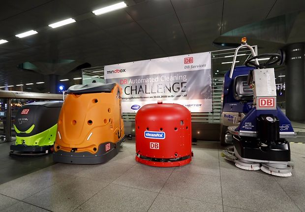
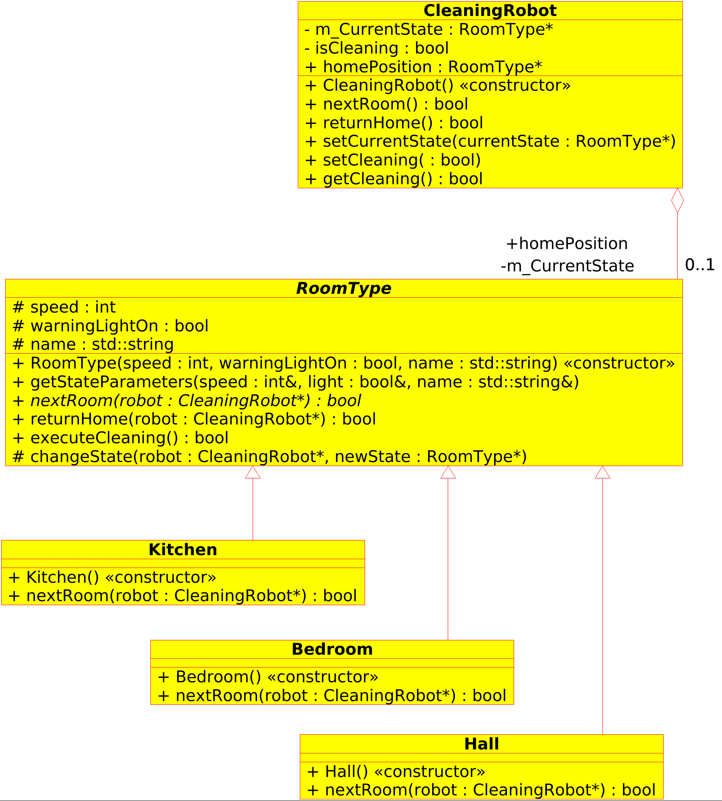

<!--

author:   Sebastian Zug & Georg Jäger
email:    sebastian.zug@informatik.tu-freiberg.de & Georg.Jaeger@informatik.tu-freiberg.de
version:  0.0.2
language: de
narrator: Deutsch Female

import:   https://github.com/liascript/CodeRunner

-->

[](https://liascript.github.io/course/?https://raw.githubusercontent.com/SebastianZug/VL_SoftwareprojektRobotik/master/05_Entwurfsmuster.md#1)

# Entwurfsmuster

| Parameter            | Kursinformationen                                                                                                                                                                             |
| -------------------- | --------------------------------------------------------------------------------------------------------------------------------------------------------------------------------------------- |
| **Veranstaltung:**   | `Softwareprojekt Robotik`                                                                                                                                                                     |
| **Semester**         | `Wintersemester 2021/22`                                                                                                                                                                      |
| **Hochschule:**      | `Technische Universität Freiberg`                                                                                                                                                             |
| **Inhalte:**         | `Entwurfsmuster und deren Umsetzung in C++`                                                                                                                                                |
| **Link auf GitHub:** | [https://github.com/TUBAF-IfI-LiaScript/VL_Softwareentwicklung/blob/master/05_Entwurfsmuster.md](https://github.com/TUBAF-IfI-LiaScript/VL_SoftwareprojektRobotik/blob/master/05_Entwurfsmuster.md) |
| **Autoren**          | @author                                                                                                                                                                                       |


--------------------------------------------------------------------------------

# Entwurfsmuster

Eine interaktive Version des Kurses finden Sie unter [Link](https://liascript.github.io/course/?https://raw.githubusercontent.com/SebastianZug/VL_SoftwareprojektRobotik/master/05_Entwurfsmuster.md#1)

**Zielstellung der heutigen Veranstaltung**

+ Anwendung von Designpatterns (Adapter, Observer, Strategy, State) in Beispielanwendung
+ Zusammenfassung der bisher betrachteten Aspekte der Programmiersprache C++

--------------------------------------------------------------------------------

## Anwendungsfall ...

Nehmen wir einmal an, Sie sind technischer Entwicklungsleiter in einem dynamischen Start-Up, dass einen Reinigungsroboter entwickelt. Als Alleinstellungsmerkmal soll der Roboter in der Lage sein verschiedene Untergründe mit unterschiedlichen Reinigungsstrategien zu säubern.

Die Relevanz der Anwendung unterstreicht der Betrieb von Reinigungsrobotern in unterschiedlichen Anwendungsfeldern (Bahnhöfe, Krankenhäuser, etc.).

<!-- width="80%" -->
*Teilnehmerfeld der Automated Cleaning Challenge im Hauptbahnhof Berlin 2018* [^1]

[^1]:  Pressemitteilung DB AG (Pablo Castagnola)  [Link](https://www.deutschebahn.com/de/presse/pressestart_zentrales_uebersicht/reinigungsroboterrrennen-1201744)

Weiterführende Informationen zu den Herausforderungen sowie Videos unter [Link](https://dbmindbox.com/de/db-challenge/challenge/automatisiertes-reinigenchallenge/)

Wenn wir das Ganze als Black-Box Modell betrachten ergibt sich also folgendes Bild:

<!--
style="width: 80%; max-width: 860px; display: block; margin-left: auto; margin-right: auto;"
-->
```ascii

                           Nutzereingaben/Nutzerinteraktion
                            | - Reinigungsstrategie
                            | - Parameter des Prozesses
                            v
  aktuelle Umgebung       +-------------------+
    - Untergrund          |                   |      autonomes
    - Hindernisse     --> | Reinigungsroboter | -->  Verhalten
    - Verschmutzung       |                   |          ^
                          +-------------------+          |
                                                         |
                                                    Bewertung des
                                                    Erfolges
```

Eine Menge Aufwand! Nicht nur die Roboterhardware muss entwickelt und getestet werden auch eine ganze Menge Software ist notwendig. Können wir nicht auf bestehende Implementierungen zurückgreifen? Irgendwann hat doch schon mal jemand einen Planer geschrieben ... Was hindert uns daran, diesen zu nutzen?

Dabei stehen uns zwei Möglichkeiten offen:

+ Wiederverwendung als Black-Box Bibliothek -> wie baue ich meinen Code um eine bestehende Implementierung **und wahre dabei einen "Sicherheitsabstand"**
+ Wiederverwendung als White-Box -> wie integriere ich eine bestehende Implementierung in mein Projekt **und wahre dabei einen "Sicherheitsabstand"**

> **Aufgabe:** Wiederholen Sie die SOLID Entwurfsprinzipien für den Objektorientierten Softwareentwurf

## Motivation: Vererbung vs. Komposition

Die Vererbung realisiert eine "ist ein" Relation und erlaubt explizit die Codewiederverwendung. Methoden und Membervariablen aus Basisklassen können in abgeleiteten Klassen wiederverwendet werden.

```cpp                 Inheritance.cpp
// Base class
class Animal {
  int feet;
  void sleep();
};

// Derived class
class Dog: public Animal {
  void guard();
};

// Derived class
class Cat : public Animal {
  void catchMice();
};
```

Die abgeleiteten Klassen sind nicht der eigene Herr ihrer Schnittstellen. Wenn in der Basisklasse eine zusätzliche `public` Methode - `swim()` - hinzufügt wird, erscheint diese auch in der Schnittstelle der abgeleiteten Klassen. Wir blähen die Schnittstelle der abgeleiteten Klasse auf.

Die Lösung sollte über eine Komposition folgt der Beschreibung [Composition over inheritance](https://en.wikipedia.org/wiki/Composition_over_inheritance).

```cpp                 +Visibility.cpp
class VisibilityDelegate
{
public:
    virtual void draw() = 0;
};

class NotVisible : public VisibilityDelegate
{
public:
    virtual void draw() override {
        // no-op
    }
};

class Visible : public VisibilityDelegate
{
public:
    virtual void draw() override {
        // code to draw a model at the position of this object
    }
};
```
```cpp                 -Update.cpp
class UpdateDelegate
{
public:
    virtual void update() = 0;
};

class NotMovable : public UpdateDelegate
{
public:
    virtual void update() override {
        // no-op
    }
};

class Movable : public UpdateDelegate
{
public:
    virtual void update() override {
        // code to update the position of this object
    }
};
```
```cpp                 -Object.cpp
#include <memory>

class Object
{
    std::unique_ptr<VisibilityDelegate> v;
    std::unique_ptr<UpdateDelegate> u;
    std::unique_ptr<CollisionDelegate> c;

public:
    Object(std::unique_ptr<VisibilityDelegate> _v, std::unique_ptr<UpdateDelegate> _u, std::unique_ptr<CollisionDelegate> _c)
        : v(std::move(_v))
        , u(std::move(_u))
        , c(std::move(_c))
    {}

    void update() {
        this->u->update();
    }

    void draw() {
        this->v->draw();
    }

    void collide(Object objects[]) {
        this->c->collide(objects);
    }
};
```
<script>
</script>

> **Merke:** Die Objektkomposition ist der Klassenvererbung vorzuziehen!

Vererbung kann eingesetzt werden, wenn es um Interfaces geht.
Während es in Sprachen wie Java und C# direkt das Sprachfeature des Interface gibt, muss man sich in C++ mit einer abstrakten Basisklasse als Interface behelfen.

## Entwurfsmuster

Design Pattern sind spezielle Muster für Interaktionen und Zusammenhänge  der
Bestandteile einer Softwarelösung. Sie präsentieren Implementierungsmodelle, die
für häufig wiederkehrende Abläufe (Generierung und Maskierung von Objekten) eine
flexible und gut wartbare Realisierung sicherstellen. Dafür werden die  Abläufe
abstrahiert und auf generisch Anwendbare Muster reduziert, die dann mit
domänenspezifische Bezeichnern versehen nicht nur für die vereinfachte Umsetzung
sondern auch für die Kommunikation dazu genutzt werden. Dies vereinfacht die
Interaktion zwischen Softwarearchitekten, Programmierer und andere
Projektmitglieder.

> Design Pattern sind Strukturen, Modelle, Schablonen und Muster, die sich zur Entwicklung stabiler Softwaremodelle nutzen lassen.

Entwurfsmuster für Software orientieren sich eng an den grundlegenden Prinzipien der objektorientierten Programmierung:

+ Vererbung
+ Kapselung
+ Polymorphie

Dabei sollte ein Muster:

+ ein oder mehrere Probleme lösen,
+ die Lesbarkeit und Wartbarkeit des Codes erhöhen
+ auf die Nutzung sprachspezifischer Feature verzichten, um eine Übertragbarkeit sicherzustellen
+ ein eindeutiges Set von Begriffen definieren
+ Denkanstöße für den eigenen Entwurf liefern

## Kategorien

In welchen Kategorien werden Design Pattern üblicherweise strukturiert:

1. Erzeugungsmuster (englisch creational patterns)

    Dienen der Erzeugung von Objekten. Sie entkoppeln die Konstruktion eines Objekts von seiner Repräsentation. Die Objekterzeugung wird gekapselt und ausgelagert, um den Kontext der Objekterzeugung unabhängig von der konkreten Implementierung zu halten, gemäß der Regel: „Programmiere auf die Schnittstelle, nicht auf die Implementierung!“

2. Strukturmuster (englisch structural patterns)

    Erleichtern den Entwurf von Software durch vorgefertigte Schablonen für Beziehungen zwischen Klassen.

3. Verhaltensmuster (englisch behavioral patterns)

    Modellieren komplexes Verhalten der Software und erhöhen damit die Flexibilität der Software hinsichtlich ihres Verhaltens.

> ACHTUNG: Entwurfsmuster sind keine Wunderwaffe und kein Garant für gutes Design! Möglichst viele Design Pattern zu nutzen verbaut mitunter den Blick auf elegantere Lösungen.

| Erzeugungsmuster          | Strukturmuster | Verhaltensmuster    |
| ------------------------- | -------------- | ------------------- |
| *Fabrikmethode*           | *Adapter*      | Beobachter          |
| *Abstrakte Fabrik*        | Brücke         | Besucher            |
| Prototyp                  | Container      | Interceptor         |
| *Einzelstück (Singleton)* | Dekorierer     | Interpreter         |
| Erbauer                   | Fassade        | Kommando            |
|                           | Fliegengewicht | Memento             |
|                           | Stellvertreter | Schablonenmethode   |
|                           |                | Strategie           |
|                           |                | Vermittler          |
|                           |                | *Zustand*           |
|                           |                | Zuständigkeitskette |

Die kursiv gehaltenen Einträge waren bereits Gegenstand der Vorlesung "Softwareentwicklung" im Sommersemester.

### Adapter

Ausgangspunkt der Überlegungen ist eine existierende Implementierung
für die Integration unterschiedlicher Sensorsysteme. Diese versucht über eine templatisierte Klassenhierarchie sowohl den Datentyp der Messdaten als auch die konkreten Zugriffsfunktionen in einem Interface zu abstrahieren.

```cpp                      SensorInterfaces.cpp
#include <iostream>

template <class T>
class AbstractSensorInterface{
   protected:
     bool sensorIsActive = false;
   public:
     //virtual bool initSensorInterface();
     virtual T readLastMeasurement() const = 0;
};

template <class T>
class USBSensor: public AbstractSensorInterface<T>
{
  public:
    bool initSensorInterface(){
      // Configuration of corresponding USB Device
      // check its availability
      // in case of success
      this->sensorIsActive = true;
      // further parameter settings
      return this->sensorIsActive;
    }
    virtual T readLastMeasurement() const {
      // Access sensor reading via USB
      return static_cast<T>(50);
    }
};

template<typename T>
void print(const AbstractSensorInterface<T>& sensor)
{
	std::cout << "Measured distance " << sensor.readLastMeasurement() << std::endl;
}

int main()
{
  USBSensor<float> myDistanceSensor;
  bool stat = myDistanceSensor.initSensorInterface();
  std::cout << "Sensor check .... " << stat << std::endl;
  if (stat)
  	print(myDistanceSensor);
  else
  	std::cout << "Sensor not avialable";

  return EXIT_SUCCESS;
}
```
@LIA.eval(`["main.c"]`, `g++ -Wall main.c -o a.out `, `./a.out`)

Nun wird aber ein neuer Laserscanner eingekauft, der zwar auch über die
USB-Schnittstelle angesprochen wird, für den aber der Hersteller ein  komplett unterschiedliches Interface definiert hat.


{{1-2}}
********************************************************************************

Wie betten wir den neuen Sensor in unsere Implementierung ein?

| Variante                                                                                                           | Diskussion                                                                                                                                                                                                                                                          |
| ------------------------------------------------------------------------------------------------------------------ | ------------------------------------------------------------------------------------------------------------------------------------------------------------------------------------------------------------------------------------------------------------------- |
| Überladen der Methode `initSensorInterface()`, so dass die entsprechende Signatur von `NewUSBSensor` bedient wird. | Damit wird die Schnittstelle unseres `AbstractSensorInterface` generell aufgebläht. Durch immer neue, spezifische Funktionen verlieren wir die Einheitlichkeit. Zudem verringert sich die Wartbarkeit, wenn von jeder Version n Varianten nebeneinander exisiteren. |
| Anpassung der Klasse `NewUSBSensor` in Bezug auf unsere `AbstractSensorInterface` Definition                       | Es ist fraglich, ob wir nicht ggf. mit weiteren Versionen dieser Klasse des Treibers konfrontiert werden. Die Integration müsste dann jeweils neu vorgenommen werden.                                                                                               |
Einen flexibleren Lösungsansatz bietet das Adapter-Entwurfsmuster. Wir kapseln die individuellen Eigenschaften des neuen Treibers in einer Wrapper-Klasse, die die Schnittstelle zwischen Hersteller-Implementierung und unserer Definition bietet.

```cpp                      Adapter.cpp
#include <iostream>
#include <vector>
#include <algorithm>
#include <random>
#include <memory>

template <class T>
class AbstractSensorInterface{
   protected:
     bool sensorIsActive = true;
   public:
     //virtual bool initSensorInterface();
     virtual T readLastMeasurement() const = 0;
};

class NewUSBSensor{
  public:
    bool initSensorInterface(float angleResolution){
       // sent angleResolution to sensor
       bool success = true;
       // and some additional adjustments here
       return success;
    }
    std::vector<int> readnMeasurements(unsigned int n) const{
      // simulate measurements
      std::random_device rd;
      std::mt19937 gen(rd()); //Standard mersenne_twister_engine seeded with rd()
      std::uniform_int_distribution<> distrib(1, 100);

      std::vector<int> v(n);
      std::generate(v.begin(), v.end(), [&distrib, &gen](){return distrib(gen);});
      //for(unsigned int i = 0; i<n; i++ ) v[i]=distrib(gen);
      return v;
    }
};

class IndivUSBSensor: public AbstractSensorInterface<std::vector<int>>
{
  private:
    std::unique_ptr<NewUSBSensor> sensor;
    const float angleResolution = 1.;
    const unsigned int beams = 10;
  public:
    bool initSensorInterface(){
    	if(!sensor)
    	{
    		this->sensor = std::make_unique<NewUSBSensor>();
    	}

      this->sensor->initSensorInterface(angleResolution);
      //sensorIsActive = true;  // in case of success
      return this->sensorIsActive;
    }
    std::vector<int> readLastMeasurement() const {
      return this->sensor->readnMeasurements(beams);
    }
};

template<typename T>
void print(const AbstractSensorInterface<T>& sensor)
{
	std::cout << "Measured distance " << sensor.readLastMeasurement() << std::endl;
}


void print(const IndivUSBSensor& sensor)
{
	std::cout << "Measured distance(s) :";
	  for (auto itr: sensor.readLastMeasurement()){
	     std::cout << itr << ", ";
	  }
}


int main()
{
  IndivUSBSensor a;
  bool stat = a.initSensorInterface();
  std::cout << "Sensor check .... " << stat << std::endl;
  if (stat){
  	print(a);
  }
  else std::cout << "Sensor not avialable";
  return EXIT_SUCCESS;
}
```
@LIA.eval(`["main.c"]`, `g++ -Wall main.c -o a.out `, `./a.out`)

********************************************************************************

### Observer

Allgemein finden Beobachter-Muster Anwendung, wenn die  Veränderung in einem Objekt anderen mitgeteilt werden soll. Dieses kann das selbst entscheiden, wie darauf zu reagieren ist.

Das beobachtete Objekt (Subjekt) bietet einen Mechanismus, um Beobachter an- und abzumelden und diese über Änderungen zu informieren. Es kennt alle seine Beobachter nur über eine begrenzte gemeinsame Schnittstelle. Die avisierte Änderungen werden unspezifisch gegenüber jedem angemeldeten Beobachter angezeigt.

Man unterscheidet zwei verschiedene Arten, das Beobachter-Muster umzusetzen. Beide
implementieren eine "Push" Notifikation (vgl. im Unterschied dazu "Pull" Mechanismen).


| Art                      | Wirkung                                                                                                                                                                                                                                                                    |
| ------------------------ | -------------------------------------------------------------------------------------------------------------------------------------------------------------------------------------------------------------------------------------------------------------------------- |
| Push Notification        | Jedes Mal wenn sich das beobachtete Objekt ändert, werden alle Beobachter benachrichtigt. Es werden jedoch keine Daten mitgeschickt, weshalb diese Form immer die gleiche Beobachter-Schnittstelle hat. Die Beobachter müssen nach Eintreffen der Nachricht Daten abholen. |
| Push-Update Notification | Jedes Mal wenn sich das beobachtete Objekt ändert, werden alle Beobachter benachrichtigt. Zusätzlich leitet das beobachtete Objekt die Update-Daten, die die Änderungen beschreiben, an die Beobachter weiter.                                                             |


In unserem Roboterbeispiel wollen wir das Observer-Entwurfsmuster benutzen, um den Datenaustausch zwischen dem Modul für die Objekterkennung und der Notaus-Klasse und dem Navigationsmodul zu realisieren. Wir realisieren eine *Push-Update Notification*, die es jedem Beobachter überlässt auf den zugehörigen Distanzwert zu reagieren.

**Switch to smart pointers**


```cpp                     Observer.cpp
#include <list>
#include <iostream>
#include <memory>

class ObserverInterface
{
public:
	virtual void update() = 0;
};

///// Subject

class Subject{
private:
  std::list<std::shared_ptr<ObserverInterface>> observers;

public:
	void attach(std::shared_ptr<ObserverInterface> observer){
	   this->observers.push_back(observer);
  }
	void detach(std::shared_ptr<ObserverInterface> observer){
	   this->observers.remove_if([&observer](const std::shared_ptr<ObserverInterface>& e){return (e.get() == observer.get());});
  }

	void notify(){
	   for (auto itr: this->observers)
	   {
		     itr->update();
	   }
}
protected:
	Subject() {};

};

class ConcreteSubject : public Subject{
private:
	std::string data;

public:
	void setData(std::string _data) { this->data = _data; }
	std::string getData() { return this->data; }
};

/// Observer

class ConcreteObserver : public ObserverInterface
{
private:
	std::string name;
	std::string observerState;
	std::shared_ptr<ConcreteSubject> subject;

public:
	void update(){
	   this->observerState = this->subject->getData();
     std::cout << "Observer: " << this->name << " hat neuen Zustand: " << this->observerState << std::endl;
  }
	void setSubject(const std::shared_ptr<ConcreteSubject>& subj){
     this->subject = subj;
  }
	std::shared_ptr<ConcreteSubject> getSubject(){
     return this->subject;
  }
	ConcreteObserver(const std::shared_ptr<ConcreteSubject>& subj, std::string _name){
    this->name = _name;
		this->subject = subj;
  }
};

int main()
{
  // Hier noch ohne Smartpointer ... siehe Hausaufgaben
	std::shared_ptr<ConcreteSubject> subj = std::make_shared<ConcreteSubject>();

	std::shared_ptr<ConcreteObserver> obs1 = std::make_shared<ConcreteObserver>(subj,"NotStop");
	std::shared_ptr<ConcreteObserver> obs2 = std::make_shared<ConcreteObserver>(subj,"Navigationsmodul");

	subj->attach(obs1);
	subj->attach(obs2);

	subj->setData("TestData");
	subj->notify();

	return 0;

}
```
@LIA.eval(`["main.c"]`, `g++ -Wall main.c -o a.out `, `./a.out`)

Nachteile:

1. Änderungen am Subjekt führen bei großer Beobachteranzahl zu hohen Änderungskosten. Außerdem informiert das Subjekt jeden Beobachter, auch wenn dieser die Änderungsinformation nicht benötigt. Zusätzlich können die Änderungen weitere Änderungen nach sich ziehen und so einen unerwartet hohen Aufwand haben.

2. Push Notificationen verzichten auf einen spezifischen Datentyp. Dies vermeidet individuelle Ausprägungen und erhöht die Wiederverwendbarkeit. Gleichzeitig ist der Informationsgehalt der Notifikation aber auch sehr beschränkt.

3. Ruft ein Beobachter während der Bearbeitung einer gemeldeten Änderung wiederum Änderungsmethoden des Subjektes auf, kann es zu Endlosschleifen kommen.

4. Die lose Kopplung erschwert die Rekonstruktion des Informationsflusses. Es wird dadurch häufig schwer nachvollziehbar, welche Zustände das Programm bei einem Ereignis insgesamt durchläuft.

### State

Das Zustandsmuster wird zur Kapselung unterschiedlicher, zustandsabhängiger Verhaltensweisen eines Objektes eingesetzt. Dabei wird das zustandsabhängige Verhalten des Objekts in separate Klassen ausgelagert, wobei für jeden möglichen Zustand eine eigene Klasse eingeführt wird, die das Verhalten des Objekts UND ggf. den Zustandswechsel spezifiziert. Damit der Kontext die separaten Zustandsklassen einheitlich behandeln kann, wird eine gemeinsame Abstrahierung dieser Klassen definiert.


Im Sequenzdiagramm stellen sich die entsprechenden Abläufe dann wie folgt dar:


Welche Zustände aber kennt unser Robotersystem? Nehmen wir an, dass der Roboter eine Wohnung zu reinigen hat. Nach einer Exploration der Umgebung entsteht eine Karte, wobei 3 Räume erfasst wurden `Bedroom`, `Kitchen` und `Hall`.

Hinsichtlich der Bewegung zwischen diesen Räumen sind zwei Basisfunktionen - `nextroom()` und `goHome()` - zu implmenetieren. Während bei erstgenanntem die Reihenfolge bei der Reihnigung/Inspektion durch den Nutzer vorgegeben wird, ist das Ziel der letzteren durch den Standort der Ladestation definiert.

| Bewegungsbefehl | Kitchen | Hall    | Bedroom |
| --------------- | ------- | ------- | ------- |
| `nextroom()`    | Hall    | Bedroom | Kitchen |
| `goHome()`      | Hall    |         | Hall    |

Das Verhalten aus dem Aufruf von `nextroom()` ist also vom aktuellen Zustand des Roboters abhängig, während `goHome()` zumindest in Bezug auf das Ziel immer gleich ausgeführt wird.

| Funktion           | Kitchen | Hall | Bedroom |
| ------------------ | ------- | ---- | ------- |
| Warnlicht blinkend | On      | On   | Off     |
| Geschwindigkeit    | niedrig | hoch | hoch    |

Wie bilden wir diese Mechanismen auf das State-Pattern ab? Intuitiv starten wir mit einer komplexen "allwissenden" Implementierung einer Funktion, die alle Übergänge umfasst.

```cpp
void nextroom(){
  if ((isCleaning) && (cleaningReady)){
    if (currentState == "Kitchen"){
      Robot.setSpeed(10);
      Robot.switchWarningLightOn(true);
      Robot.nextGoal = "Bedroom";
    }
    if (currentState == "Bedroom"){
      Robot.setSpeed(10);
      Robot.switchWarningLightOn(off);
      Robot.nextGoal = "Kitchen";
    }
  }
}
```

Welche Probleme sehen Sie?

Betrachten Sie die Implementierung in [github](https://github.com/SebastianZug/VL_SoftwareprojektRobotik/tree/WiSe2019-20/examples/05_DesginPattern). Diese realisiert das Zustands-Pattern für das Roboterbeispiel.

<!-- width="70%" -->

### Strategy

Meistens wird eine Strategie durch Klassen umgesetzt, die alle bestimmte Schnittstelle implementieren. Das kann zum Beispiel ein Suchalgorithmus über einer Zahlenmenge sein, der durch den Nutzer in Abhängigkeit des Vorwissens um das Datenset und dessen Konfiguration gewählt wird. Wie aber strukturieren wir
die unterschiedlichen "Strategien"?


Die Verwendung von Strategien bietet sich an, wenn

+ viele verwandte Klassen sich nur in ihrem Verhalten unterscheiden.
+ unterschiedliche (austauschbare) Varianten eines Algorithmus benötigt werden.
+ Daten innerhalb eines Algorithmus vor Klienten verborgen werden sollen.

Nehmen wir an, dass wir unterschiedliche Strategien für die Reinigung nutzen wollen. Vergleichen Sie dazu entsprechende Publikationen wie zum Beispiel [Paper](https://www.semanticscholar.org/paper/Path-planning-algorithm-development-for-autonomous-Hasan-Abdullah-Al-Nahid/e39988d4ee80bd91aa3c125f885ce3c0382767ef)

```cpp    Strategy.cpp
#include <iostream>
#include <memory>

class AbstractStrategy {
public:
    virtual void operator()() = 0;
    virtual ~AbstractStrategy() {}
};

class Context {
    std::shared_ptr<AbstractStrategy> strat;

public:
    Context() : strat(nullptr) {}
    void setStrategy(std::shared_ptr<AbstractStrategy> _strat) {
	     this->strat = strat;
    }
    void strategy()  { if (this->strat) (*(this->strat))(); }
};

class RandomWalk : public AbstractStrategy {
public:
    virtual void operator()() override { std::cout << "   Moving around without any strategy\n"; }
};

class LoopStrategy : public AbstractStrategy {
public:
    virtual void operator()() override { std::cout << "   Operating in circular structures\n"; }
};

class LinesStrategy : public AbstractStrategy {
public:
    virtual void operator()() override { std::cout << "   Covering the operational area line by line\n"; }
};


int main() {
    std::shared_ptr<Context>  c = std::make_shared<Context>();

    c->setStrategy( std::shared_ptr<AbstractStrategy>(new RandomWalk) );
    c->strategy();

    c->setStrategy( std::shared_ptr<AbstractStrategy>(new LoopStrategy) );
    c->strategy();

    c->setStrategy( std::shared_ptr<AbstractStrategy>(new LinesStrategy) );
    c->strategy();
}
```
@LIA.eval(`["main.c"]`, `g++ -Wall main.c -o a.out `, `./a.out`)


## Aufgabe der Woche

1. Erweitern Sie das Beispiel `SensorInterfaces.cpp` so dass Sie nicht nur einen Wert auslesen können. Dazu sollten Sie:

    + das Template um einen Parameter `size` erweitern, der die Zahl der gespeicherten Sensordaten angibt
    + Methoden für die Speicherung und den Datenzugriff auf der Basis eine Container-Klasse einfügt
    + die Zugriffsfunktion des Interfaces dahingehend erweitern.

2. Templatisieren Sie das Observer-Entwurfsmuster aus dem Beispiel `Observer.cpp`. Wie können Sie sicherstellen, dass unterschiedliche Datentypen an die Observer weitergereicht werden können?

3. Implementieren Sie das Observer Beispiel auf der Basis von smart Pointern.

4. Beschäftigen Sie sich mit Linux Terminal Grundlagen

!?[LInux Introduction](https://www.youtube.com/watch?v=V6iym-VZMu0)
