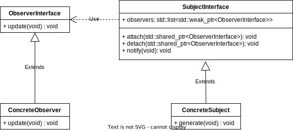

<!--

author:   Sebastian Zug & Georg Jäger
email:    sebastian.zug@informatik.tu-freiberg.de & Georg.Jaeger@informatik.tu-freiberg.de
version:  25.0.0
language: en
narrator: UK English Female

onload
window.CodeRunner = {
    ws: undefined,
    handler: {},

    init(url) {
        this.ws = new WebSocket(url);
        const self = this
        this.ws.onopen = function () {
            self.log("connections established");
            setInterval(function() {
                self.ws.send("ping")
            }, 15000);
        }
        this.ws.onmessage = function (e) {
            // e.data contains received string.

            let data
            try {
                data = JSON.parse(e.data)
            } catch (e) {
                self.warn("received message could not be handled =>", e.data)
            }
            if (data) {
                self.handler[data.uid](data)
            }
        }
        this.ws.onclose = function () {
            self.warn("connection closed")
        }
        this.ws.onerror = function (e) {
            self.warn("an error has occurred => ", e)
        }
    },
    log(...args) {
        console.log("CodeRunner:", ...args)
    },
    warn(...args) {
        console.warn("CodeRunner:", ...args)
    },
    handle(uid, callback) {
        this.handler[uid] = callback
    },
    send(uid, message) {
        message.uid = uid
        this.ws.send(JSON.stringify(message))
    }
}

//window.CodeRunner.init("wss://coderunner.informatik.tu-freiberg.de/")
window.CodeRunner.init("ws://127.0.0.1:8001/")
//window.CodeRunner.init("wss://ancient-hollows-41316.herokuapp.com/")
@end


@LIA.c:       @LIA.eval(`["main.c"]`, `gcc -Wall main.c -o a.out`, `./a.out`)
@LIA.clojure: @LIA.eval(`["main.clj"]`, `none`, `clojure -M main.clj`)
@LIA.cpp:     @LIA.eval(`["main.cpp"]`, `g++ main.cpp -o a.out`, `./a.out`)
@LIA.go:      @LIA.eval(`["main.go"]`, `go build main.go`, `./main`)
@LIA.haskell: @LIA.eval(`["main.hs"]`, `ghc main.hs -o main`, `./main`)
@LIA.java:    @LIA.eval(`["@0.java"]`, `javac @0.java`, `java @0`)
@LIA.julia:   @LIA.eval(`["main.jl"]`, `none`, `julia main.jl`)
@LIA.mono:    @LIA.eval(`["main.cs"]`, `mcs main.cs`, `mono main.exe`)
@LIA.nasm:    @LIA.eval(`["main.asm"]`, `nasm -felf64 main.asm && ld main.o`, `./a.out`)
@LIA.python:  @LIA.python3
@LIA.python2: @LIA.eval(`["main.py"]`, `python2.7 -m compileall .`, `python2.7 main.pyc`)
@LIA.python3: @LIA.eval(`["main.py"]`, `none`, `python3 main.py`)
@LIA.r:       @LIA.eval(`["main.R"]`, `none`, `Rscript main.R`)
@LIA.rust:    @LIA.eval(`["main.rs"]`, `rustc main.rs`, `./main`)
@LIA.v:       @LIA.eval(`["main.v"]`, `v main.v`, `./main`)
@LIA.zig:     @LIA.eval(`["main.zig"]`, `zig build-exe ./main.zig -O ReleaseSmall`, `./main`)

@LIA.dotnet
```xml    -project.csproj
<Project Sdk="Microsoft.NET.Sdk">
  <PropertyGroup>
    <OutputType>Exe</OutputType>
    <TargetFramework>net6.0</TargetFramework>
    <ImplicitUsings>enable</ImplicitUsings>
    <Nullable>enable</Nullable>
  </PropertyGroup>
</Project>
```
@LIA.eval(`["Program.cs","project.csproj"]`, `dotnet build -nologo`, `dotnet run`)
@end

@LIA.dotnetFsharp
```xml    -project.csproj
<Project Sdk="Microsoft.NET.Sdk">
  <PropertyGroup>
    <OutputType>Exe</OutputType>
    <TargetFramework>net6.0</TargetFramework>
  </PropertyGroup>
  <ItemGroup>
    <Compile Include="Program.fs" />
  </ItemGroup>
</Project>
```
@LIA.eval(`["Program.fs", "project.fsproj"]`, `dotnet build -nologo`, `dotnet run`)
@end

@LIA.eval:  @LIA.eval_(false,`@0`,@1,@2,@3)

@LIA.evalWithDebug: @LIA.eval_(true,`@0`,@1,@2,@3)

@LIA.eval_
<script>
function random(len=16) {
    let chars = 'ABCDEFGHIJKLMNOPQRSTUVWXYZabcdefghijklmnopqrstuvwxyz0123456789';
    let str = '';
    for (let i = 0; i < len; i++) {
        str += chars.charAt(Math.floor(Math.random() * chars.length));
    }
    return str;
}


const uid = random()
var order = @1
var files = []

var pattern = "@4".trim()

if (pattern.startsWith("\`")){
  pattern = pattern.slice(1,-1)
} else if (pattern.length === 2 && pattern[0] === "@") {
  pattern = null
}

if (order[0])
  files.push([order[0], `@'input(0)`])
if (order[1])
  files.push([order[1], `@'input(1)`])
if (order[2])
  files.push([order[2], `@'input(2)`])
if (order[3])
  files.push([order[3], `@'input(3)`])
if (order[4])
  files.push([order[4], `@'input(4)`])
if (order[5])
  files.push([order[5], `@'input(5)`])
if (order[6])
  files.push([order[6], `@'input(6)`])
if (order[7])
  files.push([order[7], `@'input(7)`])
if (order[8])
  files.push([order[8], `@'input(8)`])
if (order[9])
  files.push([order[9], `@'input(9)`])


send.handle("input", (e) => {
    CodeRunner.send(uid, {stdin: e})
})
send.handle("stop",  (e) => {
    CodeRunner.send(uid, {stop: true})
});


CodeRunner.handle(uid, function (msg) {
    switch (msg.service) {
        case 'data': {
            if (msg.ok) {
                CodeRunner.send(uid, {compile: @2})
            }
            else {
                send.lia("LIA: stop")
            }
            break;
        }
        case 'compile': {
            if (msg.ok) {
                if (msg.message) {
                    if (msg.problems.length)
                        console.warn(msg.message);
                    else
                        console.log(msg.message);
                }

                send.lia("LIA: terminal")
                CodeRunner.send(uid, {exec: @3, filter: pattern})

                if(!@0) {
                  console.clear()
                }
            } else {
                send.lia(msg.message, msg.problems, false)
                send.lia("LIA: stop")
            }
            break;
        }
        case 'stdout': {
            if (msg.ok)
                console.stream(msg.data)
            else
                console.error(msg.data);
            break;
        }

        case 'stop': {
            if (msg.error) {
                console.error(msg.error);
            }

            if (msg.images) {
                for(let i = 0; i < msg.images.length; i++) {
                    console.html("<hr/>", msg.images[i].file)
                    console.html("")
                }
            }

            if (msg.files) {
                let str = "<hr/>"
                for(let i = 0; i < msg.files.length; i++) {
                    str += `<a href='data:application/octet-stream${msg.files[i].data}' download="${msg.files[i].file}">${msg.files[i].file}</a> `
                }

                console.html(str)
            }

            window.console.warn(msg)

            send.lia("LIA: stop")
            break;
        }

        default:
            console.log(msg)
            break;
    }
})


CodeRunner.send(
    uid, { "data": files }
);

"LIA: wait"
</script>
@end
-->

[](https://liascript.github.io/course/?https://raw.githubusercontent.com/SebastianZug/VL_SoftwareprojektRobotik/master/05_Entwurfsmuster.md#1)

# The Observer Design Pattern in C++

Based on the course [Softwareprojekt Robotik](https://liascript.github.io/course/?https://raw.githubusercontent.com/SebastianZug/VL_SoftwareprojektRobotik/master/05_Entwurfsmuster.md#1) taught at TU Bergakademie Freiberg.

--------------------------------------------------------------------------------

**Goal of the Course**

+ Understand the structure of the Observer design pattern
+ Understand its application scenarios and principles it can be used for
+ Understand its advantages and disadvantages

**Prior Knowledge**

+ A working understanding of C++ up to ISO 2014 Standard
  + Specifically: Inheritance, STL-Containers, Smart Pointers

--------------------------------------------------------------------------------

## Overview of the Observer Design Pattern

The Observer Pattern is generally used when **changes in an object need to be communicated to others**, allowing them to decide how to react to those changes.
With this approach, the design pattern can be used in event-driven systems, for instance:

| Scenario                         | Description                                                                                                                                                                                                                                         |
| ---------------------------- | --------------------------------------------------------------------------------------------------------------------------------------------------------------------------------------------------------------------------------------------------- |
| **Sensor and IoT Applications**        | Sensors can serve as observed objects, informing various systems about changes. These systems can then react to the sensor values. |
| **Database Updates**        | In database-based applications, multiple parts of the application can respond to changes in the database by waiting for updates. |
| **User Interfaces and GUI Elements**        | GUI elements (observers) can react to changes in underlying data or models (observed objects) by updating their display. |

## Elements and Types

For implementing the Observer pattern, two interfaces (**ObserverInterface**, **ObservableInterface**) are required along with two or more concrete implementations thereof:

<!-- align="center" width="70%"  -->

**Classes**

| Name                         | Description                                                                                                                                                                                                                                         |
| ---------------------------- | --------------------------------------------------------------------------------------------------------------------------------------------------------------------------------------------------------------------------------------------------- |
| **ObserverInterface**        | Interface to be implemented by the observing class. The **update()** method is called by when the observed object has changed, e.g. because new data is available. |
| **ObservableInterface** | Interface to be implemented by an object that is to be observable. Next to **attach()** and **detach()** methods for registering and un-registering observers, the **notify()** methods is central to dispatch notifications to observers.                                       |


> The observed object provides a mechanism to **attach** and **detach** observers and informs them about changes. 
> It only knows its observers through a limited common interface. :
> The intended changes are notified in a manner to each registered observer.


## Implementation Variants

There are two different ways to implement the Observer Pattern, both of which use a "push" notification (in contrast to "pull" mechanisms):


| Type                         | Description                                                                                                                                                                                                                                         |
| ---------------------------- | --------------------------------------------------------------------------------------------------------------------------------------------------------------------------------------------------------------------------------------------------- |
| **Push Notification**        | In this approach, observers are informed about changes when they specifically request it. The observed object provides an interface for observers to query the current state. When the state changes, observers can query it and react accordingly. |
| **Push-Update Notification** | In this approach, the observed object actively and automatically notifies all observers when there are changes. Observers receive the updated information directly and do not need to actively request it.  In this variant, **notify()** and **update()** need to receive an additional argument - that fixes the information received but loosens the connection between observed object and observer.|


<!-- align="center" width="120%"  --> 

## The Code

```c++ observer_interface.hpp
#ifndef OBSERVER_INTERFACE_HPP
#define OBSERVER_INTERFACE_HPP

#include <iostream>

/**
 * @brief Defines the interface to be known by the observable object, that is, the subject
 */
class ObserverInterface
{
  public:
    virtual void update() = 0;
};
#endif
```
```c++ observable_interface.hpp
#ifndef OBSERVABLE_INTERFACE_HPP
#define OBSERVABLE_INTERFACE_HPP

#include <memory>
#include <list>
#include "observer_interface.hpp"

/**
 * @brief Defines the interface for an observable object
 */
class Observable
{
  private:
    std::list<std::weak_ptr<ObserverInterface>> observers;
  
  public:
    /**
     * @brief Attach observer to observable object by pushing it to the list of observers
     */
    void attach(std::shared_ptr<ObserverInterface> observer)
    {
      this->observers.push_back(observer);
    }
      
    /**
     * @brief Detach observer to observable by finding it in the list and removing the occurrence
     */
    void detach(std::shared_ptr<ObserverInterface> observer)
    {
      this->observers.remove_if([&observer](const std::weak_ptr<ObserverInterface>& e){if(const auto o = e.lock()){return (o.get() == observer.get());} else {return false;}});
    }
    
    /**
     * @brief Notify all observers about changed state
     */
    void notify()
    {
      for(const auto& o : this->observers)
      {
        if(auto observer = o.lock())
        {
          // here we allow the observer to act on the notification
          observer->update();
        }
      }
    }
};
#endif
```
```c++ distance_sensor.hpp
#ifndef DISTANCE_SENSOR_HPP
#define DISTANCE_SENSOR_HPP

#include <random>

#include "observable_interface.hpp"

/**
 *@brief An observable object could be, for instance, any data generating or processing source. For instance a sensor
 */
 class DistanceSensor : public Observable
 {
  private:
    double distance_observation;
    
    std::mt19937 sensor_interface; // simulate sensor interface with random number generation
    std::uniform_real_distribution<double> sensor_object;
  
  public:
    /**
     *@brief Initialize the sensor and its "interface"
     */
    DistanceSensor() : sensor_interface(std::random_device{}()), sensor_object(0.0, 1.0)
    {
    }
  
    /**
     *@brief Getter function to allow the observer to get information - in this case the measured distance
     */
    double getDistanceObservation() const {return this->distance_observation;}
    
    /**
     *@brief Source of data - here we "measure" the distance
     */
    void measure()
    {
      this->distance_observation = this->sensor_object(this->sensor_interface);
      this->notify();
    }
 };
 #endif
```
```c++ printer.hpp
#ifndef PRINTER_HPP
#define PRINTER_HPP

#include <iostream>
#include <memory>

#include "distance_sensor.hpp"
/**
  *@brief A concrete observer that executes work depending on the observed object
  */
class Printer : public ObserverInterface
{
  private:
    std::weak_ptr<DistanceSensor> sensor;
    
  public:
    /**
     *@brief Construct a printer by passing in the distance sensor to be observed
     */
    Printer(std::shared_ptr<DistanceSensor> distance_sensor) : sensor(distance_sensor)
    {
    }
    
    /**
     *@brief Implement the abstract function to be updated when new data arives
     */
    virtual void update() override final
    {
      if(auto s = this->sensor.lock())
      {
        std::cout << "Current distance: " << s->getDistanceObservation() << std::endl;
      }
    }
};
#endif
```
```c++ main.cpp
#include <iostream>
#include "printer.hpp"

int main(int argc, char** argv)
{
  std::shared_ptr<DistanceSensor> sensor = std::make_shared<DistanceSensor>();
  std::shared_ptr<Printer> printer = std::make_shared<Printer>(sensor);
  sensor->attach(printer);
  
  for(int i = 0; i < 10; i++)
  {
    sensor->measure();
  }

  return EXIT_SUCCESS;
}
```
@LIA.eval(`["observer_interface.hpp", "observable_interface.hpp", "distance_sensor.hpp", "printer.hpp", "main.cpp"]`, `g++ -Wall main.cpp observer_interface.hpp observable_interface.hpp distance_sensor.hpp printer.hpp -o a.out`, `./a.out`)

## Summary
