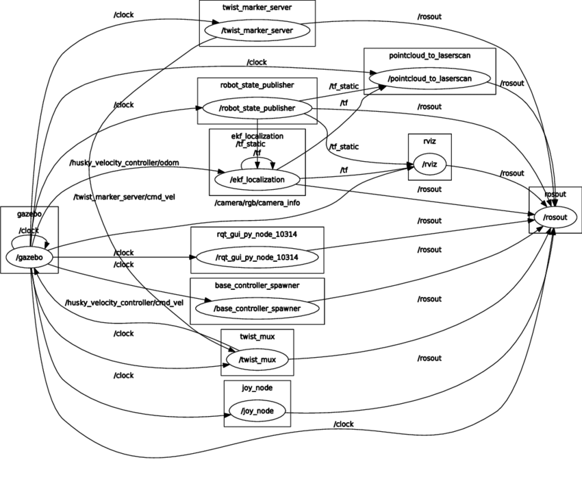
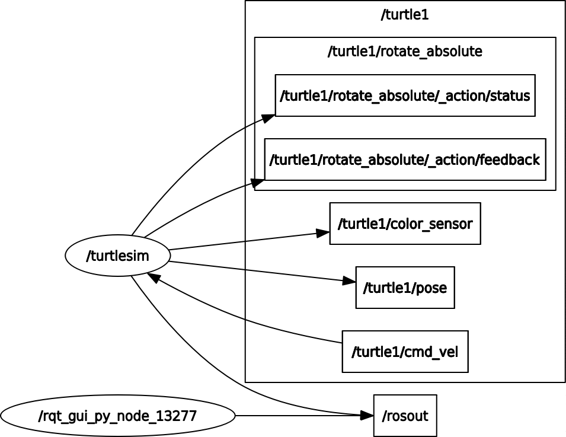

<!--

author:   Sebastian Zug & Georg Jäger
email:    sebastian.zug@informatik.tu-freiberg.de & Georg.Jaeger@informatik.tu-freiberg.de
version:  1.0.0
language: de
comment: In dieser Veranstaltung der Vorlesung werden die Paket und Buildkonzepte von ROS2 vorgestellt. Dabei entsteht ein einfaches eigenes Package.
narrator: Deutsch Female

import: https://raw.githubusercontent.com/LiaTemplates/Rextester/master/README.md
import: https://raw.githubusercontent.com/liascript-templates/plantUML/master/README.md
-->

# Vorlesung VIII - ROS2 Kommunikation

Eine interaktive Version des Kurses finden Sie unter [Link](https://liascript.github.io/course/?https://raw.githubusercontent.com/SebastianZug/SoftwareprojektRobotik/master/07_ROS_Pakete.md)

**Zielstellung der heutigen Veranstaltung**

+

--------------------------------------------------------------------------------

# Was ist eigentlich eine Middleware?

> Middleware im Kontext verteilter Anwendungen ist eine Software, die über die vom Betriebssystem bereitgestellten Dienste hinaus Dienste bereitstellt, um den verschiedenen Komponenten eines verteilten Systems die Kommunikation und Verwaltung von Daten zu ermöglichen.

Middleware unterstützt und vereinfacht komplexe verteilte Anwendungen, sonst müsste die Anwendung Fragen wie:

+ Welche Informationen sind verfügbar?
+ In welchem Format liegen die Daten vor, bzw. wie muss ich meine Informationen verpacken?
+ Wer bietet die Informationen an?
+ Welche Laufzeit haben die Daten maximal?
...

Eine Middleware befreit die Applikation davon diese Frage zu beantworten. Vielmehr bieten Middleware-Dienste  einen Satz von Programmierschnittstellen, um einer Anwendung:

+ eine beliebige "Lokalisierung" im gesamten Netzwerk zu ermöglichen
+ eine standardisierte Interaktion mit einem anderen Dienst oder einer anderen Anwendung umzusetzen
+ Daten zu filtern (Inhalte, Autorisierung)
+ eine unabhängigen Netzzugriff unabhängig vom Netztyp sicherzustellen
+ einen zuverlässigen Datenaustausch sicherzustellen.

__Und in ROS2?__

Für die Realisierung dieser Aufgabe stehen unterschiedlichen Lösungsansätze mit
verschiedenen Schwerpunktsetzungen bereit. Entsprechend integriert ROS2 ein
abstraktes Interface für ein Einbettung von Middelware-Lösungen, die den DDS Standard implementieren.

https://index.ros.org/doc/ros2/Concepts/DDS-and-ROS-middleware-implementations/

ROS2 setzteAls Default Lösung wird eine Implementierung des DDS-Interoperability Real Time Publish Subscribe integriert.

<!--
style="width: 80%; max-width: 860px; display: block; margin-left: auto; margin-right: auto;"
-->
```ascii

              User Applications                        
+---------+---------+---------+
| rclcpp  | rclpy   | rcljava | ...
+---------+---------+---------+-------------+
| rcl (C API) ROS client library interface  |
| Services, Parameters, Time, Names ...     |
+-------------------------------------------+
| rmw (C API) ROS middleware interface      |
| Pub/Sub, Services, Discovery, ...         |
+-----------+-----------+-------------+----+
| DDS       | DDS       | DDS         | ...
| Adapter 0 | Adapter 1 | Adapter 2   |
+-----------+-----------+-------------+
| FastRTPS  | RTI       | PrismTech   | ...
|           | Context   | OpenSplice  |
+-----------+-----------+-------------+

```

Welche Aufgaben bildet DDS für ROS2 über entsprechende Schnittstellen ab?

Discovery ... DDS ist vollständig verteilt, auch auf der Ebene des Discovery Systems und steht damit im Unterschied zu ROS1, dass ein zentrales Koordinationselemente `roscore` einsetzte. Damit entfällt der zentralen Fehlerpunkt, der für die Kommunikation zwischen Teilen des Systems erforderlich ist.

    + Wenn ein Knoten gestartet wird, wirbt er für seine Anwesenheit bei anderen Knoten im Netzwerk mit derselben ROS-Domäne (gesetzt mit der Umgebungsvariablen ROS_DOMAIN_ID). Knoten reagieren auf diese Werbung mit Informationen über sich selbst, damit die entsprechenden Verbindungen hergestellt werden können und die Knoten kommunizieren können.

    + Knoten bewerben ihre Präsenz regelmäßig, so dass auch nach der ersten Erkundungsphase Verbindungen zu neu gefundenen Einheiten hergestellt werden können.

    + Knoten informieren die anderen Knoten, wenn sie offline gehen.

Publish/Subscribe ...

Efficient Transport Alternatives ...

Messages ...

Services and Actions ... DDS verfügt derzeit nicht über einen Request-Response-Mechanismus, mit dem die entsprechenden Konzept der Dienste in ROS umgesetzt werden könnten. Derzeit wird in der OMG DDS-Arbeitsgruppe eine RPC-Spezifikation zur Ratifizierung geprüft, und mehrere der DDS-Anbieter haben einen Entwurf für die Implementierung der RPC-API. Es ist jedoch nicht klar, ob diese Norm für Aktionen geeignet ist, aber sie könnte zumindest eine nicht vorweggenommene Version von ROS-Diensten unterstützen. ROS 2 könnte entweder Dienste und Aktionen zusätzlich zum Publisher-Abonnement implementieren (dies ist in DDS wegen der zuverlässigen QoS-Einstellung für das Publisher-Abonnement besser möglich) oder es könnte die DDS RPC-Spezifikation verwenden, sobald es für Dienste fertig ist, und dann Aktionen darauf aufbauen, wiederum wie in ROS 1.

__Welche Rolle spielen die QoS Eigenschaften des Kommunkations-Layers?__

ROS 2 bietet eine Vielzahl von Quality of Service (QoS)-Richtlinien, mit denen Sie die Kommunikation zwischen Knoten und die Datenhaltung optimieren können. Im Gegensatz zu ROS1, das vorrangig auf TCP setzte, kann ROS2 von Transparenz der jeweiligen DDS-Implementierungen profitieren.

Eine Reihe von QoS "Richtlinien" kombinieren sich zu einem QoS "Profil". Angesichts der Komplexität der Auswahl der richtigen QoS-Richtlinien für ein bestimmtes Szenario bietet ROS 2 einen Satz vordefinierter QoS-Profile für gängige Anwendungsfälle (z.B. Sensordaten). Gleichzeitig erhalten die Benutzer die Flexibilität, spezifische Profile der QoS-Richtlinien zu steuern.

QoS-Profile können für Publisher, Abonnenten, Service-Server und Clients angegeben werden. Damit wird die kombinierbarkeit der Komponenten unter Umständen eingeschränkt!

https://index.ros.org/doc/ros2/Concepts/About-Quality-of-Service-Settings/

https://index.ros.org/doc/ros2/Tutorials/Quality-of-Service/


DDS ist ein Beispiel, alternative

+ *Durability* ... legt fest, ob und wie lange Daten, die bereits ausgetauscht worden sind,  "am Leben bleiben"
+ *Reliability* ...  Die Reliability-QoS definiert, ob alle geschriebenen Datensätze (irgendwann) bei allen Readern angekommen sein müssen. Bei zuverlässiger (`reliable`) Kommunikation werden geschriebene Datensätze eines Topics, die aus irgendwelchen Gründen auf dem Netzwerk verloren gehen, von der Middleware wiederhergestellt, um diese Daten verlässlich den Data Readern zustellen zu können. Im Unterschied dazu definiert `best effort` eine schnellstmögliche Zustellung.
+ *History* ...
+ *Depth* ...

https://static1.squarespace.com/static/51df34b1e4b08840dcfd2841/t/5a3bb7c2419202cda4149077/1513863138814/12_Schneider.pdf

https://link.springer.com/chapter/10.1007/978-3-319-91590-6_14

## ROS Publish-Subscribe

Publish/Subscribe

Themenbasierte Registrierung (topic based)

Parameterbasierte Registrierung (content based)


Das Publish/Subscribe-Paradigma, bei dem der Publisher hat überhaupt kein wissen darüber, wer der/die Subscriber sind generiert folgende Vorteile:

+ Es entkoppelt Subsysteme, die damit unabhängig von einander werden. Damit steigt die Skalierbarkeit des Systems und gleichzeitig die Handhabbarkeit.
+ Die Abarbeitung erfolgt asynchron und ohne Kontrollflussübergabe. Der Knoten ist damit allein auf den eigenen Zustand fokussiert.
+ Der Publisher zusätzlich zum Veröffentlichen nicht auch noch komplexe Zielinformationen angeben muss.
+ Publisher und Subscriber können die Arbeit jederzeit einstellen. Aus rein Kommunikationstechnischen Gründen beeinflusst dies das System nicht.
+ Publisher und Subscriber können eine spezfische Nachrichtenstruktur verwerden, die auf die Anwendung zugeschnitten ist.

Auf der anderen Seite ergeben sich genau daraus auch die zentralen Nachteile:

+ Die Zustellung einer Nachricht kann unter Umständen nicht garantiert werden.
+ Der Ausfall einer Komponente wird nicht zwangsläufig erkannt.
+ Das Pub/Sub-Pattern skaliert gut für kleine Netzwerke mit einer geringen Anzahl von Publisher- und Subscriber-Knoten und geringem Nachrichtenvolumen. Mit zunehmender Anzahl von Knoten und Nachrichten steigt jedoch die Wahrscheinlichkeit von Instabilitäten,

<!-- width="100%" -->


## ROS Services

Bisher haben wir über asynchrone Kommunikationsmechanismen gesprochen. Ein Publisher triggert ggf. mehrere Subscriber. Die damit einhergehende Flexibilität kann aber nicht alle Anwendungsfälle abdecken:

+ Berechne einen neuen Pfad
+ Aktiviere die Kamera
+ ...

In diesem Fall liegt eine Interaktion in Form eines Remote-Procedure-Calls (RPC) vor. Die Anfrage / Antwort erfolgt über einen Dienst, der durch ein Nachrichtenpaar definiert ist: eine für die Anfrage und eine für die Antwort. Ein bereitstellender ROS-Knoten bietet einen Dienst unter einem Stringnamen an, und ein Client ruft den Dienst auf, indem er die Anforderungsnachricht sendet und in seiner Ausführung innehält und auf die Antwort wartet. Die Client-Bibliotheken stellen diese Interaktion dem Programmierer so dar, als wäre es ein Remote Procedure Call.

Dafür sind 3 Schritte notwendig:

1. Ein Service wird über ein Service File definiert, dass analog zu den nutzerdefinierten Paketen die Struktur der auszutauschenden Daten beschreibt. Dabei wird sowohl die Struktur des Aufrufes, wie auch die Antwort des Services beschrieben. Dabei wird das gleiche Format wie bei den nutzerspezifischen Messages verwendet.

2. Die Logik des Service (Entgegennahme des Requests/ Ausliefern der Antwort) wird in einem Knoten implementiert. Hier werden die Parameter der Anfrage ausgewertet, die Antwort bestimmt und diese auf das Ausgabeformat abgebildet.

Diese Vorgänge sollen nun in zwei Beispielen besprochen werden. Einmal anhand
des Turtlesim-Beispiels und anhand einer eigenen Implementierung.

### Manuelle Interaktion mit ROS-Services

```
ros2 run turtlesim turtlesim_node
```

<!-- width="60%" -->

Wie explorieren Sie die Services, die durch den `turtlesim_node` bereitgestellt werden?

`ros2` stellt zwei Schnittstellen für die Arbeit mit den Services bereit.

+ `service` erlaubt den Zugriff auf die tatsächlich angebotenen Services während
+ `srv` die Definitionsformate, die nicht zwingend auch genutzt werden darstellt.

```bash
> ros2 service list
/clear
/kill
/reset
/spawn
/turtle1/set_pen
/turtle1/teleport_absolute
/turtle1/teleport_relative
/turtlesim/describe_parameters
/turtlesim/get_parameter_types
/turtlesim/get_parameters
/turtlesim/list_parameters
/turtlesim/set_parameters
/turtlesim/set_parameters_atomically
>
> ros2 srv list | grep turtlesim
turtlesim/srv/Kill
turtlesim/srv/SetPen
turtlesim/srv/Spawn
turtlesim/srv/TeleportAbsolute
turtlesim/srv/TeleportRelative
```

Offenbar stellt die Turtlesim-Umgebung 5 Services bereit, deren Bedeutung selbsterklärend ist. Die zugehörigen Definitionen sind namensgleich zugeordnet. Auf die zusätzlich aufgezeigten Parameter wird im nächstfolgenden Abschnitt eingegangen.

Das Format lässt sich entsprechend aus den srv Dateien ablesen:

```
> ros2 srv show turtlesim/srv/Spawn
float32 x
float32 y
float32 theta
string name # Optional. A unique name will be created and returned if this is empty
---
string name
```

Versuchen wir also eine Service mittels `ros2 service call` manuell zu starten. Der Aufruf setzt sich aus mehreren Elementen zusammen, deren Konfiguration zwischen den ROS2 Versionen schwanken. An erster Stelle steht der Dienstname gefolgt von der Service-Definition und dem eigentlichen Parametersatz.

```
> ros2 service call /spawn turtlesim/srv/Spawn "{x: 2, y: 2, theta: 0.2, name: ''}"

waiting for service to become available...
requester: making request: turtlesim.srv.Spawn_Request(x=2.0, y=2.0, theta=0.2, name='')

response:
turtlesim.srv.Spawn_Response(name='turtle2')
```

Offenbar wird eine neue Schildkröte in der Simulation erzeugt und mit einem generierten Namen versehen. In diesem Fall erfolgt als Reaktion auf den Request nicht nur eine allgemeine Antwort, vielmehr wird ein weiterer Knoten erzeugt der weitere Publisher und Subscriber öffnet.

<!-- width="80%" -->

Mit den anderen Services (`Kill`) kann dessen Verhalten nun adaptiert werden.


### Integration in Client/Server Implemetierung

https://medium.com/@danieljeswin/introduction-to-programming-with-ros2-services-77273d7e8ddc

Nehmen wir an, dass wir ein Multiroboter-Szenario die Zustände der einzelnen Roboter in einer Datenbank speichert. Diese senden Ihre aktuelle Position an die Datenbank. Daraufhin können die Dispatcher-Knoten, diese Datenbank kontaktieren, um einen geeigneten Roboter für eine Aufgaben zu identifizieren. Wir gehen davon aus, dass dem Knoten die Roboter in einem Raum bekannt sind. Nun möchte er mehr über deren Zustand wissen. Entsprechend verschickt er eine Serviceanfrage an unsere Datenbank, die folgende Struktur aufweist:

```
string robotname
---
string location
bool busy
float32 batterylevel
```

#### Anwendung in Parameter Konfiguration

https://index.ros.org/doc/ros2/Tutorials/Parameters/Understanding-ROS2-Parameters/

https://stackoverflow.com/questions/53917469/how-to-launch-a-node-with-a-parameter-in-ros2


Kann man den Paramteraufruf mit in die launch scripte aufnehmen?


## ROS Actions


## Aufgabe der Woche

+ Schreiben Sie einen neuen Service, der es erlaubt die Roboter abzufragen, die sich in einem Raum befinden.
