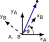
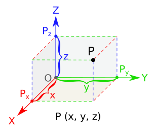
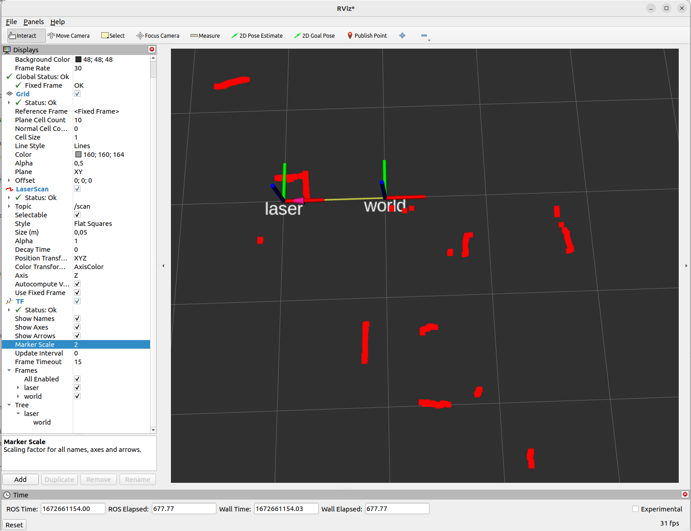
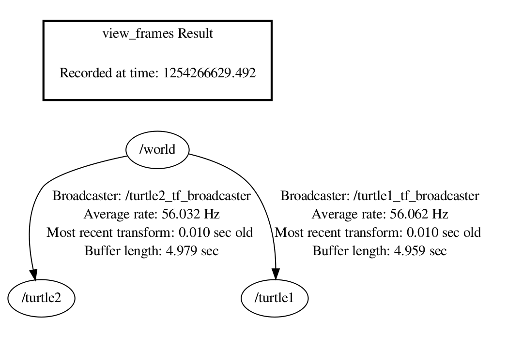

<!--

author:   Sebastian Zug & Georg Jäger
email:    sebastian.zug@informatik.tu-freiberg.de & Georg.Jaeger@informatik.tu-freiberg.de
version:  0.0.5
language: de
narrator: Deutsch Female

import:  https://github.com/liascript/CodeRunner

script:   https://cdn.jsdelivr.net/chartist.js/latest/chartist.min.js
          https://d3js.org/d3-random.v2.min.js
          https://d3js.org/d3.v4.min.js
          https://cdn.plot.ly/plotly-latest.min.js

-->

[](https://liascript.github.io/course/?https://raw.githubusercontent.com/SebastianZug/VL_SoftwareprojektRobotik/master/10_Koordinatentransformation.md#1)

# Koordinatentransformation

| Parameter            | Kursinformationen                                                                                                                                                                           |
| -------------------- | ------------------------------------------------------------------------------------------------------------------------------------------------------------------------------------------- |
| **Veranstaltung:**   | `Softwareprojekt Robotik`                                                                                                                                                                   |
| **Semester**         | `Wintersemester 2023/24`                                                                                                                                                                    |
| **Hochschule:**      | `Technische Universität Freiberg`                                                                                                                                                           |
| **Inhalte:**         | `Umsetzung von ROS Paketen`                                                                                                                                                 |
| **Link auf GitHub:** | [https://github.com/TUBAF-IfI-LiaScript/VL_Softwareentwicklung/blob/master/10_Koordinatentransformation.md](https://github.com/TUBAF-IfI-LiaScript/VL_SoftwareprojektRobotik/blob/master/10_Koordinatentransformation.md) |
| **Autoren**          | @author                                                                                                                                                                                     |


--------------------------------------------------------------------------------

## Einordnung 

... wir generieren ein "rohes" Distanzmessignal und wollen dies weiterverwenden.
Dafür konfigurieren wir eine Verarbeitungskette aus den nachfolgenden Elementen.

<!--
style="width: 100%; max-width: 720px; display: block; margin-left: auto; margin-right: auto;"
-->
```ascii

  Type A                     Type C             Type A                     Type C         
  n Samples +-------------+  n Samples          n Samples +-------------+  m Samples          
       ---->| Trans-      |---->                     ---->| Filterung   |---->
            | formation   |                          ---->|             |
            +-------------+                     (Type B)  +-------------+
                                                n Samples      n ≥ m

  Type A                     Type C             Type A                     Type C         
  n Samples +-------------+  n Samples          n Samples +-------------+  m Samples          
       ---->| Detektion   |---->                     ---->| Feature     |---->
            |             |---->                          | extraction  |
            +-------------+  Fehler                       +-------------+
                             Validität                         n ≥ m
                                                  size(Type A) ≫ size(Type B)
```         

Beispiele für Datenvorverarbeitung

+ Aufbereitung der Daten, Standardisierung
+ zeitliche Anpassung
+ Fehler, Ausreißer und Rauschen erkennen und behandeln,
+ Integration oder Differenzierung
+ Feature-Extraktion (Gesichter auf Positionen, Punktewolken auf Linien, Flächen, Objekte)

Das ganze fügt sich dann ein in die allgemeine Verarbeitungskette von Daten, die
die Abbildung von Rohdaten auf Informationen, Features und letztendlich auf Entscheidungen realisiert. Dabei beruht dieser Fluss nicht auf den Daten eines
einzigen Sensors sondern kombiniert verschiedene (multimodale) Inputs.

<!--
style="width: 100%; max-width: 900px; display: block; margin-left: auto; margin-right: auto;"
-->
```ascii    
             Verständnis                     Verständnis            Verständnis
  Rohdaten -----------------> Informationen --------------> Wissen ------------------> Weisheit
             von Relationen                  von Mustern            von Prinzipien
```

> Im Rahmen dieser Veranstaltung fokussieren wir uns auf die Umsetzung der Koordinatentransformation.


## Motivation und mathematische Darstellung

--{{0}}--
Roboter spannen mit ihren Sensoren und Aktoren jeweils eigene Koordinatensysteme auf. Diese dienen als Bezug für die Darstellung von erfassten Hindernissen, intendierten Wegpunkten oder Orientierungen im 2 oder 3D Raum.

> Beispiel 1: Zwei Roboter operieren in einem Areal. Einer erkennt ein kritisches Hindernis - wo befindet es sich in Bezug auf den anderen Roboter?

> Beispiel 2: Ein stationärer Manipulator erfasst alle Objekte auf der Arbeitsfläche in dem er eine Kamera über diese bewegt. Entsprechend werden alle Objekte im Koordinatensystem der Kamera beschrieben. Für die Planung der Greifoperation müssen wir deren Lage aber auf das Basiskoordinatensystem des Roboters überführen.

<!-- style="width: 70%;"-->


### Mathematische Beschreibung 

Entsprechend beziehen sich Punkte als Vekoren $\textbf{p}=[x, y]$ im Raum immer auf ein Bezugskoordinatensystem $A$, dass bei deren Spezifikation als Index angegeben wird $\textbf{p}_A$.

<!-- style="width: 50%;"-->

### Relevante Transformationen

Aus dem Kontext der _körpererhaltende Transformationen_ (im Unterschied zu Scherung und Skalierung) müsen zwei Relationen berücksichtigt werden:

1. Translation 

Die Darstellung eines Punkte im Koordinatensystem $A$ kann mit dem Translationsvektor $t_{A\rightarrow B}$ bestimmt werden.

$$
\begin{align*} 
\textbf{p}_A - \textbf{p}_B &= \textbf{t}_{A\rightarrow B} \\
\textbf{p}_B &= \textbf{p}_A - \textbf{t}_{A\rightarrow B} 
\end{align*} 
$$

<!-- style="width: 50%;"-->

2. Rotation

    Bisher haben wir lediglich Konzepte der translatorischen Transformation betrachtet. Rotationen um den Winkel $\varphi$ lassen sich folgendermaßen abbilden.

    <!-- style="width: 20%;"-->


    $$ x_B = x_A\cos\varphi + y_A\sin\varphi,$$
    $$ y_B= -x_A\sin\varphi + y_A\cos\varphi,$$

    In der Matrizenschreibweise bedeutet dies

$$
\textbf{p}_B 
=
\begin{bmatrix}
\cos\varphi & \sin\varphi \\ 
-\sin\varphi & \cos\varphi
\end{bmatrix}_{A\rightarrow B}
\cdot
\textbf{p}_B \\
$$


### Homogene Koordinaten

<!-- style="width: 35%;"-->

Fassen wir nun Translation und Rotation zusammen, so können wir eine 2D Koordinatentransformation mit 

$$\textbf{p}_B=\begin{bmatrix}
\cos\varphi & \sin\varphi \\ 
-\sin\varphi & \cos\varphi
\end{bmatrix}_{A\rightarrow B} \cdot \textbf{p}_A - \textbf{t}_{A\rightarrow B}$$

beschreiben. Problematisch ist, dass 

+ die Translation auf einer Addition und 
+ die Rotation auf der Multiplikation von Matrizen 

beruhen. 

Homogene Koordinaten lösen dieses Problem durch das Hinzufügen einer weiteren, virtuellen Koordinate. Der Wert der Matrix bleibt dabei unverändert!

1. Translation 

$$
\begin{align*} 
\begin{bmatrix}
\textbf{p}_B \\
1 \\
\end{bmatrix}
&=
\underbrace{
\begin{bmatrix}
1 & 0 & -t_x\\ 
0 & 1 & -t_y \\
0 & 0 & 1 \\
\end{bmatrix}}_{\textbf{T}_{A\rightarrow B}}
\cdot
\begin{bmatrix}
\textbf{p}_A \\
1 \\
\end{bmatrix}_A \\ 
\end{align*}
$$

2. Rotation 

$$
\begin{align*} 
\begin{bmatrix}
\textbf{p}_B \\
1 \\
\end{bmatrix}
&=
\underbrace{
\begin{bmatrix}
\cos\varphi & \sin\varphi & 0\\ 
-\sin\varphi & \cos\varphi & 0 \\
0 & 0 & 1 \\
\end{bmatrix}}_{\textbf{R}_{A\rightarrow B}}
\cdot
\begin{bmatrix}
\textbf{p}_A \\
1 \\
\end{bmatrix}_A \\ 
\end{align*}
$$

> Beide Transformationsarten sind mit einer mathematischen Operation erklärt. Damit lassen sich auch die Rechenregeln für Matrizen anwenden.

### Inverse Transformation

Die Umkehrung einer Transformation wird über die inverse Matrix von $R$ und $T$ abgebildet. Dabei bieten die spezfischen Eigenschaften der Matrix Vereinfachungsmöglichkeiten.

1. Translation 

Die Umkehrung der Translation mit $\textbf{t}_{A\rightarrow B}$ kann über einen entgegengesetzte Verschiebung anhand von $\textbf{t}_{B\rightarrow A}$ realisiert werden. In homogenen Koordinaten bedeutet das:

$$
\begin{align*}
\begin{bmatrix}
\textbf{p}_B \\
1 \\
\end{bmatrix} 
&= 
T_{A\rightarrow B} \cdot
\begin{bmatrix}
\textbf{p}_A \\
1 \\
\end{bmatrix} \\
\begin{bmatrix}
\textbf{p}_A \\
1 \\
\end{bmatrix} 
&= 
T_{A\rightarrow B}^{-1} \cdot
\begin{bmatrix}
\textbf{p}_B \\
1 \\
\end{bmatrix} 
= 
T_{B\rightarrow A} \cdot
\begin{bmatrix}
\textbf{p}_B \\
1 \\
\end{bmatrix} 
\end{align*}
$$

$$
T_{A\rightarrow B} \cdot T_{A\rightarrow B}^{-1} = 
\begin{bmatrix}
1 & 0 & -t_x\\ 
0 & 1 & -t_y \\
0 & 0 & 1 \\
\end{bmatrix}
\cdot
\begin{bmatrix}
1 & 0 & t_x\\ 
0 & 1 & t_y \\
0 & 0 & 1 \\
\end{bmatrix} 
= 
E
$$

2. Rotation

Analog ergibt sich die Umkehrung der Rotation mit $\varphi$ über einen entgegengesetzte Rotation mit $-\varphi$ umgesetzt werden. In homogenen Koordinaten gilt:

$$
\begin{align*}
\begin{bmatrix}
\textbf{p}_B \\
1 \\
\end{bmatrix} 
&= 
R_{A\rightarrow B} \cdot
\begin{bmatrix}
\textbf{p}_A \\
1 \\
\end{bmatrix} \\
\begin{bmatrix}
\textbf{p}_A \\
1 \\
\end{bmatrix} 
&= 
R_{A\rightarrow B}^{-1} \cdot
\begin{bmatrix}
\textbf{p}_B \\
1 \\
\end{bmatrix} 
= 
R_{B\rightarrow A} \cdot
\begin{bmatrix}
\textbf{p}_B \\
1 \\
\end{bmatrix} 
\end{align*}
$$


$$
R_{A\rightarrow B} \cdot R_{A\rightarrow B}^{-1} = 
\begin{bmatrix}
\cos\varphi & \sin\varphi & 0\\ 
-\sin\varphi & \cos\varphi & 0 \\
0 & 0 & 1 \\
\end{bmatrix}
\cdot
\begin{bmatrix}
\cos\varphi & -\sin\varphi & 0\\ 
\sin\varphi & \cos\varphi & 0 \\
0 & 0 & 1 \\
\end{bmatrix} 
= 
E
$$

> Die Berechnung einer inversen Matrix ist nicht nötig. 

### Kombination von Transformationen

Sofern sich in dieser Kette weitere Koordinatenssysteme wiederfinden können weitere Transformationsmatrizen $T_{M\rightarrow N}$ oder $R_{M\rightarrow N}$ integriert werden. Dabei sind sich wiederholende Verschiebungen oder Rotationen als Aggregation zu betrachten.

$$\textbf{p}_D=\underbrace{\bm{T}_{A\rightarrow B} \bm{T}_{B\rightarrow C} \bm{T}_{C\rightarrow D}}_{\substack{\bm{T}_{A\rightarrow D}}} \cdot \textbf{p}_A$$

$$\textbf{p}_D=\underbrace{\bm{R}_{A\rightarrow B} \bm{R}_{B\rightarrow C} \bm{R}_{C\rightarrow D}}_{\substack{\bm{R}_{A\rightarrow D}}} \cdot \textbf{p}_A$$

Bedeutsamer ist die Kombination aus beiden Typen - dabei gilt die Aussage $T \cdot R = R \cdot T$ nicht!

$$
\begin{bmatrix}
\textbf{p}_B \\
1 \\
\end{bmatrix} 
= 
R_{A\rightarrow B} \cdot T_{A\rightarrow B} 
\cdot
\begin{bmatrix}
\textbf{p}_A \\
1 \\
\end{bmatrix} 
= 
\begin{bmatrix}
\cos\varphi & \sin\varphi & -t_x\\ 
-\sin\varphi & \cos\varphi & -t_y \\
0 & 0 & 1 \\
\end{bmatrix}
\cdot 
\begin{bmatrix}
\textbf{p}_A \\
1 \\
\end{bmatrix} 
$$


## Beispiel Anwendungsfall 2D

Die folgende Grafik stellt zwei Koordinatensysteme ($A$, $B$) dar. Diese sind in einem globalen Koordinatensystem $O$ angeordnet. Die Translation zwisch $O$ und $A$ sowie $B$ wird durch den Vektor $t_A$ und $t_B$ illustriert.

Die Werte für $t_{A_x}$, $t_{A_y}$ und $\varphi_A$ können über die Schieberegler am linken oberen Rand verändert werden.

Der grüne Vektor markiert die gesuchte Größe - die Abbildung des Hindernisses, dass in $A$ am Punkt (2,3) liegt. Durch die Veränderung der Lage von A in O kann dieser Wert aus globaler Sicht verändert werden (vgl. $F_O$). 

??[asf](https://www.geogebra.org/classic/htug5qmn?embed)

Die nachfolgende Berechnung zeigt, wie die zuvor gezeigten Koordinatentransformationen für die Abbildung des Punktes F genutzt werden können.

```python    coordinates.py
import numpy as np
from numpy.linalg import inv
 
phi_A = 0 * np.pi /180      # phi in Radiant
t_A = [2, 0.5]
p_A = [2, 3]             # Angabe in homogenen Koordinaten
R_OB = np.array([[ np.cos(phi_A), -np.sin(phi_A),     0],
                 [ np.sin(phi_A), np.cos(phi_A),      0],
                 [             0,            0 ,     1]])
T_OB = np.array([[            1,             0,  t_A[0]],
                 [             0,            1,  t_A[1]],
                 [             0,            0,      1]])

# Determine transformation matrix
Xi_OB = np.dot(T_OB, R_OB)

# Determine f_global
p_O= Xi_OB.dot(np.append(p_A, 1))
print(p_O[0:2])
```
@LIA.eval(`["main.py"]`, `none`, `python3 main.py`)

> Aufgabe: Berechnen Sie die die Koordinatenangabe im System $B$

## 3D Koordinaten

<!--  style="width:50%; max-width:300px; min-width:600px"-->

> Merke: _The Axes display shows a set of axes, located at the origin of the target frame - __red - x green - y blue -z__

Die entsprechende translatorische Transformation in homogenen Koordinaten ergibt sich nun mit einer erweiterten Matrix:

$$
T_{A\rightarrow B}
= 
\begin{bmatrix}
1 & 0 & 0 & -t_x\\ 
0 & 1 & 0 & -t_y \\
0 & 0 & 1 & -t_z\\
0 & 0 & 0 & 1\\
\end{bmatrix}
$$

> Wie ist es um die Rotationen bestellt? 

Nunmehr müssen wir drei Rotationsachsen betrachten.

| Bezeichnung | Achse | Transformationsmatrix |
|------------|--------|---------------|
| Gieren (Hochachse) | z      | $ R^z_{A\rightarrow B} =  \begin{bmatrix} \cos\varphi & \sin\varphi & 0 & 0\\  -\sin\varphi & \cos\varphi & 0 & 0\\ 0 & 0 & 1 & 0\\  0 & 0 & 0 & 1 \\ \end{bmatrix} $ |
| Nicken (Querachse)    | y      | $ R^y_{A\rightarrow B} =  \begin{bmatrix} \cos\varphi &  0 & \sin\varphi & 0\\  0 & 1 & 0  & 0\\  -\sin\varphi &  0 & \cos\varphi & 0\\ 0 & 0 & 0 & 1 \\ \end{bmatrix} $ |
| Rollen (Längsachse)      | x      | $ R^x_{A\rightarrow B} =  \begin{bmatrix} 1 & 0 & 0 & 0\\ 0 & \cos\varphi & \sin\varphi & 0 \\ 0 & -\sin\varphi & \cos\varphi & 0 \\ 0 & 0 & 0 & 1 \\ \end{bmatrix} $ |

Positiv:

+ Intuitiv benutzbar
+ Gut geeignet für die Bewegung in Animationen - die virtuelle Kamer lässt sich gut durch die Eulerwinkel interpolieren!

Negativ: 

− Gimbal Lock (Unstetigkeit)

− Für allgemeine Rotationen bestimmen sich die Eulerwinkel nicht eindeutig

> ROS nutzt für die Darstellung von Rotationen Quaternionen. Diese überwinden die Einschränkungen der Euler-Winkel Darstellung sind aber nicht so anschaulich. Entsprechend stellt die TF Bibliothek Transformationsvorschriften bereit, um zwischen beiden Formaten zu wechseln.

!?[Tutorial](https://www.youtube.com/watch?v=_t4HZ8r_qFM) 

## Umsetzung in ROS

Die Handhabung der unterschiedlichen Koordinatensystem in ROS ist über das `tf`-verteitle System gelöst.

)")

ROS stellt unter dem namen _tf2_ mehrere Pakete bereit, um Transformationen zu handhaben. Um die Abbildung von Daten aus einem Koordinatensystem in ein anderes zu realsieren müssen diese in einer Baumstruktur verbunden sein. Ausgehend davon können wir eine Information aus einem _Frame_ (Knoten im Baum) in einen anderen überführen.

+ eindeutige Zuordnung zu Frames 
+ mathematische Darstellung der Translations-/Rotationsparameter
+ ggf. Kommunikation von Änderungen der Translation-/Rotationsparameter


Grundlage dieser Lösung ist die Integration einer Frame-ID in jeden Datensatz. Jede `sensor_msgs` enthält entsprechend einen header, der folgendermaßen strukturiert ist.

```text  std_msgs/Header Message
# sequence ID: consecutively increasing ID
uint32 seq
#Two-integer timestamp that is expressed as:
# * stamp.sec: seconds (stamp_secs) since epoch (in Python the variable is called 'secs')
# * stamp.nsec: nanoseconds since stamp_secs (in Python the variable is called 'nsecs')
time stamp
#Frame this data is associated with
string frame_id
```

Eine Transformation kann entweder 

+ statisch (ändert sich nicht im Laufe der Zeit) oder 
+ dynamisch (kann sich im Laufe der Zeit ändern, muss es aber nicht) 

sein. Die Unterscheidung ist aus Fehlertoleranzgründen wichtig, robuste Systeme müssen wissen, ob ihre Informationen ggf. veraltet sind. Statische Transformationen können einmal gesendet werden und können dann als bekannt vorausgesetzt werden.

### Beispiel 1 Laserscanner

```bash    RunLaserScanner
ros2 run urg_node urg_node_driver --ros-args 
      --params-file ./examples/07_ROS_Pakete/startupHokuyo/config/hokuyo_config.yml
```

```bash 
urg_node:
  ros__parameters:
    serial_port: "/dev/ttyACM0"
    serial_baud: 115200
    laser_frame_id: laser
    angle_min: -2.356194496154785
    angle_max: 2.0923497676849365
    angle_increment: 0.006135923322290182
    scan_time: 0.1
    range_min: 0.02
    range_max: 5.0
    publish_intensity: false
    publish_multiecho: false
```

```bash  StartTransformPublisher
# deprecated version
# ros2 run tf2_ros static_transform_publisher 1 0 0 0 0 0 laser world
ros2 run tf2_ros static_transform_publisher --x 1 --y 0 --z 0 
                                            --yaw 0 --pitch 0 --roll 0 
                                            --frame-id laser --child-frame-id world     
[INFO] [1706605092.505727237] [static_transform_publisher_Bb8HJhELdkMTNFcb]: Spinning until stopped - publishing transform
translation: ('1.000000', '0.000000', '0.000000')
rotation: ('0.000000', '0.000000', '0.000000', '1.000000')
from 'laser' to 'world'
```

<!--  style="width:80%; max-width:300px; min-width:600px"-->

### Beispiel 2 - Turtle

Dabei werden die Relationen zwischen den Koordinatensystemen über eigene Publisher und Listener ausgetauscht. Am Ende bildet jede Applikation eine Baumstruktur aus den Transformationen zwischen den Frames. Isolierte Frames können entsprechend nicht in Verbindung mit anderen gesetzt werden.

<!--  style="width:60%; max-width:300px; min-width:600px"-->

_Beispielhafte Darstellung des tf-Trees eines ROS-Turtle Szenarios, das zwei Turtle umfasst. Die individuellen Posen werden jeweils gegenüber den globalen `world`-Frame beschrieben._

Nehmen wir nun an, dass wir die Positionsinformation von `turtle2` im Koordindatensystem von `turtle1` darstellen wollen, um zum Beispiel eine Richtungsangabe zu bestimmen. Dafür subskribieren wir uns für deren Frame und berechnen die Koordinate im eigenen Koordinatensystem.

```cpp    MessageTfTransform.cpp
#include "ros/ros.h"
#include "tf/transform_listener.h"
#include "tf/message_filter.h"
#include "message_filters/subscriber.h"

class PoseDrawer
{
public:
  PoseDrawer() : tf_(),  target_frame_("turtle1")
  {
    point_sub_.subscribe(n_, "turtle_point_stamped", 10);
    tf_filter_ = new tf::MessageFilter<geometry_msgs::PointStamped>(point_sub_, tf_, target_frame_, 10);
    tf_filter_->registerCallback( boost::bind(&PoseDrawer::msgCallback, this, _1) );
  } ;

private:
  message_filters::Subscriber<geometry_msgs::PointStamped> point_sub_;
  tf::TransformListener tf_;
  tf::MessageFilter<geometry_msgs::PointStamped> * tf_filter_;
  ros::NodeHandle n_;
  std::string target_frame_;

  //  Callback to register with tf::MessageFilter to be called when transforms are available
  void msgCallback(const boost::shared_ptr<const geometry_msgs::PointStamped>& point_ptr)
  {
    geometry_msgs::PointStamped point_out;
    try
    {
      tf_.transformPoint(target_frame_, *point_ptr, point_out);

      printf("point of turtle 2 in frame of turtle 1 Position(x:%f y:%f z:%f)\n",
             point_out.point.x,
             point_out.point.y,
             point_out.point.z);
    }
    catch (tf::TransformException &ex)
    {
      printf ("Failure %s\n", ex.what()); //Print exception which was caught
    }
  };
};

int main(int argc, char ** argv)
{
  ros::init(argc, argv, "pose_drawer"); //Init ROS
  PoseDrawer pd; //Construct class
  ros::spin(); // Run until interupted
};
```

```
point of turtle 2 in frame of turtle 1 Position(x:-0.603264 y:4.276489 z:0.000000)
point of turtle 2 in frame of turtle 1 Position(x:-0.598923 y:4.291888 z:0.000000)
point of turtle 2 in frame of turtle 1 Position(x:-0.594828 y:4.307356 z:0.000000)
point of turtle 2 in frame of turtle 1 Position(x:-0.590981 y:4.322886 z:0.000000)
```

Dann können wir darauf reagieren und die Position von Schildkröte 1 ansteuern.

### Beispiel 3 - URDF für statische Relationen

Die Konfiguration der Transformationen lässt sich auch abstrakt anhand konkreter Modelle in einer eigenen Sprache darstellen. Die beschreiben 

1. geometrische Dimensionen einzelner Komponenten und  
2.  physikalische Eigenschaften deren
3. Relationen anhand sog. Joints 
4. integrierte Sensoren/Aktoren 

Das Unified Robot Description Format (URDF) ist eine Variante davon. Auf der Basis eines XML-Formates können die oben genannten Parameter beschrieben werden. Die Beschreibungssprache XACO erweitert die darstellbaren Inhalte und ermöglicht insbesondere die Referenzierung von Sub-Dokumenten.

```xml
<?xml version="1.0"?>
<robot name="origins">
  <link name="base_link">
    <visual>
      <geometry>
        <cylinder length="0.6" radius="0.2"/>
      </geometry>
    </visual>
  </link>

  <link name="right_leg">
    <visual>
      <geometry>
        <box size="0.6 0.1 0.2"/>
      </geometry>
      <origin rpy="0 1.57075 0" xyz="0 0 -0.3"/>
    </visual>
  </link>

  <joint name="base_to_right_leg" type="continuous">
    <parent link="base_link"/>
    <child link="right_leg"/>
    <origin xyz="0 -0.22 0.25"/>
  </joint>
</robot>
```

Das gezeigt Listing 
[example.urdf](https://github.com/TUBAF-IfI-LiaScript/VL_SoftwareprojektRobotik/tree/master/examples/10_Koordinatentransformation/urdf_example/example.urdf) finden Sie im Projektrepository.

```
ros2 launch urdf_tutorial display.launch.py model:=examples/10_Koordinatentransformation/urdf_example/example.urdf
```

Ein umfangreicheres Modell lässt sich zum Beispiel nach dem Aufruf von  

```
ros2 launch urdf_tutorial display.launch.py model:=`ros2 pkg prefix --share urdf_tutorial`/urdf/06-flexible.urdf
```

evaluieren.