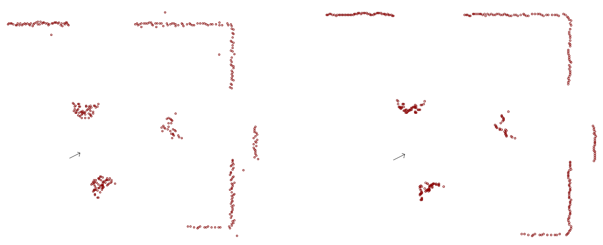

<!--

author:   Sebastian Zug & Georg Jäger
email:    sebastian.zug@informatik.tu-freiberg.de & Georg.Jaeger@informatik.tu-freiberg.de
version:  1.0.0
language: de
comment:  In dieser Vorlesungen werden die Schichten einer Roboterarchitektur adressiert.
narrator: Deutsch Female

import: https://raw.githubusercontent.com/LiaTemplates/Rextester/master/README.md
import: https://raw.githubusercontent.com/liascript-templates/plantUML/master/README.md

script:   https://cdn.jsdelivr.net/chartist.js/latest/chartist.min.js
          https://d3js.org/d3-random.v2.min.js
          http://d3js.org/d3.v4.js
          https://cdn.plot.ly/plotly-latest.min.js

link: https://cdn.jsdelivr.net/chartist.js/latest/chartist.min.css

link: https://cdnjs.cloudflare.com/ajax/libs/animate.css/3.7.0/animate.min.css
-->

# Vorlesung X - Sensordatenverarbeitung

Eine interaktive Version des Kurses finden Sie unter [Link](https://liascript.github.io/course/?https://raw.githubusercontent.com/SebastianZug/SoftwareprojektRobotik/master/09_Sensordatenverarbeitung.md)

**Zielstellung der heutigen Veranstaltung**

+ Parameterisierung von Meßungenauigkeiten
+ Filterung von Messdaten
+ Schätzung

--------------------------------------------------------------------------------

## Wie weit waren wir gekommen?

... wir generieren ein "rohes" Distanzmessignal.


<!--
style="width: 100%; max-width: 720px; display: block; margin-left: auto; margin-right: auto;"
-->
```ascii

  Type A                     Type C             Type A                     Type C         
  n Samples +-------------+  n Samples          n Samples +-------------+  m Samples          
       ---->| Trans-      |---->                     ---->| Filterung   |---->
            | formation   |                          ---->|             |
            +-------------+                     (Type B)  +-------------+
                                                n Samples      n ≥ m

  Type A                     Type C             Type A                     Type C         
  n Samples +-------------+  n Samples          n Samples +-------------+  m Samples          
       ---->| Detektion   |---->                     ---->| Abstraktion |---->
            |             |---->                          |             |
            +-------------+  Fehler                       +-------------+
                             Validität                         n ≥ m
                                                  size(Type A) ≫ size(Type B)
```         

Beispiele für Datenvorverarbeitung

+ Aufbereitung der Daten, Standardisierung
+ zeitliche Anpassung
+ Fehler, Ausreißer und Rauschen erkennen und behandeln,
+ Integration oder Differenzierung
+ Abstraktion (Punktewolken auf Linien, Flächen, Objekte)

## Transformation

Ein Aspekt der Transformation ist die Abbildung der Messdaten, die ggf. als
Rohdaten des Analog-Digital-Wandlers vorliegen auf die eigentlich intendierte
Messgröße.

Beispiel: Gyroskop MPU9250 mit internem 16bit ADC und variablem Meßbereich.

<!--
style="width: 80%; max-width: 500px; display: block; margin-left: auto; margin-right: auto;"
-->
```ascii
Ausgabe-         Messbereich des Sensors        
wert             2g             4g           8g           16g
65535     --     -  g           -  2g
           -     ^              ^
           -     |              |
40960      -     o              o
32768      -     |              |
           -     |              |
           -     |              |
           -     v              v
    0     --     - ╸g           -  ╸2g
```  

$$a = \frac{Messbereich}{Auflösung} \cdot ADCvalue - \frac{1}{2} Messbereich$$

> Offenbar haben wir es hier mit einem linearen Zusammenhang zwischen der Messgröße und dem ADC Wert zu tuen.

Beispiel: Analoger Distanzsensor GP2D12


Allgemeines Vorgehen bei der Approximation eines Polynoms

Polynom $$y(x)= a_0 + a_1x + a_ax^2 + ... + a_nx^n$$

1. Definition des Grades des Polynoms (lineare, quadratische, kubische … Relation)

2. Generierung der Messpunkte (m-Stützstellen) – $x_m, y_m$

3. Aufstellen des Gleichungssystems

$$y_0(x_0) = a_0 + a_1x_0 + a_ax_0^2 + ... + a_nx_0^n$$
$$y_1(x_2) = a_0 + a_1x_1 + a_ax_1^2 + ... + a_nx_1^n$$
$$y_2(x_2) = a_0 + a_1x_2 + a_ax_2^2 + ... + a_nx_2^n$$
$$y = Am$$

4. Lösen des Gleichungssystems (Methode der kleinsten Quadrate)

5. Evaluation des Ergebnispolynoms

6. evtl. Neustart

<!-- width="100%" -->
*Abhängigkeit der Abbildung vom Grad des Polynoms *


Umsetzung im RoboterSystem

$$y(x)= a_0 + a_1x + a_ax^2 + ... + a_nx^n$$

mit $2\cdot(n-1)$ Multiplikationen und $n$ Additionen.

### Koordinatentransformation


## Filterung

> (das/der) Filter (m., n., nach fr. filtrer, it. feltrare, „durchseihen“; ursprünglich „durch Filz laufen lassen“ zu germanisch *felt „Filz“)

Ziel:

+ Reduzierung des Rauschens
+ Löschung von fehlerhaften  		   Werten
+ Konzentration der Daten

Ein Filter bildet die Folge (xi) der Sensorwerte auf eine Folge (yi) ab.

Domäne: Zeit, Frequenzbereich

Bezug: 	Signalspezifikation,  			Systemmodell


### Glättung

Ein Ansatz für die Glättung sind gleitende Fenster, innerhalb derer die Daten analysiert werden.

> Anders als in (offline) Zeitreihen-Analysen leiten wir den Ausgabewert ausschließlich von den zuvor erfassten Werten ab.  

$$y_k(x_k, x_{k-1}, x_{k-2} ... x_{k-N+1})$$ mit $N$ als Fenstergröße

Zeitreihen würden auch die nachfolgenden Werte berücksichtigen!

$$y_k( ... x_{k+2}, x_{k+1}, x_k, x_{k-1}, x_{k-2} ...)$$

Damit laufen wir den Messdaten zeitlich gesehen hinterher!

Ein gleitender Mittelwert wird häufig als Allheilmittel für die Filterung von Messwerten dargestellt.

$y_k = \frac{1}{N}\sum_{i=0}^{i>N} x_{k-i}$

Im folgenden Beispiel wird ein niederfrequentes Bewegungsmuster mit einem höherfrequenten Störsignal überlagert. Welche Veränderungen erkennen Sie am Ausgabesignal des Filters verglichen mit dem Originalsignal?

```js  GenerateData.js
//Actual filter method
function slidingWindow(randoms, window_size) {
    var result = new Array(randoms.length).fill(null);
    for (var i = window_size; i < randoms.length; i++) {
        var window = randoms.slice(i - window_size, i);
        result[i] = window.reduce(function(p,c,i,a){return p + (c/a.length)},0);
    }
    return result;
}

var xrange = d3.range(0, 4*Math.PI, 4 * Math.PI/100);
var ideal_values = xrange.map(x => Math.sin(x));
var noise = d3.range(0, 100, 1).map(d3.randomNormal(0, 0.1));
var noisy_values = new Array(xrange.length).fill(0);
for (var i = 0; i <= noise.length; i++){
   noisy_values[i] = ideal_values[i] + noise[i];
}

const window_size = 3;
var mean = slidingWindow(noisy_values, window_size);

new Chartist.Line('#chart1', {
  labels: [1, 2, 3, 4],
  series: [ideal_values, noisy_values, mean]
});
```
<script>@input</script>

<div class="ct-chart ct-golden-section" id="chart1"></div>

### Medianfilter

Einen alternativen Ansatz implementiert der Medianfilter. Hier werden die Werte des gleitenden Fensters sortiert und der Wert in der Mitte dieser Reihung zurückgegeben.

```js  GenerateData.js
function medianFilter(inputs, window_size) {
  var result = new Array(inputs.length).fill(null);
  for (var i = window_size-1; i < inputs.length; i++) {
      var window = inputs.slice(i - window_size + 1, i + 1);
      var sorted = window.sort((a, b) => a - b);
      var half = Math.floor(window_size / 2);
      if (window_size % 2)
         result[i] = sorted[half];
      else
         result[i] = (sorted[half - 1] + sorted[half]) / 2.0;
  }
  return result;
}

var xrange = d3.range(0, 4*Math.PI, 4 * Math.PI/100);
var ideal_values = xrange.map(x => Math.sin(x));
var noise = d3.range(0, 100, 1).map(d3.randomNormal(0, 0.1));
var noisy_values = new Array(xrange.length).fill(0);
for (var i = 0; i <= noise.length; i++){
   noisy_values[i] = ideal_values[i] + noise[i];
}

const window_size = 5;
var mean = medianFilter(noisy_values, window_size);

new Chartist.Line('#chart1', {
  labels: [1, 2, 3, 4],
  series: [ideal_values, noisy_values, mean]
});
```
<script>@input</script>

<div class="ct-chart ct-golden-section" id="chart1"></div>

Der Median-Filter ist ein nichtlinearer Filter, er entfernt Ausreißer und wirkt damit als Filter und Detektor.


<!-- width="100%" -->
*Anwendung des Medianfilters auf Laserscans*

### Koordinatentransformation


## Detektion

Die Detektion zielt auf die Erfassung von Anomalien im Signalverlauf. Dabei werden Modelle des Signalverlaufes oder der Störung genutzt, um

* Ausreißer (single sample)
* Level shifts (mehrere aufeinander folgende Samples)
* veränderliches Noiseverhalten
* ...

zu erfassen. Auch hier lassen sich sehr unterschiedliche Ansätze implementieren, das Spektrum der Lösungen soll anhand von zwei Lösungsansätze diskutiert werden.

                               {{1}}
******************************************************************************
Begonnen werden soll mit einem einfachen Schwellwerttest, der die Änderung zwischen zwei Messungen berücksichtigt. Welches Parameter des Signals sind für den Erfolg dieser Methode maßgeblich bestimmend?

```js  GenerateData.js
var layout = {
    height : 300,
    width :  650,
    margin: { l: 60, r: 10, b: 0, t: 10, pad: 4},
    showlegend: true,
    legend: { x: 1, xanchor: 'right', y: 1},
    tracetoggle: false
};

function generateStep(xrange, basis, step, step_index){
  var result = new Array(xrange.length).fill(basis);
  return result.fill(step, step_index);
}

var xrange = d3.range(0, 100, 1);
var ideal_values = generateStep(xrange, 3.5, 1, 50);
var noise = d3.range(0, 100, 1).map(d3.randomNormal(0, 0.1));
var noisy_values = new Array(xrange.length).fill(0);
for (var i = 0; i <= noise.length; i++){
   noisy_values[i] = ideal_values[i] + noise[i];
}

var trace1 = {
  x: xrange,
  y: ideal_values,
  name: 'Ideal step function',
  mode: 'line'
};

var trace2 = {
  x: xrange,
  y: noisy_values,
  name: 'Noisy measurements',
  mode: 'markers'
};

Plotly.newPlot('rawData', [trace1, trace2], layout);

var diff = new Array(xrange.length).fill(0);
for (var i = 1; i <= noise.length; i++){
   diff[i] = noisy_values[i-1] - noisy_values[i];
}
var trace1 = {
  x: xrange,
  y: diff,
  name: 'Derivation of the signal',
  mode: 'line'
};
Plotly.newPlot('derivedData', [trace1], layout);

```
<script>@input</script>

<div id="rawData"></div>
<div id="derivedData"></div>

Allein aus dem Rauschen ergibt sich bei dieser Konfiguration $\sigma = 0.1$ eine stochastisch mögliche Änderung von $6 \cdot \sigma = 0.6$. Für alle Werte oberhalb dieser Schranke kann mit an Sicherheit grenzender Wahrscheinlichkeit angenommen werden, dass eine Verschiebung des eigentlichen Messgröße vorliegt. Welche Verfeinerung sehen Sie für diesen Ansatz?

******************************************************************************

                                {{2}}
******************************************************************************
Unter der Berücksichtigung des bisherigen gefilterten Signalverlaufes, der zum Beispiel mit einem Median-Filter erzeugt wurde, können wir aber auch versuchen die Erklärbarkeit der Messungen aus der Historie der Messwerte zu erklären.

```js  DetektorII.js
var layout = {
    height : 300,
    width :  650,
    margin: { l: 60, r: 10, b: 0, t: 10, pad: 4},
    showlegend: true,
    legend: { x: 1, xanchor: 'right', y: 1},
    tracetoggle: false
};

function generateStep(xrange, basis, step, step_index){
  var result = new Array(xrange.length).fill(basis);
  return result.fill(step, step_index);
}

//Actual filter method
function medianFilter(inputs, window_size) {
  var result = new Array(inputs.length).fill(null);
  for (var i = window_size-1; i < inputs.length; i++) {
      var window = inputs.slice(i - window_size + 1, i + 1);
      var sorted = window.sort((a, b) => a - b);
      var half = Math.floor(window_size / 2);
      if (window_size % 2)
         result[i] = sorted[half];
      else
         result[i] = (sorted[half - 1] + sorted[half]) / 2.0;
  }
  return result;
}

var xrange = d3.range(0, 100, 1);
var ideal_values = generateStep(xrange, 0.5, 1, 50);
var noise = d3.range(0, 100, 1).map(d3.randomNormal(0, 0.1));
var noisy_values = new Array(xrange.length).fill(0);
for (var i = 0; i <= noise.length; i++){
   noisy_values[i] = ideal_values[i] + noise[i];
}

const window_size = 5;
var mean = medianFilter(noisy_values, window_size);
console.log(mean)
console.log(mean.slice(0,5))
console.log(noisy_values.slice(0,5))

var trace1 = {
  x: xrange,
  y: ideal_values,
  name: 'Ideal step function',
  mode: 'line'
};

var trace2 = {
  x: xrange,
  y: noisy_values,
  name: 'Noisy measurements',
  mode: 'markers'
};

var trace3 = {
  x: xrange,
  y: mean,
  name: 'Filtered measurements',
  mode: 'line'
};

Plotly.newPlot('rawData', [trace1, trace2, trace3], layout);

var diff = new Array(xrange.length).fill(0);
for (var i = 1; i <= noise.length; i++){
   diff[i] = mean[i-1] - noisy_values[i];
}
var trace1 = {
  x: xrange,
  y: diff,
  name: 'Difference between filtered and original signal',
  mode: 'line'
};
Plotly.newPlot('derivedData', [trace1], layout);

```
<script>@input</script>

<div id="rawData"></div>
<div id="derivedData"></div>

Im Ergebnis zeigt sich eine größere Robustheit des Detektors, da nunmehr nicht mehr die gesamte Streubreite des Rauschens berücksichtigt zu werden ist.

******************************************************************************

                         {{3}}
******************************************************************************
Alternative Filterkonzepte erweitern den Fensteransatz und bewerten die Verteilung der darin enthaltenen Samples. Dabei wird die Verteilung eines Referenzdatensatz mit der jeweiligen Fehlersituation verglichen und die Wahrscheinlichkeit bestimmt, dass die beiden Verteilungen zur gleichen Grundgesamtheit gehören.

Im folgenden soll dies Anhand der Detektion von

<!-- width="100%" -->
*Störabhängigkeit eines infrarot-lichtbasierten Distanzsensors in Bezug auf externe Beleuchtung *

<!-- width="100%" -->
*Konfiguration der Größe des Referenzsamples und des Sliding Windows und deren Auswirkung auf die korrekte Klassifikation (Kolmogoroff-Smirnow) (links Referenzdatensatz, rechts gestörte Messung jeweils mit unterschiedlicher Zahl von Samples)*

<!-- width="100%" -->
*Zeitliches Verhalten verschiedener Tests - Fligner (links), Mann-Whitney U (rechts))*


******************************************************************************


## Abstraktion


## Realisierung in ROS

> Achtung: Die folgenden Beispiele werden anhand von ROS1 erläutert. Die tf Unterstützung von ROS2 ist noch minimal,


## Aufgabe der Woche
