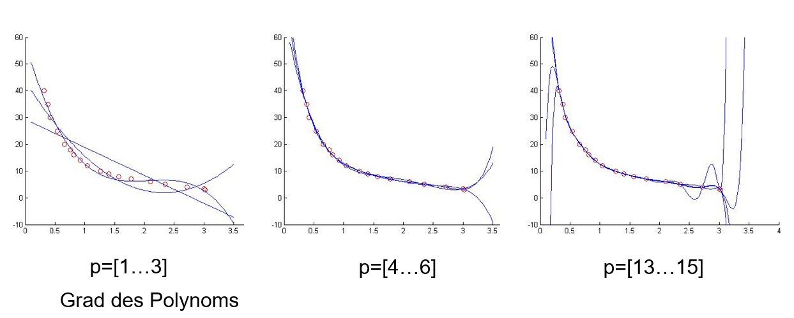
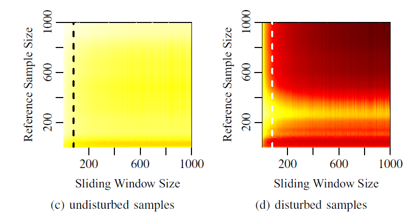

<!--

author:   Sebastian Zug & Georg Jäger
email:    sebastian.zug@informatik.tu-freiberg.de & Georg.Jaeger@informatik.tu-freiberg.de
version:  0.0.1
language: de
narrator: Deutsch Female

import: https://github.com/liascript/CodeRunner
        https://raw.githubusercontent.com/liascript-templates/plantUML/master/README.md

script:   https://cdn.jsdelivr.net/chartist.js/latest/chartist.min.js
          https://d3js.org/d3-random.v2.min.js
          https://d3js.org/d3.v4.min.js
          https://cdn.plot.ly/plotly-latest.min.js
-->

# Sensordatenverarbeitung

Eine interaktive Version des Kurses finden Sie unter [Link](https://liascript.github.io/course/?https://raw.githubusercontent.com/SebastianZug/SoftwareprojektRobotik/master/10_Sensordatenverarbeitung.md)

**Zielstellung der heutigen Veranstaltung**

+ Basiskonzepte der Sensordatenvorverarbeitung
+ Filterung und Identifikation

--------------------------------------------------------------------------------

## Wie weit waren wir gekommen?

... wir generieren ein "rohes" Distanzmessignal und wollen dies weiterverwenden.
Dafür konfigurieren wir eine Verarbeitungskette aus den nachfolgenden Elementen.

<!--
style="width: 100%; max-width: 720px; display: block; margin-left: auto; margin-right: auto;"
-->
```ascii

  Type A                     Type C             Type A                     Type C         
  n Samples +-------------+  n Samples          n Samples +-------------+  m Samples          
       ---->| Trans-      |---->                     ---->| Filterung   |---->
            | formation   |                          ---->|             |
            +-------------+                     (Type B)  +-------------+
                                                n Samples      n ≥ m

  Type A                     Type C             Type A                     Type C         
  n Samples +-------------+  n Samples          n Samples +-------------+  m Samples          
       ---->| Detektion   |---->                     ---->| Feature     |---->
            |             |---->                          | extraction  |
            +-------------+  Fehler                       +-------------+
                             Validität                         n ≥ m
                                                  size(Type A) ≫ size(Type B)
```         

Beispiele für Datenvorverarbeitung

+ Aufbereitung der Daten, Standardisierung
+ zeitliche Anpassung
+ Fehler, Ausreißer und Rauschen erkennen und behandeln,
+ Integration oder Differenzierung
+ Feature-Extraktion (Gesichter auf Positionen, Punktewolken auf Linien, Flächen, Objekte)

## Transformation

    {{0-1}}
********************************************************************************

__Ableitung der eigentlichen Messgröße__

Ein Aspekt der Transformation ist die Abbildung der Messdaten, die ggf. als
Rohdaten des Analog-Digital-Wandlers vorliegen auf die eigentlich intendierte
Messgröße.

Beispiel: Gyroskop MPU9250 mit internem 16bit ADC und variablem Meßbereich.

<!--
style="width: 80%; max-width: 500px; display: block; margin-left: auto; margin-right: auto;"
-->
```ascii
Ausgabe-         Messbereich des Sensors        
wert             2g             4g           8g           16g
65535     --     -  g           -  2g
           -     ^              ^
           -     |              |
40960      -     o              o
32768      -     |              |
           -     |              |
           -     |              |
           -     v              v
    0     --     - ╸g           -  ╸2g
```  

$$a = \frac{Messbereich}{Auflösung} \cdot ADCvalue - \frac{1}{2} Messbereich$$

> Die Gleichung beschreibt einen linearen Zusammenhang zwischen der Messgröße und dem ADC Wert zu tuen.

Beispiel: Analoger Distanzsensor GP2D12 (vgl. Übersicht unter [Link](https://acroname.com/articles/sharp-infrared-ranger-comparison))

<!-- width="50%" -->

*Sensorkennlinie eines GP2Y0A21 Sensors [Link](https://www.robotshop.com/media/files/pdf2/gp2y0a21yk_e.pdf)*

Offenbar benötigen wir hier ein nichtlinerares Approximationsmodell. Die Entsprechenden Funktionen können sehr unterschiedlich gewählt werden ein Beispiel ist die Erzeugung eines Polynoms, dass das intendierte Verhalten abbildet.


********************************************************************************

                 {{1-2}}
********************************************************************************

__Allgemeines Vorgehen bei der Approximation eines Polynoms__

Polynom $$y(x)= a_0 + a_1x + a_ax^2 + ... + a_nx^n$$

1. Definition des Grades des Polynoms (lineare, quadratische, kubische … Relation)

2. Generierung der Messpunkte (m-Stützstellen) – $x_m, y_m$

3. Aufstellen des Gleichungssystems

$$y_0(x_0) = a_0 + a_1x_0 + a_ax_0^2 + ... + a_nx_0^n$$
$$y_1(x_2) = a_0 + a_1x_1 + a_ax_1^2 + ... + a_nx_1^n$$
$$y_2(x_2) = a_0 + a_1x_2 + a_ax_2^2 + ... + a_nx_2^n$$
$$y = Am$$

4. Lösen des Gleichungssystems (Methode der kleinsten Quadrate)

5. Evaluation des Ergebnispolynoms

6. evtl. Neustart

<!-- width="100%" -->
*Abhängigkeit der Abbildung vom Grad des Polynoms *

__Umsetzung im RoboterSystem__

$$y(x)= a_0 + a_1x + a_ax^2 + ... + a_nx^n$$

mit $2\cdot(n-1)$ Multiplikationen und $n$ Additionen. Einen rechnerisch günstigere Implementierung bietet das Horner Schema, das die Exponentialfunktionen zerlegt:

$$y(x)= a_0 + x \cdot (a_1 + x \cdot (... + a_nx^n))$$

damit verbleiben $n$ Multiplikationen und $n$ Additionen.

Für aufwändige mehrdimensionale Kennlinien bietet sich im Unterschied zur
funktionalen Abbildung eine Look-Up-Table an, die die Daten in Form eines Arrays oder Vektors speichert.

```c LookUpTable
static const uint8_t lookup[256] =
{0,0,0,0 … 20,23,26,30,31,30,28,-..,4,4,4,4,4,3,3,3,…0,0,0};
distance= lookup[ADC_output]
```

Welche Vor- und Nachteile sehen Sie für die gegensätzlichen Ansätze?


********************************************************************************

                 {{2-3}}
********************************************************************************

__Koordinatentransformation__

Die Transformation eines Datensatzes aus einem Koordinatensystem in ein anderes betrifft sowohl die Übertragung zwischen unterschiedlichen Darstellungsformen als auch den Wechsel des Bezugsystems.

Gehen wir von einem Laserscan aus. Dieser wurde in Polarkoordinaten erfasst, um aber die Frage zu klären, wie weit dieser von der Frontseite unserer Roboters entfernt ist, müssen wir zunächst die Sample in ein kartesisches Koordinaten übersetzen, dessen Ursprung wir auf die fordere Kante des Roboters legen.

<!--
style="width: 100%; max-width: 500px; display: block; margin-left: auto; margin-right: auto;"
-->
```ascii
         .
       .   .  .    Laserscanner Messungen
      .         . . . .      .  
      .                . . .  . .  . .
     .                       /          .
     .                      /
    .               ^      /
    .               |K    /       Ursprung
  .           ╔═════o-->═/╗    -  karthesisches System
 .          ╭╮║         / ║╭╮  ^
  .         ││╢        /  ╟││  |  d
.           ╰╯║    .-./   ║╰╯  v
              ║   ( L )   ║    -  Ursprung   
              ║    `-'    ║       Polarkoordnaten
            <-------------->      Laserscanner
                    b
```  

Der Laserscanner generiert eine Folge von Paaren $[\rho, r]_k$, die die Winkellage und die zugehörige Entfernung zum Punkt bezeichnet.

Schritt 1: Transformation der der Polarkoordinaten

<!--
style="width: 30%; max-width: 500px; display: block; margin-left: auto; margin-right: auto;"
-->
```ascii    
       0°           
     y ^ ... .  x,y
  \    |    /.
   \-α | α / .
    \  |  /  .
      .-.    .
     ( o )-------> x   
      `-'  
```

$$
\begin{bmatrix}
x_L \\
y_L \\
\end{bmatrix}
=
r \cdot
\begin{bmatrix}
sin(\rho) & \\
cos(\rho) &
\end{bmatrix}
$$

Schritt 2: Transformation in neues Koordinatensystem

$$
\begin{bmatrix}
x_K \\
y_K \\
\end{bmatrix}
=
\begin{bmatrix}
x_L \\
y_L \\
\end{bmatrix}
+
\begin{bmatrix}
0 \\
d \\
\end{bmatrix}
$$


Schritt 3: Filtern der relevanten Datensamples

Wir filtern zunächst erst mal nach den Samples, die unmittelbar vor dem Roboter liegen, für die also gilt $-\frac{b}{2}<=x<=\frac{b}{2}$. Für diese wird dann geprüft, ob ein y-Wert kleiner als eine Schwelle vorliegt.

> **Aufgabe:** Wie müssten wir die Berechnung anpassen, wenn der Laserscanner aus baulichen Gründen um 90 Grad verdreht wäre.

********************************************************************************

                    {{3-4}}
********************************************************************************

Bisher haben wir lediglich Konzepte der translatorischen Transformation betrachtet. Rotationen folgendermaßen abgebildet werden:

$$ x'=x\cos\varphi + y\sin\varphi,$$
$$ y'= -x\sin\varphi + y\cos\varphi,$$
$$ z'=z $$

In der Matrizenschreibweise bedeutet dies

$$\vec{x}' = \begin{pmatrix} \cos\varphi & \sin\varphi & 0 \\ -\sin\varphi & \cos\varphi & 0 \\ 0 & 0 & 1\end{pmatrix} \cdot \vec x = A \vec{x} $$


Fassen wir nun Translation und Rotation zusammen, so können wir eine 2D Koordinatentransformation mit

$$\vec{x}\,'=A \vec{x} + \vec{b}$$

beschreiben.

> Wie muss dieses Konzept erweitert werden, um 3D Szenarien abbilden zu können?

********************************************************************************

## Filterung

> das/der Filter feltrare, "durchseihen"; ursprünglich "durch Filz laufen lassen" zu germanisch felt = "Filz"

Ziel:

+ Reduzierung des Rauschens
+ Löschung von fehlerhaften Werten
+ Konzentration der Daten

Ein Filter bildet die Folge $x_i$ der Sensorwerte auf eine Folge $y_i$ ab. Die Domäne, in der der Filter arbeitet, kann im Zeit oder Frequenzbereich liegen. Als Vorwissen auf seiten des Entwicklers kann die Signalspezifikation oder ein Systemmodell angenommen werden.


### Gleitender Mittelwert

Ein Ansatz für die Glättung sind gleitende Fenster, innerhalb derer die Daten analysiert werden.

> Anders als in (offline) Zeitreihen-Analysen leiten wir den Ausgabewert ausschließlich von den zuvor erfassten Werten ab.  

$$y_k(x_k, x_{k-1}, x_{k-2} ... x_{k-N+1})$$ mit $N$ als Fenstergröße

Zeitreihen würden auch die nachfolgenden Werte berücksichtigen!

$$y_k( ... x_{k+2}, x_{k+1}, x_k, x_{k-1}, x_{k-2} ...)$$

Damit laufen wir den Messdaten zeitlich gesehen hinterher!

Ein gleitender Mittelwert wird häufig als Allheilmittel für die Filterung von Messwerten dargestellt, manipuliert das Signal aber auch entsprechend:

$$y_k = \frac{1}{N}\sum_{i=0}^{i<N} x_{k-i}$$

Im folgenden Beispiel wird ein niederfrequentes Bewegungsmuster mit einem höherfrequenten Störsignal überlagert. Welche Veränderungen erkennen Sie am Ausgabesignal des Filters verglichen mit dem Originalsignal?


```js  -Data.js
const window_size = 3;

var xrange = d3.range(0, 4*Math.PI, 4 * Math.PI/100);
var ideal_values = xrange.map(x => Math.sin(x));
var noise = d3.range(0, 100, 1).map(d3.randomNormal(0, 0.1));
var noisy_values = new Array(xrange.length).fill(0);
for (var i = 0; i <= noise.length; i++){
   noisy_values[i] = ideal_values[i] + noise[i];
}
```
```js  SlidingWindow.js
//Actual filter method (moving average)
function slidingWindow(randoms, window_size) {
    var result = new Array(randoms.length).fill(null);
    for (var i = window_size; i < randoms.length; i++) {
        var window = randoms.slice(i - window_size, i);
        result[i] = window.reduce(function(p,c,i,a){return p + (c/a.length)},0);
    }
    return result;
}
```
```js -Visualize.js
var mean = slidingWindow(noisy_values, window_size);

var layout = {
    height : 300,
    width :  650,
    xaxis: {range: [0, 10]},
    margin: { l: 60, r: 10, b: 0, t: 10, pad: 4},
    showlegend: true,
    legend: { x: 1, xanchor: 'right', y: 1},
    tracetoggle: false
};

var trace1 = {
  x: xrange,
  y: ideal_values,
  name: 'Ideales Signal',
  mode: 'line'
};

var trace2 = {
  x: xrange,
  y: noisy_values,
  name: 'Verrauschtes Signal',
  mode: 'line'
};

var trace3 = {
  x: xrange,
  y: mean,
  name: 'Mittelwertfilter',
  mode: 'line'
};
Plotly.newPlot('chart1', [trace1, trace2, trace3], layout);
```
<script>
  @input(0)
  @input(1)
  @input(2)
</script>

<div id="chart1"></div>


                                        {{1}}
********************************************************************************

__Welche Abwandlungen sind möglich, um die Eigenschaften des Filters zu verbessern?__

1. Gewichteter Mittelwert

Wir gewichten den Einfluß der einzelnen Elemente individuell. Damit können jüngere Anteile einen höheren Einfluß auf die Ausgabe nehmen als ältere.

$$y_k = \sum_{i=0}^{i<N} w_i \cdot x_{k-i}$$ mit

$$\sum_{i=0}^{i<N} w_i = 1$$

2. Exponentielle Glättung

Die Glättung der Mittelwerte selbst steigert die Filtereigenschaften und erhöht die Dynamik des Filters.

$$\overline{y_k} = \alpha \cdot y_{k-1} + (1 - \alpha)\cdot y_k$$

Der Wert von $\alpha$ bestimmt in welchem Maße die "Historie" der Mittelwerte einbezogen wird.

********************************************************************************

### Medianfilter

Einen alternativen Ansatz implementiert der Medianfilter. Hier wird untersucht, welcher Wert den größten Abstand zu allen anderen hat und damit für einen vermuteten Ausreißer steht.

$$\sum_{i=1}^{N}{\|\vec{x}_\text{VM}-\vec{x}_i\|_p} \leq \sum_{i=1}^{N}{\|\vec{x}_j-\vec{x}_i\|_p}$$
$$ \vec{x}_\text{VM} = \arg\min_{\vec{x}_j \in X} \sum_{i=1}^{N}{\|\vec{x}_j-\vec{x}_i\|_p} $$

Dabei stellt sich die Frage, wie viele

Für einen eindimensionalen Wert wird für den Medianfilter eine Fenstergröße definiert und deren mittlerer Wert als Ausgabe übernommen.

```js  -GenerateData.js
const window_size = 3;
var xrange = d3.range(0, 4*Math.PI, 4 * Math.PI/100);
var ideal_values = xrange.map(x => Math.sin(x));
var noise = d3.range(0, 100, 1).map(d3.randomNormal(0, 0.1));
var noisy_values = new Array(xrange.length).fill(0);
for (var i = 0; i <= noise.length; i++){
  //if (noise[i] > 0.2) // (Simulate outlier failure model instead of Gaussian noise)
  noisy_values[i] = ideal_values[i] + noise[i];
  //else
  //noisy_values[i] = ideal_values[i];
}
```
```js  +MedianFilter.js
function medianFilter(inputs, window_size) {
  var result = new Array(inputs.length).fill(null);
  for (var i = window_size-1; i < inputs.length; i++) {
      var window = inputs.slice(i - window_size + 1, i + 1);
      var sorted = window.sort((a, b) => a - b);
      var half = Math.floor(window_size / 2);
      if (window_size % 2)
         result[i] = sorted[half];
      else
         result[i] = (sorted[half - 1] + sorted[half]) / 2.0;
  }
  return result;
}
```
```js  -Visualize.js
var median = medianFilter(noisy_values, window_size);

var layout = {
    height : 300,
    width :  650,
    xaxis: {range: [0, 10]},
    margin: { l: 60, r: 10, b: 0, t: 10, pad: 4},
    showlegend: true,
    legend: { x: 1, xanchor: 'right', y: 1},
    tracetoggle: false
};

var trace1 = {
  x: xrange,
  y: ideal_values,
  name: 'Ideales Signal',
  mode: 'line'
};

var trace2 = {
  x: xrange,
  y: noisy_values,
  name: 'Verrauschtes Signal',
  mode: 'line'
};

var trace3 = {
  x: xrange,
  y: median,
  name: 'Medianfilter',
  mode: 'line'
};
Plotly.newPlot('chart1', [trace1, trace2, trace3], layout);
```
<script>
  @input(0)
  @input(1)
  @input(2)
</script>

<div id="chart1"></div>

Der Median-Filter ist ein nichtlinearer Filter, er entfernt Ausreißer und wirkt damit als Filter und Detektor!

Die nachfolgende Abbildung zeigt ein Beispiel für die Anwendung des Medianfilters im 2d Raum. Laserscannerdaten werden hier geglättet. Die Punkte werden in Abhängigkeit von den Abständen zwischeneinander.


<!-- width="100%" -->
*Anwendung des Medianfilters auf Laserscans*

## Detektion

Die Detektion zielt auf die Erfassung von Anomalien im Signalverlauf. Dabei werden Modelle des Signalverlaufes oder der Störung genutzt, um

* Ausreißer (single sample)
* Level shifts (mehrere aufeinander folgende Samples)
* veränderliches Noiseverhalten
* ...

zu erfassen. Auch hier lassen sich sehr unterschiedliche Ansätze implementieren, das Spektrum der Lösungen soll anhand von zwei Lösungsansätze diskutiert werden.

                               {{1}}
******************************************************************************
Begonnen werden soll mit einem einfachen Schwellwerttest, der die Änderung zwischen zwei Messungen berücksichtigt. Welches Parameter des Signals sind für den Erfolg dieser Methode maßgeblich bestimmend?

```js -GenerateData.js
var sampleCount = 100;
function generateStep(xrange, basis, step, step_index){
  var result = new Array(xrange.length).fill(basis);
  return result.fill(step, step_index);
}
var xrange = d3.range(0, sampleCount, 1);
var ideal_values = generateStep(xrange, 3.5, 1, 50);
var noise = d3.range(0, sampleCount, 1).map(d3.randomNormal(0, 0.1));
var noisy_values = new Array(xrange.length).fill(0);
for (var i = 0; i <= noise.length; i++){
   noisy_values[i] = ideal_values[i] + noise[i];
}
```
```js +Processing.js
var diff = new Array(xrange.length).fill(0);
for (var i = 1; i <= noise.length; i++){
   diff[i] = noisy_values[i-1] - noisy_values[i];
}
```
```js -Visualization.js
var layout = {
    height : 300,
    width :  650,
    xaxis: {range: [0, sampleCount]},
    margin: { l: 60, r: 10, b: 0, t: 10, pad: 4},
    showlegend: true,
    legend: { x: 1, xanchor: 'right', y: 1},
    tracetoggle: false
};

var trace1 = {
  x: xrange,
  y: ideal_values,
  name: 'Ideal step function',
  mode: 'line'
};

var trace2 = {
  x: xrange,
  y: noisy_values,
  name: 'Noisy measurements',
  mode: 'markers'
};
Plotly.newPlot('rawData', [trace1, trace2], layout);

var trace1 = {
  x: xrange,
  y: diff,
  name: 'Derivation of the signal',
  mode: 'line'
};
Plotly.newPlot('derivedData', [trace1], layout);

```
<script>
  @input(0)
  @input(1)
  @input(2)
</script>

<div id="rawData"></div>
<div id="derivedData"></div>

Allein aus dem Rauschen ergibt sich bei dieser Konfiguration $\sigma = 0.1$ eine stochastisch mögliche Änderung von $6 \cdot \sigma = 0.6$. Für alle Werte oberhalb dieser Schranke kann mit an Sicherheit grenzender Wahrscheinlichkeit angenommen werden, dass eine Verschiebung des eigentlichen Messgröße vorliegt. Welche Verfeinerung sehen Sie für diesen Ansatz?

******************************************************************************

                                {{2}}
******************************************************************************
Unter der Berücksichtigung des gefilterten Signalverlaufes, der zum Beispiel mit einem Mittelwert-Filter erzeugt wurde, können wir aber auch die Erklärbarkeit der Messungen untersuchen.

```js -GenerateData.js
var sampleCount = 100;

function generateStep(xrange, basis, step, step_index){
  var result = new Array(xrange.length).fill(basis);
  return result.fill(step, step_index);
}

var xrange = d3.range(0, sampleCount, 1);
var ideal_values = generateStep(xrange, 0.5, 1, 50);
var noise = d3.range(0, sampleCount, 1).map(d3.randomNormal(0, 0.1));
var noisy_values = new Array(xrange.length).fill(0);
for (var i = 0; i <= noise.length; i++){
   noisy_values[i] = ideal_values[i] + noise[i];
}
```
```js +Processing.js
function slidingAverage(randoms, window_size) {
    var result = new Array(randoms.length).fill(null);
    for (var i = window_size; i < randoms.length; i++) {
        var window = randoms.slice(i - window_size, i);
        result[i] = window.reduce(function(p,c,i,a){return p + (c/a.length)},0);
    }
    return result;
}

const window_size = 5;
var mean = slidingAverage(noisy_values, window_size);

var diff = new Array(xrange.length).fill(0);
for (var i = 1; i <= noise.length; i++){
   diff[i] = mean[i] - noisy_values[i];
}
```
```js -Visualization
var layout = {
    height : 300,
    width :  650,
    xaxis: {range: [0, sampleCount]},
    margin: { l: 60, r: 10, b: 0, t: 10, pad: 4},
    showlegend: true,
    legend: { x: 1, xanchor: 'right', y: 1},
    tracetoggle: false
};

var trace1 = {
  x: xrange,
  y: ideal_values,
  name: 'Ideal step function',
  mode: 'line'
};

var trace2 = {
  x: xrange,
  y: noisy_values,
  name: 'Noisy measurements',
  mode: 'markers'
};

var trace3 = {
  x: xrange,
  y: mean,
  name: 'Filtered measurements',
  mode: 'line'
};

Plotly.newPlot('rawDataII', [trace1, trace2, trace3], layout);

var trace1 = {
  x: xrange,
  y: diff,
  name: 'Difference between filtered and original signal',
  mode: 'line'
};
Plotly.newPlot('derivedDataII', [trace1], layout);
```
<script>
  @input(0)
  @input(1)
  @input(2)
</script>


<div id="rawDataII" width="100%"></div>
<div id="derivedDataII"width="100%"></div>

Im Ergebnis zeigt sich eine größere Robustheit des Detektors, da nunmehr nicht mehr die gesamte Streubreite des Rauschens berücksichtigt zu werden ist.

******************************************************************************

                         {{3}}
******************************************************************************
Alternative Filterkonzepte erweitern den Fensteransatz und bewerten die Verteilung der darin enthaltenen Samples. Dabei wird die Verteilung eines Referenzdatensatz mit der jeweiligen Fehlersituation verglichen und die Wahrscheinlichkeit bestimmt, dass die beiden Verteilungen zur gleichen Grundgesamtheit gehören.

Im folgenden soll dies Anhand der Detektion von

<!-- width="100%" -->
*Störabhängigkeit eines infrarot-lichtbasierten Distanzsensors in Bezug auf externe Beleuchtung *

<!-- width="80%" -->
*Konfiguration der Größe des Referenzsamples und des Sliding Windows und deren Auswirkung auf die korrekte Klassifikation (Kolmogoroff-Smirnow) (links Referenzdatensatz, rechts gestörte Messung jeweils mit unterschiedlicher Zahl von Samples)*

<!-- width="80%" -->
*Zeitliches Verhalten verschiedener Tests - Fligner (links), Mann-Whitney U (rechts))*

******************************************************************************

## Abstraktion

Während der Abstraktion werden die Rohdaten im Hinblick auf relevante Aspekte segmentiert und vorverarbeitet. Beispiele dafür sind die

+ Extraktion von höherabstrakten Linien, Ebenen, usw. aus Laserscans oder Punktwolken oder Gesichtern in Bildern
+ Kategorisierung von Situationen (Form des Untergrundes anhand von Beschleunigungsdaten, Einparkhilfen beim Fahrzeug (grün, gelb, rot))
+ Identifikation von Anomalien
+ ...

Das ganze fügt sich dann ein in die allgemeine Verarbeitungskette von Daten, die
die Abbildung von Rohdaten auf Informationen, Features und letztendlich auf Entscheidungen realisiert. Dabei beruht dieser Fluß nicht auf den Daten eines
einzigen Sensors sondern kombiniert verschiedene (multimodale) Inputs.

<!--
style="width: 100%; max-width: 900px; display: block; margin-left: auto; margin-right: auto;"
-->
```ascii    
             Verständnis                     Verständnis            Verständnis
  Rohdaten -----------------> Informationen --------------> Wissen ------------------> Weisheit
             von Relationen                  von Mustern            von Prinzipien
```

Eine knappe Einführung in die Grundlagen der Datenfusion folgt in der kommenden Veranstaltung, eine Vertiefung im Sommersemester.

## Anwendung einer Rohdatenverarbeitung in ROS

> __Achtung:__ Die nachfolgende Erläuterung bezieht sich auf die ROS1 Implementierung. Unter ROS2 ist die Implementierung der entsprechenden Pakete noch nicht abgeschlosssen.

Wie werden Laserscanner-Informationen unter ROS abgebildet? Schauen wir uns dies an einem realen Beispiel an. Ein zugehöriges Bag-File finden Sie im `data` Ordner dieses Kurses.

<!--  style="width:60%; max-width:300px; min-width:600px"-->

Eine Kurz-Dokumentation einer häufig genutzen Scanners vom Typ Hokuyo URG04 finden Sie unter [Link](https://www.robotshop.com/media/files/pdf/hokuyo-urg-04lx-ug01-specifications.pdf)

### Transformationen mit tf

                  {{0-1}}
********************************************************************************

Die Handhabung der unterschiedlichen Koordinatensystem in ROS1 ist über das `tf`-verteitle System gelöst.

<!--  style="width:60%; max-width:300px; min-width:600px"-->

_Darstellung verschiedener Koordinatensysteme innerhalb eines Roboterszenarios (Autor Bo im ROS Forum unter [answers.ros.org](https://answers.ros.org/question/265846/how-to-build-tf-topic-frame-tree-for-hector_slam-or-gmapping/))_

`tf` spannt einen Baum aus Transformationen auf, innerhalb derer diese automatisiert aufgelöst werden können. Grundlage dieser Lösung ist die Integration einer Frame-ID in jeden Datensatz. Jede `sensor_msgs` enthält entsprechend einen header, der folgendermaßen strukturiert ist.

```text  std_msgs/Header Message
# sequence ID: consecutively increasing ID
uint32 seq
#Two-integer timestamp that is expressed as:
# * stamp.sec: seconds (stamp_secs) since epoch (in Python the variable is called 'secs')
# * stamp.nsec: nanoseconds since stamp_secs (in Python the variable is called 'nsecs')
# time-handling sugar is provided by the client library
time stamp
#Frame this data is associated with
string frame_id
```
********************************************************************************

                   {{1-3}}
********************************************************************************

Dabei werden die Relationen zwischen den Koordinatensystemen über eigene Publisher und Listener ausgetauscht. Am Ende bildet jede Applikation eine Baumstruktur aus den Transformationen zwischen den Frames. Isolierte Frames können entsprechend nicht in Verbindung mit anderen gesetzt werden.

<!--  style="width:60%; max-width:300px; min-width:600px"-->

_Beispielhafte Darstellung des tf-Trees eines ROS-Turtle Szenarios, das zwei Turtle umfasst. Die individuellen Posen werden jeweils gegenüber den globalen `world`-Frame beschrieben._

********************************************************************************

                   {{2-3}}
********************************************************************************

Nehmen wir nun an, dass wir die Positionsinformation von `turtle2` im Koordindatensystem von `turtle1` darstellen wollen, um zum Beispiel eine Richtungsangabe zu bestimmen. Dafür subscrbieren wir uns für deren

```cpp    MessageTfTransform.cpp
#include "ros/ros.h"
#include "tf/transform_listener.h"
#include "tf/message_filter.h"
#include "message_filters/subscriber.h"

class PoseDrawer
{
public:
  PoseDrawer() : tf_(),  target_frame_("turtle1")
  {
    point_sub_.subscribe(n_, "turtle_point_stamped", 10);
    tf_filter_ = new tf::MessageFilter<geometry_msgs::PointStamped>(point_sub_, tf_, target_frame_, 10);
    tf_filter_->registerCallback( boost::bind(&PoseDrawer::msgCallback, this, _1) );
  } ;

private:
  message_filters::Subscriber<geometry_msgs::PointStamped> point_sub_;
  tf::TransformListener tf_;
  tf::MessageFilter<geometry_msgs::PointStamped> * tf_filter_;
  ros::NodeHandle n_;
  std::string target_frame_;

  //  Callback to register with tf::MessageFilter to be called when transforms are available
  void msgCallback(const boost::shared_ptr<const geometry_msgs::PointStamped>& point_ptr)
  {
    geometry_msgs::PointStamped point_out;
    try
    {
      tf_.transformPoint(target_frame_, *point_ptr, point_out);

      printf("point of turtle 2 in frame of turtle 1 Position(x:%f y:%f z:%f)\n",
             point_out.point.x,
             point_out.point.y,
             point_out.point.z);
    }
    catch (tf::TransformException &ex)
    {
      printf ("Failure %s\n", ex.what()); //Print exception which was caught
    }
  };
};

int main(int argc, char ** argv)
{
  ros::init(argc, argv, "pose_drawer"); //Init ROS
  PoseDrawer pd; //Construct class
  ros::spin(); // Run until interupted
};
```

```
point of turtle 2 in frame of turtle 1 Position(x:-0.603264 y:4.276489 z:0.000000)
point of turtle 2 in frame of turtle 1 Position(x:-0.598923 y:4.291888 z:0.000000)
point of turtle 2 in frame of turtle 1 Position(x:-0.594828 y:4.307356 z:0.000000)
point of turtle 2 in frame of turtle 1 Position(x:-0.590981 y:4.322886 z:0.000000)
```

Die aktuell größte Einschränkung des ROS tf-Konzeptes ist das Fehlen einer Unsicherheitsdarstellung für die Relationen.

********************************************************************************

### Anwendung laser-filters

Der primäre Inhalt des `laser_filters`-Pakets [(Link)](http://wiki.ros.org/laser_filters) besteht aus einer Reihe von Filtern und Transformationsalgorithem für Laserscanner-Rohdaten. Der Anwender konfiguriert dabei die Parameter der Filter in einem Beschreibungsfile, die eigentliche Ausführung übernehmen zwei Knoten, die dann mehrere Filter nacheinander ausführen. Der  `scan_to_scan_filter_chain` Knoten wendet eine Reihe von Filtern auf einen `sensor_msgs/LaserScan` an. Die `scan_to_cloud_filter_chain` implementiert zunächst eine Reihe von Filtern auf einen `sensor_msgs/LaserScan` an, wandelt ihn in einen `sensor_msgs/PointCloud` um und wendet dann eine Reihe von Filtern auf den `sensor_msgs/PointCloud` an.

<!--
style="width: 80%; max-width: 900px; display: block; margin-left: auto; margin-right: auto;"
-->
```ascii   
        my_laser_config.yaml:
        +-------------------------+
        | scan_filter_chain:     \|
        |   - name: shadows       |
        |       type ...          |
        |       ...               |
        +-------------------------+         
                     |
                     v
        +------------------------------------------------------------------------------+
        | Parameter server                                                             |
        +------------------------------------------------------------------------------+
                                 |            |           |
        scan_to_cloud_chain      v            v           v
        ╔══════════════════════════════════════════════════════════════════════════════╗               
        ║                        +---------------------------------------------------+ ║               
        ║                        | filter_chain mit sensor_msgs::LaserScan           | ║               
        ║  +-----------------+   |  +----------------+             +---------------+ | ║               
  scan  ║  |                 |   |  |                |             |               | | ║ scan_filtered
    ------>|tf-Messagefilter |----->| Scan filter 1  |--> .... --> |Scan filter N  | |------>          
        ║  |                 |   |  |                |             |               | | ║               
        ║  +-----------------+   |  +----------------+             +---------------+ | ║               
        ║         ^              +---------------------------------------------------+ ║               
tf data ║         |                                                         |          ║               
    --------------.    .----------------------------------------------------.          ║               
        ║         |    |         +---------------------------------------------------+ ║               
        ║         v    v         | filter_chain mit sensor_msgs::PointCloud          | ║               
        ║  +-----------------+   |  +----------------+             +---------------+ | ║               
        ║  |                 |   |  |                |             |               | | ║ cloud_filtered
        ║  |LaserProjection  |----->| Cloud filter 1 |             |Cloud filter N | |------>          
        ║  |                 |   |  |                |             |               | | ║    
        ║  +-----------------+   |  +----------------+             +---------------+ | ║               
        ║                        +---------------------------------------------------+ ║   
        ╚══════════════════════════════════════════════════════════════════════════════╝
```

```text  Examplary_laser_filter_config.yaml
scan_filter_chain:
- name: shadows
  type: laser_filters/ScanShadowsFilter
  params:
    min_angle: 10
    max_angle: 170
    neighbors: 20
    window: 1
- name: dark_shadows
  type: laser_filters/LaserScanIntensityFilter
  params:
    lower_threshold: 100
    upper_threshold: 10000
    disp_histogram: 0
```

Dabei sind folgende Filtertypen in das Konzept eingebettet:

| Bezeichnung                           | Bedeutung                                                                                                             |
| ------------------------------------- | --------------------------------------------------------------------------------------------------------------------- |
| `ScanShadowsFilter`                   | eleminiert Geisterreflexionen beim Scannen von Objektkanten.                                                          |
| `InterpolationFilter`                 | interpoliert Punkte für ungültige Messungen                                                                           |
| `LaserScanIntensityFilter`            | filtered anhand der Intensität des reflektierten Laserimpulses                                                        |
| `LaserScanRangeFilter`                | beschränkt die Reichweite                                                                                             |
| `LaserScanAngularBoundsFilter`        | entfernt Punkte, die außerhalb bestimmter Winkelgrenzen liegen, indem der minimale und maximale Winkel geändert wird. |
| `LaserScanAngularBoundsFilterInPlace` | überschreibt Werte außerhalb der angegebenen Winkellage mit einem Distanzwert außerhalb der maximalen Reichweite                                                                                                                      |
| `LaserScanBoxFilter`                  | selektiert Messungen, die in einem bestimmten kartesischen Raum liegen.                                               |


## Aufgabe der Woche

+ Implementieren Sie eine exponentielle Glättung für den Durchschnitt im Beispiel zu gleitenden Mittelwert.
+ Nutzen Sie Bag-Files, die Sie zum Beispiel unter folgendem [Link](https://code.google.com/archive/p/tu-darmstadt-ros-pkg/downloads) finden, um eine Toolchain für die Filterung von Messdaten zu implementieren. Experimentieren Sie mit den verschiedenen Filtern.
