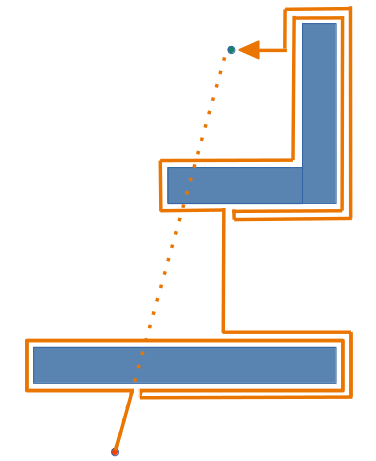
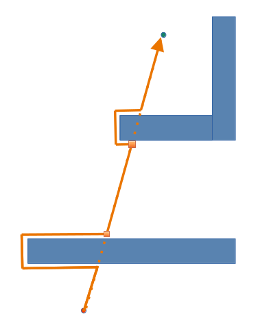
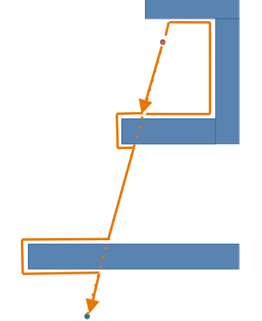
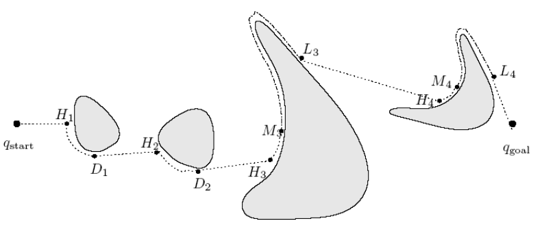
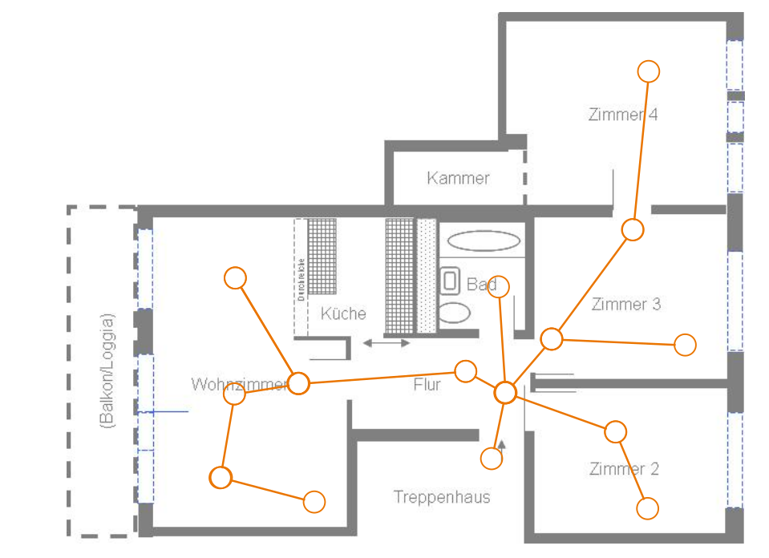

<!--

author:   Sebastian Zug & Georg Jäger & Claude.ai
email:    sebastian.zug@informatik.tu-freiberg.de & Georg.Jaeger@informatik.tu-freiberg.de
version:  0.0.1
language: de
comment:  Diese Vorlesung behandelt Kartenformate, Pfadplanungsalgorithmen und den ROS2 Navigation Stack.
narrator: Deutsch Female
attribute: thx

import:   https://github.com/liascript/CodeRunner
          https://raw.githubusercontent.com/TUBAF-IfI-LiaScript/VL_SoftwareprojektRobotik/refs/heads/master/config.md

-->

[](https://liascript.github.io/course/?https://raw.githubusercontent.com/TUBAF-IfI-LiaScript/VL_SoftwareprojektRobotik/refs/heads/master/11_Navigation/11_Navigation.md)

# Navigation und Pfadplanung

<!-- data-type="none" -->
| Parameter            | Kursinformationen                                                                                                       |
| -------------------- | ----------------------------------------------------------------------------------------------------------------------- |
| **Veranstaltung:**   | @config.lecture                                                                                                         |
| **Semester**         | @config.semester                                                                                                        |
| **Hochschule:**      | `Technische Universität Freiberg`                                                                                       |
| **Inhalte:**         | `Kartenformate, Pfadplanung, ROS2 Navigation Stack`                                                                    |
| **Link auf GitHub:** | https://github.com/TUBAF-IfI-LiaScript/VL_SoftwareprojektRobotik/blob/master/11_Navigation/11_Navigation.md            |
| **Autoren**          | @author                                                                                                                 |


--------------------------------------------------------------------------------

**Zielstellung der heutigen Veranstaltung**

+ Motivation der Pfadplanung über reaktive Navigationsansätze (Bug-Algorithmen)
+ Einführung in Kartenformate: Grid-basiert, topologisch, Costmaps
+ Grundlegende Pfadplanungsalgorithmen: Breitensuche, Dijkstra, A*
+ Überblick über den ROS2 Navigation Stack (Nav2)

--------------------------------------------------------------------------------

## Einordnung

In der letzten Vorlesung haben wir Kinematik und Regelung behandelt -- der Roboter kann sich nun gezielt bewegen. Aber wohin? Heute schließen wir den Kreis: Von der Umgebungsrepräsentation über die Pfadplanung bis zur Integration im Navigation Stack.

<!--
style="width: 70%; max-width: 720px; display: block; margin-left: auto; margin-right: auto;"
-->
```ascii
                       +----------------------+
                       | Handlungsplanung     |   Strategie
                       +----------------------+
                                ^ ^ ^
                                | | |
                                v v v
                       +----------------------+
                       | Ausführung           |   Taktik     <--- Heute
                       +----------------------+
                                ^ ^ ^
                                | | |
                                v v v
                       +----------------------+
                       | Reaktive Überwachung |   Ausführung  <--- VL 10
                       +----------------------+
 Sensordatenerfassung    ^ ^ ^          | | |
 Aktuatoroperationen     | | |          v v v
                       .-----------------------.
                       | Umgebung              |
                       .-----------------------.                               .
```

Heute bewegen wir uns von der Ausführungsebene zur taktischen Ebene: Wie planen wir kollisionsfreie Wege durch eine bekannte oder teilweise bekannte Umgebung?

<!--
style="width: 70%; max-width: 720px; display: block; margin-left: auto; margin-right: auto;"
-->
```ascii

       +----------+        +----------+
     +-+--------+ |     +--+--------+ |     +----------+     +----------+
+--> |Sensorik  +-+ --> | Filterung +-+ --> | Planung  | --> | Regelung | ---+
|    +----------+       +-----------+       +----------+     +----------+    |
|         VL01-07           VL08-09            VL11             VL10         |
|                                                                            |
|                              .---------------------.                       |
+----------------------------- | Umgebung            | <---------------------+
                               .---------------------.
```

--------------------------------------------------------------------------------

## Definitionen

Bevor wir in die konkreten Algorithmen einsteigen, klären wir einige zentrale Begriffe:

> **Umgebung** ... umfasst die relevanten Aspekte des Operationsgebietes. Dabei ist wichtig, ob wir von einer statischen oder einer dynamischen Umgebung ausgehen.

> **Navigation** ... umfasst die Prozesse, die für die Bewegungsplanung und -durchführung eines Roboters notwendig sind:
>
> - Selbstlokalisierung -- _Wo bin ich?_
> - ggf. Kartenerstellung (SLAM)
> - Wegplanung -- _Wie gelange ich zum Ziel?_

> **Karte** ... ist eine abstrakte Repräsentation der Umgebung, die zur Beschreibung der eigenen Position und des Zieles geeignet ist. Dabei wird zwischen Grid- und Graph-basierten Repräsentationen unterschieden.

> **Wegplanung** ... umfasst die Identifikation kollisionsfreier Wege von einer Start- zu einer Zielposition. Im Fall alternativer Pfade wird die Auswahl anhand gewisser Optimalitätskriterien definiert.

--------------------------------------------------------------------------------

## Reaktive Navigation

Beginnen wir mit einer grundlegenden Frage: Ist Navigation ohne Karte überhaupt möglich?

> Sofern keine Karte genutzt wird, erfolgt die Navigation allein anhand reaktiver Verhaltensweisen. Der Roboter trifft Entscheidungen ausschließlich auf Basis seiner aktuellen Sensorinformationen.

> Analog Move-To-Pose Controller [(VL 10)](https://liascript.github.io/course/?https://raw.githubusercontent.com/TUBAF-IfI-LiaScript/VL_SoftwareprojektRobotik/refs/heads/master/10_Kinematik_Regelung/10_Kinematik_Regelung.md#16)

### Braitenberg Vehicle

 und 2b (Aggression): Gleichseitige vs. gekreuzte Sensor-Motor-Verbindungen erzeugen grundlegend verschiedene Verhaltensweisen. (Autor: Thomas Schoch, Lizenz: [CC BY-SA 3.0](https://creativecommons.org/licenses/by-sa/3.0/))")<!--width="50%" -->
Ein klassisches Beispiel sind die **Braitenberg Vehicles**, die mit einfachen Sensor-Aktuator-Kopplungen erstaunlich komplexe Verhaltensweisen zeigen. Dabei unterscheiden sich die Fahrzeuge durch die Art der Verbindung zwischen Sensoren und Motoren und drücken damit unterschiedliche "Emotionen" aus.

> **Aufgabe:** Identifizieren Sie in den Braitenberg Vehicles die regelungstechnischen Konzepte aus VL 10 (offener vs. geschlossener Wirkungskreis).

!?[Braitenberg Vehicles](https://www.youtube.com/watch?v=9WvTXxPwaY0)

### Bug-Algorithmen

                              {{0-1}}
***********************************************************************

Die **Bug-Algorithmen** sind eine Familie reaktiver Navigationsverfahren, die auf zwei Grundannahmen basieren:

1. Die **Richtung zum Ziel** ist jederzeit bekannt (z.B. über einen Kompass)
2. In einigen Varianten wird davon ausgegangen, dass der Roboter die **Abstände Ziel** erkennen kann (z.B. Versendung von Signalen und Messung der Laufzeit)
2. Der Roboter kann **Hinderniskonturen folgen** (z.B. über Berührungssensoren oder Abstandsmessung)

Diese Algorithmen demonstrieren eindrücklich, welche Probleme ohne eine Umgebungsrepräsentation auftreten -- und motivieren damit die Einführung von Karten.

> **Konsequenz:** Die visuellen Darstellung kennt also der Roboter nicht! Er hat nur die Informationen über die Richtung zum Ziel und die Hindernisse, die er berührt oder misst. Alle Entscheidungen basieren auf diesen lokalen Informationen, ohne Kenntnis der globalen Umgebung.

***********************************************************************

                              {{1-2}}
***********************************************************************

**Bug 0 -- Der naive Ansatz**

<!--width="20%" -->

Algorithmus:

1. Bewege dich in gerader Linie Richtung Ziel
2. Wenn ein Hindernis im Weg ist, folge dessen Kontur
3. Sobald die ursprüngliche Verbindungslinie erreicht wird, verlasse die Kontur und bewege dich weiter Richtung Ziel

> **Problem:** Bug 0 kann in bestimmten Konstellationen scheitern! Stellen Sie sich ein C-förmiges Hindernis vor, dessen Öffnung vom Ziel weg zeigt. Der Roboter würde endlos die Kontur umkreisen.

***********************************************************************

                              {{2-3}}
***********************************************************************

**Bug 1 -- Vollständige Umrundung**

<!--width="20%" -->

Algorithmus:

1. Bewege dich in gerader Linie Richtung Ziel
2. Wenn ein Hindernis im Weg ist, **umrunde es vollständig**
3. Bestimme den Punkt auf der Kontur, der dem Ziel am nächsten liegt
4. Bewege dich zu diesem Punkt und verlasse die Kontur Richtung Ziel

**Komplexitätsabschätzung:** Die kürzeste Trajektorie wird durch die Länge $D$ der direkten Verbindungslinie beschrieben. Die obere Schranke ergibt sich durch die Konturen $K_i$ der Hindernisse, die im schlimmsten Fall jeweils $1{,}5$-mal umrundet werden:

$$
L_{Bug1} \leq D + 1{,}5 \cdot \sum_i K_i
$$

> **Vorteil:** Bug 1 ist **vollständig** -- wenn ein Pfad existiert, wird er gefunden. **Nachteil:** Die Umrundung jedes Hindernisses ist zeitaufwändig.

***********************************************************************

                              {{3-4}}
***********************************************************************

**Bug 2 -- Kompromiss**

<!--width="20%" -->

Algorithmus:

1. Bewege dich entlang der Verbindungslinie Start-Ziel
2. Wenn ein Hindernis im Weg ist, folge der Kontur
3. Sobald die Verbindungslinie an einem Punkt geschnitten wird, der **näher am Ziel** liegt als der Auftreffpunkt, verlasse die Kontur

$$
L_{Bug2} \leq D + \frac{1}{2} \cdot \sum_i K_i
$$

> Bug 2 ist im Durchschnitt effizienter als Bug 1, kann aber bei komplexen, verschachtelten Konturen problematisch werden.

<!--width="20%" -->

***********************************************************************

                              {{4-5}}
***********************************************************************

**Vergleich und offene Fragen**



| Algorithmus | Vollständig | Worst Case | Strategie |
|-------------|-------------|------------|-----------|
| Bug 0       | Nein        | $\infty$   | Direkt + Konturfolge |
| Bug 1       | Ja          | $D + 1{,}5 \sum K_i$ | Vollständige Umrundung |
| Bug 2       | Ja          | $D + \frac{1}{2} \sum K_i$ | Konturfolge bis Linienschnitt |

wobei $D$ die Länge der direkten Verbindungslinie Start–Ziel und $K_i$ die Konturlänge des $i$-ten Hindernisses bezeichnet.

Offene Herausforderungen bei reaktiver Navigation:

+ In welche Richtung soll die Kontur umrundet werden?
+ Wie werden dynamische Hindernisse behandelt?
+ Wie geht man mit Sensorunsicherheiten um?

> **Fazit:** Reaktive Navigation ist für einfache Szenarien ausreichend, stößt aber schnell an Grenzen. Für komplexere Umgebungen benötigen wir eine **Kartenrepräsentation** und darauf aufbauende **Planungsalgorithmen**.

***********************************************************************

--------------------------------------------------------------------------------

## Kartenformate

Für die kartengebundene Pfadplanung ist die Frage der Umgebungsrepräsentation entscheidend. Die Wahl des Kartenformats beeinflusst direkt die Möglichkeiten und die Effizienz der Pfadplanung.

### Rasterbasierte Karten (Occupancy Grids)

Eine Rasterkarte unterteilt die Umgebung in gleichförmige Zellen und speichert für jede Zelle die **Belegungswahrscheinlichkeit** $P(occupied)$:

- $P = 0.0$: frei
- $P = 1.0$: belegt
- $P = 0.5$: unbekannt


**Vorteile:**

- Einfache Datenstruktur (2D-Array)
- Direkte Integration von Sensordaten (Lidar, Sonar)
- Standardformat in ROS/Nav2 (`nav_msgs/OccupancyGrid`)

**Nachteile:**

- Hoher Speicherbedarf bei großen Umgebungen und feiner Auflösung
- Feste Auflösung -- entweder zu grob oder zu detailliert
- Speicherbedarf skaliert quadratisch: $O(n^2)$ bei $n \times n$ Zellen

**ROS2-Format:** Das `nav_msgs/OccupancyGrid`-Message enthält:

```
# nav_msgs/OccupancyGrid
Header header
MapMetaData info        # Metadaten der Karte (siehe unten)
int8[] data             # Belegungswerte: -1 (unbekannt), 0-100 (frei..belegt)
```

```
# nav_msgs/MapMetaData
time map_load_time      # Zeitpunkt des Ladens der Karte
float32 resolution      # Auflösung in Metern/Zelle
uint32 width            # Breite der Karte in Zellen
uint32 height           # Höhe der Karte in Zellen
geometry_msgs/Pose origin  # Pose der Zelle (0,0) in der Welt
```

### Adaptive Auflösung: Quadtrees

Quadtrees lösen das Problem der festen Auflösung, indem sie den Raum **adaptiv** unterteilen. Nur in Bereichen mit relevanten Details (z.B. Hinderniskanten) wird die Auflösung erhöht.


**Prinzip:** Jede Zelle wird rekursiv in vier Unterzellen aufgeteilt, solange die Zelle inhomogen ist (sowohl freie als auch belegte Bereiche enthält).

**Vorteile:**

- Deutlich geringerer Speicherbedarf in offenen Bereichen
- Hohe Auflösung nur dort, wo sie benötigt wird
- Effiziente Nachbarschaftssuche

> Eine dreidimensionale Erweiterung sind **Octrees**, die in ROS2 durch das Paket [OctoMap](https://octomap.github.io/) implementiert sind und 3D-Punktwolken effizient repräsentieren können.

### Costmaps -- Planungskarten in Nav2

In der Praxis reicht eine binäre Unterscheidung "frei/belegt" nicht aus. Der Nav2-Stack in ROS2 verwendet **Costmaps**, die jeder Zelle einen Kostenwert zuweisen:

<!-- data-type="none" -->
| Wert | Bedeutung |
|------|-----------|
| 0 | Freier Raum |
| 1--252 | Kostenwerte (steigende Kosten nahe Hindernissen) |
| 253 | Eingeschriebener Kreis (Inscribed Cost) |
| 254 | Lethal -- Hindernis |
| 255 | Unbekannt |

Nav2 unterscheidet zwei Costmap-Schichten:

**Global Costmap:** Vollständige Karte der Umgebung für die globale Pfadplanung. Wird aus der statischen Karte und den kumulierten Sensordaten aufgebaut.

**Local Costmap:** Rollierendes Fenster um den Roboter für die lokale Hindernisvermeidung. Wird kontinuierlich aus aktuellen Sensordaten aktualisiert.

**Costmap-Layer** können gestapelt werden:

1. **Static Layer** -- aus der SLAM-Karte
2. **Obstacle Layer** -- aktuelle Hindernisse aus Sensordaten
3. **Inflation Layer** -- "Aufblasen" der Hindernisse um den Roboterradius
4. **Voxel Layer** -- 3D-Hindernisse (optional)

> Der **Inflation Layer** ist besonders wichtig: Er sorgt dafür, dass der Pfadplaner einen Sicherheitsabstand zu Hindernissen einhält, indem die Kosten mit zunehmendem Abstand zum Hindernis exponentiell abnehmen.

### Topologische Karten

Topologische Karten abstrahieren die Umgebung als **Graph**: Knoten repräsentieren markante Orte (Landmarken, Kreuzungen, Räume), Kanten repräsentieren navigierbare Verbindungen.



**Vorteile:**

- Sehr kompakte Repräsentation
- Effiziente Pfadplanung mit klassischen Graphenalgorithmen
- Natürliche Beschreibung von Gebäudestrukturen

**Nachteile:**

- Keine metrische Genauigkeit innerhalb der Kanten
- Schwieriger automatisch zu erstellen
- Ungeeignet für Freiraumnavigation

### Vergleich und Konseqzenen für die Pfadplanung

<!-- data-type="none" -->
| Kriterium | Rasterbasiert | Topologisch |
|-----------|---------------|-------------|
| Speicher  | Hoch ($O(n^2)$) | Niedrig ($O(V+E)$) |
| Genauigkeit | Metrisch exakt | Qualitativ |
| Pfadplanung | Zellbasiert (A*, BFS) | Graphenbasiert (Dijkstra) |
| Erstellung | Automatisch (SLAM) | Oft manuell/semi-automatisch |
| Dynamik | Einfach aktualisierbar | Schwieriger anpassbar |

In Nav2 werden beide Ansätze **hierarchisch kombiniert**: Topologische Konzepte steuern die strategische Ebene, grid-basierte Planung die taktische.

<!-- data-type="none" -->
| Ebene             | Ansatz       | Beispiel                     |
| ----------------- | ------------ | ---------------------------- |
| Gebäudenavigation | Topologisch  | Raum A → Flur → Raum B       |
| Routenplanung     | Waypoints    | Tür₁ → Kreuzung → Tür₂       |
| Pfadplanung       | Grid/Costmap | A* zwischen Waypoints        |
| Lokale Regelung   | Grid/Costmap | Controller auf Local Costmap |

## Pfadplanung

Das Pfadplanungsproblem lässt sich formal beschreiben: Gegeben sind

- eine **Startpose** $(x_s, y_s, \theta_s)$
- eine **Zielpose** $(x_g, y_g, \theta_g)$
- eine **geometrische Beschreibung** des Roboters (Footprint)
- eine **Kartenrepräsentation** der Umgebung

Gesucht ist eine kollisionsfreie Folge von Posen vom Start zum Ziel.

**Bewertungskriterien:**

- _Vollständigkeit:_ Findet der Algorithmus immer einen Pfad, wenn einer existiert?
- _Optimalität:_ Ist der gefundene Pfad optimal (z.B. kürzester Weg)?
- _Zeitkomplexität:_ Wie schnell wird der Pfad berechnet?

### Breitensuche (Wavefront)

Die Breitensuche exploriert die Karte schichtweise vom Ziel aus -- wie eine sich ausbreitende Welle.

**Algorithmus:**

```text
initialisiere:
  fringe := {Zielknoten}     // Wellenfront
  visited := leer
  Zielknoten.cost := 0

wavefront(grid, fringe, visited):
  solange fringe nicht leer:
    node := erstes Element von fringe
    nachbarn := finde freie Nachbarn von node
    für jeden Nachbar n:
      wenn n nicht in visited:
        n.cost := node.cost + 1
        füge n am Ende von fringe ein
    füge node zu visited hinzu
    entferne node aus fringe
```

**Beispiel:** Ausbreitung der Welle in einem Grid mit Hindernis (1 = belegt):

```text
Ausgangspunkt              Schritt 3                  Ergebnis
 .  .  .  .  .  .          .  .  .  .  .  .          10  9  8  7  6  5
 .  .  .  .  .  .          .  .  .  .  .  .           9  8  7  6  5  4
 .  .  1  1  .  .          .  .  1  1  .  3           8  7 [1][1] 4  3
 .  .  1  1  .  .          .  .  1  1  3  2           7  6 [1][1] 3  2
 .  .  .  .  .  .          .  .  .  3  2  1           6  5  4  3  2  1
 S  .  .  .  .  G          .  .  3  2  1  0           5  4  3  2  1  0

 S = Start    G = Ziel                               Pfad: absteigend folgen
```

Der optimale Pfad ergibt sich durch Rückverfolgung vom Start: Wähle jeweils die Nachbarzelle mit dem niedrigsten Wert.

**Eigenschaften:**

<!-- data-type="none" -->
| Kriterium | Bewertung |
|-----------|-----------|
| Vollständig | Ja |
| Optimal | Ja (bei einheitlichen Kosten) |
| Komplexität | $O(V + E)$ -- alle Zellen werden besucht |

> **Problem:** Die Breitensuche exploriert in alle Richtungen gleichmäßig, auch in Richtungen, die offensichtlich vom Ziel weg führen. Bei großen Karten ist das ineffizient.

### Dijkstra-Algorithmus

Der Dijkstra-Algorithmus (benannt nach Edsger Wybe Dijkstra (1930--2002)) erweitert die Breitensuche um **gewichtete Kanten**. Anstatt alle Nachbarn gleichmäßig zu explorieren, werden Knoten nach ihren bisherigen **Pfadkosten** $g(x)$ priorisiert.

$$
g(x) = \text{tatsächliche Kosten vom Start bis } x
$$

Dies ist besonders relevant für **Costmaps**, in denen das Durchqueren verschiedener Zellen unterschiedliche Kosten verursacht (z.B. höhere Kosten nahe Hindernissen).

```text
initialisiere:
  open_list := {Startknoten}    (Prioritätswarteschlange nach g(x))
  g(start) := 0

dijkstra(grid, open_list):
  solange open_list nicht leer:
    node := Element mit kleinstem g(x) aus open_list
    wenn node == Ziel: return Pfad
    für jeden Nachbar n von node:
      tentative_g := g(node) + cost(node, n)
      wenn tentative_g < g(n):
        g(n) := tentative_g
        parent(n) := node
        füge n zu open_list hinzu
```

> "Breitensuche adressiert Schritte,  Dijkstra Kosten"

**Eigenschaften:**

<!-- data-type="none" -->
| Kriterium | Bewertung |
|-----------|-----------|
| Vollständig | Ja |
| Optimal | Ja (bei nicht-negativen Kantengewichten) |
| Komplexität | $O((V + E) \log V)$ mit Prioritätswarteschlange |

> Dijkstra findet den optimalen Pfad, exploriert aber -- wie die Breitensuche -- auch unnötig viele Knoten, da keine Richtungsinformation zum Ziel genutzt wird.

### A*-Algorithmus

Der **A\*-Algorithmus** (Hart, Nilsson, Raphael, 1968) kombiniert die Pfadkosten von Dijkstra mit einer **Heuristik**, die die verbleibende Distanz zum Ziel schätzt:

$$
f(x) = g(x) + h(x)
$$

- $g(x)$: tatsächliche Kosten vom Start bis $x$
- $h(x)$: geschätzte Kosten von $x$ bis zum Ziel (Heuristik)
- $f(x)$: geschätzte Gesamtkosten des Pfades über $x$

")

**Heuristikfunktionen** für Gridkarten:

| Heuristik | Formel | Eigenschaft |
|-----------|--------|-------------|
| Manhattan-Distanz | $h = \|x_g - x\| + \|y_g - y\|$ | 4-Nachbarschaft |
| Euklidische Distanz | $h = \sqrt{(x_g - x)^2 + (y_g - y)^2}$ | Unterschätzt immer |
| Diagonale Distanz | $h = \max(\|x_g - x\|, \|y_g - y\|)$ | 8-Nachbarschaft |

> **Zulässigkeitsbedingung:** Die Heuristik $h(x)$ darf die tatsächlichen Restkosten **niemals überschätzen**. Dann ist A* optimal. Eine Heuristik die nie überschätzt heißt **zulässig** (admissible).

**Algorithmus:**

```text
initialisiere:
  open_list := {Startknoten}     (Prioritätswarteschlange nach f(x))
  closed_list := leer
  g(start) := 0
  f(start) := h(start)

a_star(grid, open_list, closed_list):
  solange open_list nicht leer:
    node := Element mit kleinstem f(x) aus open_list
    wenn node == Ziel: return Pfad über parent-Zeiger

    verschiebe node von open_list nach closed_list
    für jeden Nachbar n von node:
      wenn n in closed_list: überspringe
      tentative_g := g(node) + cost(node, n)
      wenn n nicht in open_list oder tentative_g < g(n):
        parent(n) := node
        g(n) := tentative_g
        f(n) := g(n) + h(n)
        füge n zu open_list hinzu
```

**Eigenschaften:**

| Kriterium   | Bewertung                                             |
| ----------- | ----------------------------------------------------- |
| Vollständig | Ja                                                    |
| Optimal     | Ja (bei zulässiger Heuristik)                         |
| Komplexität | $O(b^d)$ im Worst Case, in der Praxis deutlich besser |

> **Sonderfälle:** Wenn $h(x) = 0$ für alle $x$, reduziert sich A* auf den Dijkstra-Algorithmus. Wenn alle Kantenkosten gleich und $h(x) = 0$, entspricht A* der Breitensuche.

### Vergleich der Algorithmen

```text
                   Breitensuche          Dijkstra              A*

                  . . . E E E . .     . . . E E E . .     . . . . . . . .
                  . . E E E E E .     . . E E E E E .     . . . . E . . .
                  . E E E 1 1 E .     . E E E 1 1 E .     . . . E 1 1 E .
                  . E E 1 1 E E .     . E E 1 1 E E .     . . E E 1 1 E .
                  . E E E E E . .     . . E E E E . .     . . . E E E . .
                  S E E E E . . G     S . . E E . . G     S . . . E . . G

                  Alle Richtungen     Kostengewichtet       Zielgerichtet
                  exploriert          priorisiert           und effizient

                  E = exploriert   1 = Hindernis   S = Start   G = Ziel
```

!?[A* Algorithmus erklärt](https://www.youtube.com/watch?v=D_T7vwwd2T4)

### Implementierungsbeispiel

```python  a_star_grid.py
import heapq
import numpy as np

def a_star(grid, start, goal):
    """A* Pfadplanung auf einem 2D-Grid.

    grid: 2D numpy array (0 = frei, 1 = belegt)
    start: (row, col) Tupel
    goal: (row, col) Tupel
    """
    rows, cols = grid.shape

    # 8-Nachbarschaft: (delta_row, delta_col, kosten)
    neighbors = [(-1,0,1), (1,0,1), (0,-1,1), (0,1,1),
                 (-1,-1,1.41), (-1,1,1.41), (1,-1,1.41), (1,1,1.41)]

    def heuristic(a, b):
        # Euklidische Distanz
        return ((a[0]-b[0])**2 + (a[1]-b[1])**2) ** 0.5

    # open_list: (f, g, row, col)
    open_list = [(heuristic(start, goal), 0, start[0], start[1])]
    came_from = {}
    g_score = {start: 0}
    closed = set()

    while open_list:
        f, g, r, c = heapq.heappop(open_list)

        if (r, c) in closed:
            continue
        closed.add((r, c))

        if (r, c) == goal:
            # Pfad rekonstruieren
            path = [(r, c)]
            while (r, c) in came_from:
                r, c = came_from[(r, c)]
                path.append((r, c))
            return path[::-1]

        for dr, dc, cost in neighbors:
            nr, nc = r + dr, c + dc
            if 0 <= nr < rows and 0 <= nc < cols and grid[nr][nc] == 0:
                new_g = g + cost
                if (nr, nc) not in g_score or new_g < g_score[(nr, nc)]:
                    g_score[(nr, nc)] = new_g
                    new_f = new_g + heuristic((nr, nc), goal)
                    heapq.heappush(open_list, (new_f, new_g, nr, nc))
                    came_from[(nr, nc)] = (r, c)

    return None  # Kein Pfad gefunden

# Beispiel
grid = np.array([
    [0, 0, 0, 0, 0, 0, 0, 0],
    [0, 0, 0, 0, 0, 0, 0, 0],
    [0, 0, 0, 1, 1, 0, 0, 0],
    [0, 0, 0, 1, 1, 0, 0, 0],
    [0, 0, 0, 0, 0, 0, 0, 0],
    [0, 0, 0, 0, 0, 0, 0, 0],
])

start = (0, 0)
goal = (5, 7)

path = a_star(grid, start, goal)
if path:
    print(f"Pfad gefunden ({len(path)} Schritte):")
    for r, c in path:
        grid[r][c] = 8
    grid[start[0]][start[1]] = 5  # Start
    grid[goal[0]][goal[1]] = 9    # Ziel
    print(grid)
else:
    print("Kein Pfad gefunden!")
```
@LIA.eval(`["main.py"]`, `none`, `python3 main.py`)

--------------------------------------------------------------------------------

## ROS2 Navigation Stack (Nav2)

Der **Navigation Stack 2 (Nav2)** ist das Standard-Navigationsframework in ROS2. Er integriert alle bisher behandelten Komponenten zu einem Gesamtsystem.


**Zentrale Komponenten:**

| Komponente | Aufgabe | Beispiel-Plugins |
|------------|---------|------------------|
| **Planner Server** | Globale Pfadberechnung Start→Ziel | NavFn (A Stern), Smac (State Lattice), Theta Stern |
| **Controller Server** | Lokale Bahnverfolgung + Hindernisvermeidung | DWB, TEB, Regulated Pure Pursuit, MPPI |
| **Recovery Server** | Fehlerbehebung bei Blockaden | Spin, Back Up, Wait |
| **Smoother Server** | Pfadglättung | Simple Smoother, Savitzky-Golay |
| **Behavior Tree** | Koordination aller Komponenten | XML-basierte Zustandsautomaten |

### Planungsablauf

Ein typischer Navigationsaufruf durchläuft folgende Schritte:

```text
1. Ziel empfangen       NavigateToPose Action
        |
        v
2. Globaler Pfad        Planner Server (z.B. A* auf Global Costmap)
        |
        v
3. Lokale Regelung      Controller Server (z.B. DWB auf Local Costmap)
        |
        v
4. cmd_vel              Geschwindigkeitsbefehle an den Roboter
        |
        v
5. Ziel erreicht?  ---> Nein: zurück zu 3 (ggf. 2 bei Umplanung)
        |
       Ja: Erfolg
```

### Konfigurationsbeispiel

Die folgende YAML-Konfiguration zeigt die drei zentralen Komponenten eines Nav2-Systems: den **Planner** für die globale Pfadberechnung, die **Costmap** als Planungsgrundlage und den **Controller** für die lokale Pfadverfolgung.

```yaml
# Planner Server -- globale Pfadplanung
planner_server:
  ros__parameters:
    planner_plugins: ["GridBased"]
    GridBased:
      plugin: "nav2_navfn_planner::NavfnPlanner"
      tolerance: 0.5
      use_astar: true
      allow_unknown: true

# Global Costmap
global_costmap:
  global_costmap:
    ros__parameters:
      update_frequency: 1.0
      publish_frequency: 1.0
      global_frame: map
      robot_base_frame: base_link
      resolution: 0.05
      track_unknown_space: true
      plugins: ["static_layer", "obstacle_layer", "inflation_layer"]
      static_layer:
        plugin: "nav2_costmap_2d::StaticLayer"
        map_subscribe_transient_local: true
      obstacle_layer:
        plugin: "nav2_costmap_2d::ObstacleLayer"
        observation_sources: scan
        scan:
          topic: /scan
          max_obstacle_height: 2.0
          clearing: true
          marking: true
      inflation_layer:
        plugin: "nav2_costmap_2d::InflationLayer"
        cost_scaling_factor: 3.0
        inflation_radius: 0.55

# Controller Server -- lokale Bahnverfolgung
controller_server:
  ros__parameters:
    controller_plugins: ["FollowPath"]
    FollowPath:
      plugin: "nav2_regulated_pure_pursuit_controller::RegulatedPurePursuitController"
      desired_linear_vel: 0.5
      lookahead_dist: 0.6
      min_lookahead_dist: 0.3
      max_lookahead_dist: 0.9
      use_velocity_scaled_lookahead_dist: true
```

**Erläuterung der Parameter:**

**Planner Server** -- Bestimmt, wie der globale Pfad berechnet wird:

- `plugin: NavfnPlanner` -- Standard-Planner in Nav2
- `use_astar: true` -- Aktiviert A\* (bei `false`: Dijkstra)
- `tolerance: 0.5` -- Zieltoleranz in Metern (Pfad gilt als erfolgreich, wenn er bis auf 0.5m ans Ziel herankommt)
- `allow_unknown: true` -- Pfadplanung auch durch unbekannte Bereiche erlaubt

**Global Costmap** -- Definiert die Planungskarte und ihre Layer:

- `resolution: 0.05` -- Zellgröße von 5cm pro Pixel
- `static_layer` -- Lädt die SLAM-Karte als Grundlage
- `obstacle_layer` -- Integriert aktuelle Lidar-Daten (`/scan`) für dynamische Hindernisse
- `inflation_layer` -- Bläst Hindernisse auf: `inflation_radius: 0.55`m Sicherheitsabstand, `cost_scaling_factor: 3.0` bestimmt, wie steil die Kosten mit der Entfernung abfallen

**Controller Server** -- Steuert die lokale Pfadverfolgung:

- `plugin: RegulatedPurePursuitController` -- Geometrischer Regler, der einem Vorausschau-Punkt (Lookahead) auf dem Pfad folgt
- `desired_linear_vel: 0.5` -- Wunschgeschwindigkeit 0.5 m/s
- `lookahead_dist: 0.6` -- Vorausschau-Distanz in Metern (weiter voraus = glattere Kurven, aber weniger reaktiv)
- `use_velocity_scaled_lookahead_dist: true` -- Passt die Vorausschau-Distanz dynamisch an die aktuelle Geschwindigkeit an

## Zusammenfassung

In dieser Vorlesung haben wir den Bogen von der reaktiven Navigation bis zum vollständigen Navigationssystem gespannt:

1. **Reaktive Navigation (Bug-Algorithmen)**
   - Navigation ohne Karte ist möglich, aber limitiert
   - Bug 0, 1, 2 zeigen zunehmend intelligente Strategien
   - Motivation für kartenbasierte Ansätze

2. **Kartenformate**
   - Rasterkarten (Occupancy Grids) -- Standard in ROS2
   - Quadtrees/Octrees -- adaptive Auflösung
   - Topologische Karten -- Graph-basierte Abstraktion
   - Costmaps -- gewichtete Planungskarten

3. **Pfadplanungsalgorithmen**
   - Breitensuche: vollständig, aber ineffizient
   - Dijkstra: berücksichtigt Kosten
   - A*: zielgerichtete Suche mit Heuristik

4. **ROS2 Navigation Stack (Nav2)**
   - Modulare Architektur: Planner, Controller, Recovery
   - Costmap-basierte Planung
   - Integration aller Vorlesungsinhalte

> Mit den Inhalten dieser Vorlesung können Sie einen mobilen Roboter vollständig autonom navigieren lassen -- von der Sensorik (VL01--07) über die Zustandsschätzung (VL08--09), die Regelung (VL10) bis zur Pfadplanung und Navigation (VL11).

--------------------------------------------------------------------------------


## Was fehlte bisher?

Die Vorlesung spannt den Bogen von der Sensorik bis zur Navigation -- aber einige wichtige Themen konnten wir im Rahmen des Wintersemesters nicht (oder nur am Rande) behandeln. Diese Lücken sind bewusst gesetzt und bilden den Ausgangspunkt für das Sommersemester.

1. **SLAM (Simultaneous Localization and Mapping)** -- Wir haben Lokalisierung (VL 08/09) und Karten (VL 11) getrennt behandelt, aber nicht den Prozess, beides gleichzeitig aufzubauen. Werkzeuge wie SLAM Toolbox, Cartographer oder gmapping sind in der Praxis essenziell -- gerade wenn keine vorgegebene Karte existiert.

2. **Verhaltensplanung und Entscheidungsarchitekturen** -- Die Ebene der Handlungsplanung (Strategie) wurde im Architekturdiagramm gezeigt, aber nicht vertieft. In der Praxis kommen hier Behavior Trees (wie sie Nav2 intern nutzt), State Machines (SMACH, FlexBE) oder einfache Entscheidungslogik zum Einsatz.

3. **Simulation (Gazebo / Isaac Sim)** -- Eine dedizierte Behandlung von Simulationsumgebungen fehlt. Für die Projektarbeit am realen Roboter ist die Möglichkeit, Algorithmen vorab in der Simulation zu testen, extrem wertvoll.

4. **Lokalisierung in bekannten Karten (AMCL / Partikelfilter)** -- Wir sind vom diskreten Bayes-Filter direkt zum Kalman-Filter übergegangen. Der Partikelfilter und AMCL (Adaptive Monte Carlo Localization) -- das Standardverfahren für die Lokalisierung in Nav2 -- wurden nicht behandelt.

5. **Softwareengineering-Praktiken für Robotik** -- Im Vorlesungsplan als Ziel genannt, aber kaum vertieft: Testing von ROS2-Nodes, CI/CD für Robotik-Projekte, Reproduzierbarkeit (Docker, rosdep) und Debugging verteilter Systeme.

6. **ROS2 Actions und Lifecycle Nodes** -- Topics und Services wurden behandelt, aber Actions -- der zentrale Kommunikationsmechanismus für Nav2-Goals und länger laufende Aufgaben -- kamen zu kurz. Ebenso Lifecycle Nodes für das geordnete Starten und Stoppen von Knoten.

7. **Sicherheit und Echtzeitaspekte** -- Keine Behandlung von funktionaler Sicherheit, Watchdogs oder den Echtzeit-Eigenschaften von ROS2 (DDS-Konfiguration, Real-time Executor). Für den Betrieb am realen Roboter werden diese Aspekte relevant.

---

> **Ausblick:** Diese Themen bilden die Grundlage für die Projektarbeit im Sommersemester. Nutzen Sie die vorlesungsfreie Zeit, um sich in die für Ihr Projekt relevanten Bereiche einzuarbeiten -- insbesondere SLAM, Simulation und Behavior Trees werden Sie am realen Roboter brauchen.
