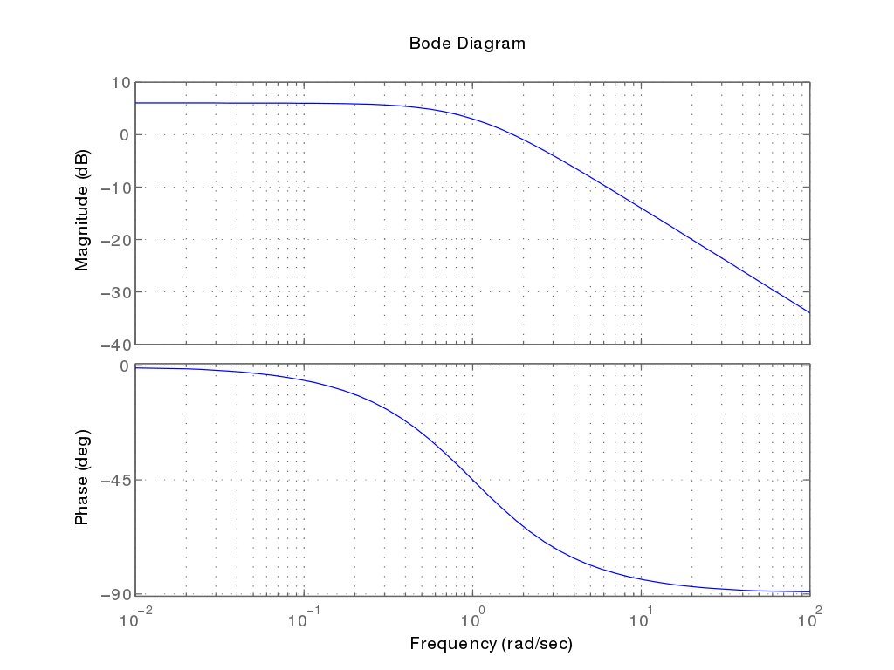
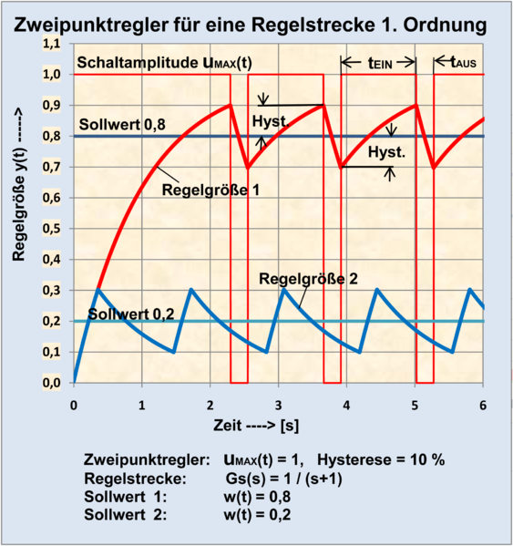

<!--

author:   Sebastian Zug & Georg Jäger
email:    sebastian.zug@informatik.tu-freiberg.de & Georg.Jaeger@informatik.tu-freiberg.de
version:  1.0.1
language: de
comment:  In dieser Vorlesungen werden die Schichten einer Roboterarchitektur adressiert.
narrator: Deutsch Female
attribute: thx

import: https://raw.githubusercontent.com/LiaTemplates/Rextester/master/README.md
import: https://raw.githubusercontent.com/liascript-templates/plantUML/master/README.md

attribute: Danke an Andre Dietrich für seinen Kurs "Einführung Regelungstechnik" aus dem Teile übernommen wurden.

script:   https://cdn.jsdelivr.net/chartist.js/latest/chartist.min.js
          https://d3js.org/d3-random.v2.min.js
          https://d3js.org/d3.v4.min.js
          https://cdn.plot.ly/plotly-latest.min.js

link: https://cdnjs.cloudflare.com/ajax/libs/animate.css/3.7.0/animate.min.css
-->

# Regelungstechnik

Eine interaktive Version des Kurses finden Sie unter [Link](https://liascript.github.io/course/?https://raw.githubusercontent.com/SebastianZug/SoftwareprojektRobotik/master/11_Regelungstechnik.md)

**Zielstellung der heutigen Veranstaltung**

+ Grundlegende Begriffe der Regelungstechnik
+ Abgrenzung zwischen Steuerung und Regelung
+ Elemente und Parameter des PID-Reglers

--------------------------------------------------------------------------------

## Wie weit waren wir gekommen?

... wir generieren ein "rohes" Distanzmessignal und haben es gefiltert.

<!--
style="width: 70%; max-width: 7200px; display: block; margin-left: auto; margin-right: auto;"
-->
```ascii

       +----------+        +----------+                                
     +-+--------+ |     +--+--------+ |     +----------+     +----------+
+--> |Sensorik  +-+ --> | Filterung +-+ --> | Regelung | --> | Aktorik  | ---+
|    +----------+       +-----------+       +----------+     +----------+    |
|                                                                            |
|                              .---------------------.                       |
+----------------------------- | Umgebung            | <---------------------+
                               .---------------------.
```

--------------------------------------------------------------------------------

## Begriffliche Einordnung

__Definition „Steuerung“ nach DIN 19226__: „Das Steuern, die Steuerung, ist ein Vorgang in einem System, bei dem eine oder mehrere Größen als Eingangsgrößen andere Größen als Ausgangsgrößen aufgrund der dem System eigentümlichen Gesetzmäßigkeiten beeinflussen. Kennzeichen für das Steuern ist der offene Wirkungsweg.“

<!--
style="width: 80%; min-width: 420px; max-width: 720px;"
-->
```ascii
              Abbildung Eingangsdaten
                  auf Stellbefehle                     System
                         :                               :
                         :                               :
    +----------+    +----------+    +----------+    +----------+
--->| Messein- |--->| Steuer-  |--->| Stell-   |--->| Strecke  |
    | richtung |    | glied    |    | glied    |    |          |
    +----------+    +----------+    +----------+    +----------+
                                         :
                                         :
                                      Aktuator
```   

Anwendungsbeispiel: Heizungsanlage mit zentralem Außentemperaturfühler

<!--
style="width: 100%; max-width: 720px;"
-->
```ascii
╔═════════════════════════════╗       Temperatur                
║                             ║        fühler       ^   Komfort
|  /                          ║         +-+       Q |    /   .
| /       .----------.        ║         | |         |   /  .'
|/      ╔═|Heizkörper|══╗     ║         +-+         |  / .' Sparprogramm      
║       ║ .----------.  ║     ║          |          | /.'        
╚═══════║═══════════════║═════╝          |          +------------>
        ║               ║   .-.   +-------------+     20°    -20° T
                        o--( M )--| Steuergerät |         
                        ║   `-'   +-------------+          
```

Eine Störung des Systemmodells durch das Öffnen der Tür kann nicht ausgeglichen werden.


__Definition „Regelung“ nach DIN 19226__ : „Das Regeln, die Regelung, ist ein Vorgang, bei dem eine Größe, die zu regelnde Größe (Regelgröße), fortlaufend erfasst, mit einer anderen Größe, der Führungsgröße, verglichen und abhängig vom Ergebnis dieses Vergleichs im Sinne einer Angleichung an die Führungsgröße beeinflusst wird. Kennzeichen für das Regeln ist der geschlossene Wirkungskreislauf, bei dem die Regelgröße im Wirkungsweg des Regelkreises fortlaufend sich selbst beeinflusst.“

<!--
style="width: 80%; min-width: 420px; max-width: 720px;"
-->
```ascii
    +----------+    +----------+    +----------+    +----------+
--->| Ver-     |--->| Regel-   |--->| Stell-   |--->| Strecke  |----+
 +->| gleicher |    | glied    |    | glied    |    |          |    |
 |  +----------+    +----------+    +----------+    +----------+    |
 |                                                                  |
 |                      +-----------+                               |
 +----------------------| Messein-  |<------------------------------+
                        | richtung  |
                        +-----------+
```     

| Begriffe im Regelkreis | Bedeutung                                                                                                                                                                             |
| ---------------------- | ------------------------------------------------------------------------------------------------------------------------------------------------------------------------------------- |
| Regelungsgröße   $x$   | „Ziel“ der Regelung, auch „Istwert“ In der Verfahrenstechnik x zumeist ein physikalischer (z. B. 	Temperatur, Druck, Durchfluss) oder chemischer Zustand (z. B. 	pH-Wert, Härte usw.) |
| Führungsgröße $w$      | Zumeist tritt w in Form einer mechanischen oder elektrischen 	Größe (Kraft, Druck, Strom, Spannung etc.) auf und wird im 	geschlossenen Regelkreis mit der Regelgröße x verglichen.   |
| Rückführgröße $r$      | Die aus der Messung der Regelgröße hervorgegangene Größe, die	zum Reglereingang auf das Vergleichsglied zurückgeführt wird.                                                          |
| Regeldifferenz $e$     | Die Eingangsgröße e des Regelgliedes ist die vom Vergleichsglied 	errechnete Differenz aus Führungsgröße und Regelgröße.                                                              |
| Stellgröße $y$         | Die Stellgröße wird vom Regler bzw. bei Verwendung eines 	Stellers vom Steller generiert.                                                                                             |
|  Störgröße $z$                      |                                                                                                                                                                                       |

<!--
style="width: 100%; max-width: 720px;"
-->
```ascii
╔═════════════════════════════╗                       
║            Temperatur +--+  ║   
|  /             fühler |  |-------------+  
| /       .----------.  +--+  ║          |
|/      ╔═|Heizkörper|══╗     ║          |
║       ║ .----------.  ║     ║          |
╚═══════║═══════════════║═════╝          |
        ║               ║   .-.   +-------------+                     
                        o--( M )--| Steuergerät |         
                        ║   `-'   +-------------+          
```

Dabei unterscheiden wir zwei grundlegende Regelungskonzepte:

| Merkmal    | Folgeregler                                                                                         | Festwertregler                                                                                                          |
| --- | --------------------------------------------------------------------------------------------------- | ----------------------------------------------------------------------------------------------------------------------- |
|     | Führungsgröße variabel                                                                              | Führungsgröße $w$ auf einen konstanter Wert eingestellt                                                                 |
| Performance    | Eine schnell veränderliche Führungsgröße erfordert einen Regel-kreis mit gutem Führungs-verhalten. | Festwertregler haben die Aufgabe Störungen auszuregeln und sind dementsprechend auf ein gutes Störverhalten auszulegen. |
| Beispiel    | Abstandsbasierte Geschwindigkeitsregelung eines Fahrzeuges                                          | Inverses Pendel                                                                                                         |

## Allgemeines Vorgehen bei der Reglerauslegung

In beiden Fällen muss man sich bewusst sein, dass die Strecke nicht
unmittelbar auf die Reglerinputs "anspringt" sondern auf die Änderung
der Führungsgröße mit einem eigenen Verzögerungsverhalten regiert.
Entsprechend der Abbildung der Stellgröße $y$ auf die Regelgröße $x$
unterscheiden wir dabei folgende Basistypen, wobei jeweils die Sprungantwort gezeigt wird.

Die Diagramme in diesem Bereich gehen auf den Autor "Chris828" zurück und sind unter https://de.wikipedia.org zu finden.

__Proportionale Strecke__

<!-- width="60%" -->
$x(t) = K_p \cdot y(t)$ mit $K_p = 2$

Beispiele: Verstärker, Spannungsteiler, Sensoren mit vernachlässigbarem Verzögerungsverhalten

__Integral wirkende Strecke__

<!-- width="60%" -->
$\dot y(t) = K_i \cdot u(t)$ mit $K_i = 2$

Beispiele: Wassertank, Kondensator, Geschwindigkeit als Integration

__Verzögerungsglied 0.Ordnung (Totzeitglied)__

<!-- width="60%" -->
$y(t) = u(t-T_t)$ mit $T_t = 0.5s$

Beispiele: Rechenzeit für die Sensordatenverarbeitung, Material auf einem Förderband,

__Verzögerungsglied 1.Ordnung (PT1-Glied)__

<!-- width="60%" -->
$y(t) = K(1-e^{-\frac{t}{T}})$ mit $K =2, T = 1s$

Beispiele: Gleichstrommotor

__Verzögerungsglied 2.Ordnung (PT2-Glied)__

<!-- width="60%" -->
 $a_2 \ddot y(t)+a_1 \dot y(t)+a_0 y(t) =b_0 u(t)$ mit  $K = 2, T = 1, D = {0.2, 1, 5}$ mit D als Dämpfung

Beispiele: Zwei hintereinander geschaltete PT1-Glieder, Gleichstrommotor (Spannung → Drehzahl) mit berücksichtigter Induktivität

Wie kann eine Strecke anhand des Modells weiter charakterisiert werden?

<!-- width="60%" -->
_Bode-Diagramm einer PT1 Strecke_

## Regler

Grundsätzlich lassen sich die Konzepte für die Regelung in zwei Kategorien einteilen. Legen wir über einen einfachen Schwellwert lediglich einen Maximalwert fest, zu dem $y$ aktiviert oder eben deaktiviert wird, so spricht man von einem Zweipunkt-Regler. Ein solche Realisierung kann aber nur diskrete Zielgrößen formulieren. Im Unterschied dazu übergeben kontinuierlich wirkende Regler eine kontinuierliche Stellgröße an die Strecke.

<!--
style="width: 80%; min-width: 420px; max-width: 720px;"
-->
```ascii
    +----------+    +----------+    +----------+    +----------+
--->| Ver-     |--->| Regel-   |--->| Stell-   |--->| Strecke  |----+
 +->| gleicher |    | glied    |    | glied    |    |          |    |
 |  +----------+    +----------+    +----------+    +----------+    |
 |                                                                  |
 |                      +-----------+                               |
 +----------------------| Messein-  |<------------------------------+
                        | richtung  |
                        +-----------+
```     


### Diskrete Regler

Für diskrete Regler existiert nur ein Spektrum an Zuständen, das als Basis der Regelung dient. Anhand eines Schwellwertes wird eine Heizungssteuerung an- oder ausgeschaltet.

<!-- width="50%" -->[^1]

[^1]: _Wikimedia Grafik des Autors "Heinrich Kümmeke"_

### Kontinuierliche Regler

Die wichtigsten klassischen Regler sollen im Folgenden kurz vorgestellt werden.
Dazu zählen Proportional-, Integral- und Differenzialregler.

Güteforderungen können u. a.die Stabilität, die Störkompensation und Sollwertfolge, sowie die Robustheit der Regler betreffen.

__Proportionalregler__

In ihrer einfachsten Form spricht man von einem verzögerungsfreien P-Regler,
dabei verändert sich der Wert der Stellgröße $u(t)$ proportional zur
Regelabweichung $e(t)$:

$$ u(t) = K_{P} \cdot e(t) $$

Der statische Faktor $K_{P}$ gibt die Stärke an, mit der der P-Regler auf die
Regelabweichung reagiert. Bei dem hier vorgestellten Regler handelt es sich des
Weiteren um einen Regler mit Proportionalglied 0ter Ordnung (PT0). Die Ordnung
eines Gliedes gibt dessen Verzögerung an.

__Integralregler__

Beim integralwirkenden Regler (I-Regler) wird die Stellgröße $u(t)$ durch
Integration der Regeldifferenz $e(t)$ gebildet. Die Stellgröße strebt dabei
nur einem konstanten Wert zu, wenn die Regeldifferenz mit fortschreitender Zeit
$t$ gegen null geht.

$$ u(t)=\frac1{T_N}\int_0^t e(\tau)d \tau $$

Integralwirkende Regel sind im Vergleich zu anderen Reglern zwar langsamer,
haben jedoch den Vorteil, dass sie eine Abweichung von Soll- zu Regelgröße
vollständig eliminieren können.

__Differenzialregler__

Bei differenzialwirkenden Regelungsgliedern (D-Regler) bestimmt die Änderung der
Regelabweichung die der Stellgröße. Ein verzögerungsfreies D-Glied ist wie folgt
definiert:

$$ u(t) = T_D \frac{de(t)}{dt} $$

> Achtung: In der Literatur wird bisweilen die Aussage getroffen, dass 90 Prozent der Einsatzfälle mit einem PID Regler handhabbar sind. Dies mag sicher pauschalisiert und wenig belegbar sein, deckt sich aber mit den Erfahrungen vieler Anwender.

Schwierig zu handhaben sind dabei insbesondere:

+ Nicht-lineare Prozesse
+ Totzeitglieder
+ Fehlendes reales Leistungsverhalten der Aktorik

## Implmentierung

Ein PID-Regler kann einfach durch Addition der einzelnen Regelglieder gebildet
werden und die unterschiedlichen Faktoren ($K_P$, $K_I$, $K_D$) sind die
Stellschräubchen an denen der Regler eingestellt werden kann. Mit einem Wert
gleich 0 kann das jeweilige Regelglied auch ausgeschaltet werden.

$$ u(t) = \underbrace{K_P \cdot e(t)}_{\text{Proportionalteil}}
        + \overbrace{K_I \cdot \sum^{t}_{t = 0} e(t) + u(0)}^{\text{Integralteil}}
        + \underbrace{K_D \cdot (e(t) - e(t-1))}_{\text{Differenzialteil}}
$$

Anhand eines Anwendungsbeispiels soll nunmehr die Wirkung genauer untersucht werden.

```js -System.js
var sampleCount = 100;
function generateStep(xrange, basis, step, step_index){
  var result = new Array(xrange.length).fill(basis);
  return result.fill(step, step_index);
}
var xrange = d3.range(0, sampleCount, 1);
var target = generateStep(xrange, 0, 1, 20);

function Regelstrecke(u) {
      return 0.25 * u
}
```
```js +Processing.js
var plant = new Float32Array(xrange.length).fill(0);
var error = new Float32Array(xrange.length).fill(0);

var ist = 0;
var u  = 0;   // Stellgröße (Druck auf das Gaspedal)

var Kp = 0.3;  // proportional Faktor
var Ki = 0.0;  // integral     Faktor (ausgeschaltet)
var Kd = 0.0;   // differenzial Faktor (ausgeschaltet)

var e_now  = 0;  // Regelabweichung e(t)
var e_old  = 0;  // Regelabweichung e(t-1)
var e_sum  = 0;  // Summe über allen Fehlern

// Taktgeber
for (var t = 1; t < plant.length; t++){
    ist = Regelstrecke(u);
    plant[t-1] = ist;
    e_old = e_now;
    e_now = target[t] - ist;
    e_sum = e_sum + e_now;

    // Bestimmung der neuen direkten Stellgröße
    u = Kp * e_now + Ki * e_sum + Kd * (e_now - e_old);
    error[t]= e_now;
}
```
```js -Visualization.js
var layout = {
    height : 300,
    width :  650,
    xaxis: {range: [0, sampleCount]},
    margin: { l: 60, r: 10, b: 0, t: 10, pad: 4},
    showlegend: true,
    legend: { x: 1, xanchor: 'right', y: 1},
    tracetoggle: false
};

var trace1 = {
  x: xrange,
  y: target,
  name: 'Step function',
  mode: 'line'
};

var trace2 = {
  x: xrange,
  y: plant,
  name: 'System',
  mode: 'line'
};
var trace3 = {
  x: xrange,
  y: error,
  name: 'Error',
  mode: 'line'
};
Plotly.newPlot('rawData', [trace1, trace2, trace3], layout);
```
<script>
  @input(0)
  @input(1)
  @input(2)
</script>

<div id="rawData"></div>

Die größte Herausforderung liegt in der Bestimmung der entsprechenden magischen Konstanten, die ein rasche Annäherung an die Sollgröße bei gleichzeitig minimalem Überschwingen gewährleistet.

<!-- width="50%" -->
_"Effects of varying PID parameters (Kp,Ki,Kd) on the step response of a system." Wikimedia Grafik des Autors "Physicsch" [Link](https://en.wikipedia.org/wiki/PID_controller#/media/File:PID_Compensation_Animated.gif)_

## Implementierung unter ROS

Für ROS gibt es ein Paket, welches einen PID Controller beispielhaft implementiert. Die entsprechende Dokumentation findet sich unter http://wiki.ros.org/pid

Evaluieren Sie das Systemverhalten für verschiedene Reglerkonfigurationen! Nutzen Sie dafür die Möglichkeit auf die Parameter des Reglers über `dynamic_reconfigure` zurückzugreifen.

## Aufgaben

+ Evaluieren Sie das Paket ROS control, dass einen PID Controller implementiert.
