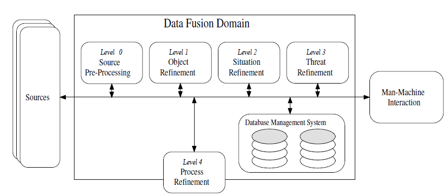
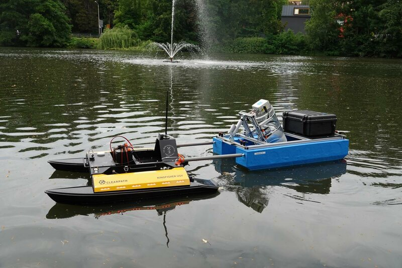
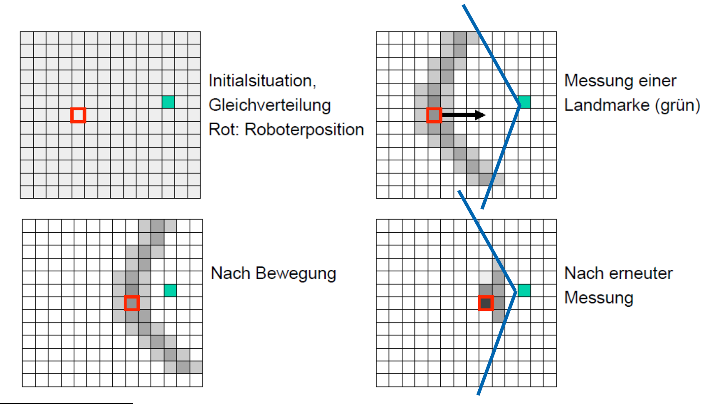
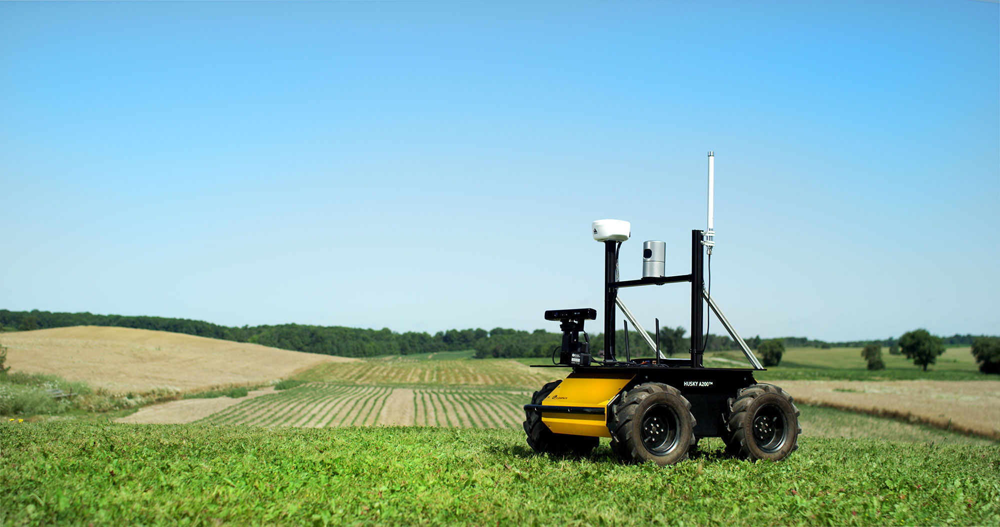

<!--

author:   Sebastian Zug & Georg Jäger
email:    sebastian.zug@informatik.tu-freiberg.de & Georg.Jaeger@informatik.tu-freiberg.de
version:  1.0.1
language: de
comment:  In dieser Vorlesungen werden die Schichten einer Roboterarchitektur adressiert.
narrator: Deutsch Female
attribute: thx

import: https://github.com/LiaTemplates/Pyodide

-->

# Datenfusion

Eine interaktive Version des Kurses finden Sie unter [Link](https://liascript.github.io/course/?https://raw.githubusercontent.com/SebastianZug/SoftwareprojektRobotik/master/12_Datenfusion.md)

**Zielstellung der heutigen Veranstaltung**

+ Vermittlung eines Grundverständnisses für die Datenfusion
+ Einführung eines Bayes basierten Schätzers als diskreten Filter
+ Ausblick auf die Praktischen Themenstellungen des folgenden Semesters

--------------------------------------------------------------------------------

## Wie weit waren wir gekommen?

... wir generieren ein "rohes" Distanzmessignal und haben es gefiltert.

<!--
style="width: 70%; max-width: 7200px; display: block; margin-left: auto; margin-right: auto;"
-->
```ascii

       +----------+        +----------+                                
     +-+--------+ |     +--+--------+ |     +----------+     +----------+
+--> |Sensorik  +-+ --> | Filterung +-+ --> | Regelung | --> | Aktorik  | ---+
|    +----------+       +-----------+       +----------+     +----------+    |
|                                                                            |
|                              .---------------------.                       |
+----------------------------- | Umgebung            | <---------------------+
                               .---------------------.
```

--------------------------------------------------------------------------------

## Grundlagen und Konzepte

     {{0-1}}
*******************************************************************************
> Zielstellung: Übergreifende Abbildung der Ergebnisse einer multimodalen Umgebungserfassung

<!--
style="width: 80%; min-width: 420px; max-width: 720px;"
-->
```ascii
    +---------------------+    +---------------------+
    | Control Application |    | Control Application |
    +---------------------+    +---------------------+
               ^                   ^      ^      ^                             
               |                   |      |      |                             
    .---------------------.        |      |      |                             
    | Environment         |        |      |      |                            
    | representation      |        |      |      |                            
    .---------------------.        |      |      |                            
               ^                   |      |      |                             
               |                   |      |      |                             
    +---------------------+        |      |      |                             
    | Sensor Fusion       |        |      |      |                           
    +---------------------+        |      |      |                            
        ^      ^      ^            |      |      |                             
        |      |      |            |      |      |                             
      +---+  +---+  +---+        +---+  +---+  +---+  
      |S 0|  |S 1|  |S 2|        |S 0|  |S 1|  |S 2|   
    .---------------------.    .---------------------.
    | Environment         |    | Environment         |
```   
_Abbildung motiviert nach Wilfried Elmenreich, An Introduction to Sensor Fusion, Research Report 47/2001, TU Wien_

*******************************************************************************

      {{1-2}}
*******************************************************************************

Herausforderungen für die Fusion der Messdaten:

+ unterschiedliche Messraten (-> Synchronisation)
+ verschiedene räumliche Abdeckungen/ Auflösungen (-> Kalibrierung)
+ unterschiedliche (variable) Fehlermodelle
+ ...

Je nach Zielstellung verfolgt die Fusion unterschiedliche Ziele:

<!--
style="width: 80%; min-width: 420px; max-width: 720px;"
-->
```ascii

Ziel             Zuverlässigkeit     Vollständigkeit      erweiterter
                 Genauigkeit                              Erfassungsbereich

Resultierende    Objekt A            Objekt A+B           Objekt C
Daten                ^                    ^                   ^     
                     |                    |                   |
               +---------------+    +---------------+     +---------------+  
Fusion         | Konkurrierend |    | Komplementär  |     | Kooperativ    |
               +---------------+    +---------------+     +---------------+  
                 ^            ^       ^         ^            ^          ^      
                 |             \     /          |            |          |      
                 |              \   /           |            |          |      
               .---.            .---.         .---.        .---.      .---.   
Sensoren       |S 0|            |S 1|         |S 2|        |S 3|      |S 4|
                  .             .               .             .         .
                   '.         .'                .              '.     .'
Environment           .-----.                +-----+              .-.
                       \ A /                 |  B  |             ( C )
                        \ /                  +-----+              '-'
                         .
```   
_Unterschiedliche Fusionsansätze analog zu Brooks und Iyengar (1997)_

+ Eine __komplementäre Fusion__ hat das Ziel, die Vollständigkeit der Daten zu erhöhen. Unabhängige Sensoren betrachten hierfür unterschiedliche Sichtbereiche und Phänomene oder messen zu unterschiedlichen Zeiten.

+ Bei der __konkurrierenden Fusion__ erfassen Sensoren gleichzeitig denselben Sichtbereich und liefern Daten gleicher Art. Die (oft gewichtete) Verknüpfung solcher, "konkurrierender" Daten kann die Genauigkeit des Gesamtsystems erhöhen.

+ Reale Sensoren erbringen die gewünschten Informationen oft nicht allein. So ergibt sich beispielsweise die benötigte Information erst aus dem Zusammensetzen der verschiedenen Ausgabedaten. Eine solche Fusion wird als __kooperative Fusion__ bezeichnet.

*******************************************************************************

        {{2-3}}
*******************************************************************************

Was aber wird fusioniert? Ein einfaches Distanzmaß, die Positioninformation eines Roboters oder die Aufenthaltswahrscheinlichkeit in einem bestimmten Raum ... Hall & Llinas (1997) unterscheiden dafür drei Ebenen der Sensordatenfusion, die die Datenkategorien - Raw Data, Feature und Decicion - referenzieren:

+ Bei der __data fusion__ werden die rohen Sensordaten vor weiteren Signalverarbeitungsschritten miteinander verschmolzen.
+ Bei der __feature fusion__ erfolgt vor der Verschmelzung eine Extraktion eindeutiger Merkmale. Die neu kombinierten Merkmalsvektoren werden im Anschluss weiterverarbeitet.
+ Bei der __decision fusion__ erfolgt die Zusammenführung erst nachdem alle Signalverarbeitungs- und Mustererkennungsschritte durchgeführt wurden.

*******************************************************************************

       {{3-4}}
*******************************************************************************

Ein immer wieder zitiertes Architekturkonzept für die Abbildung dieser Ansätze ist das _Joint Directors of Laboratories_ (JDL) Modell.

<!-- style="width: 70%;"-->

_Sensor and Data Fusion: Concepts and Application, second ed., vol. TT14SPIE Press (1999)_

1. Vorverarbeitung : zeitliche und räumliche Registrierung der Daten sowie Vorverarbeitungsmaßnahmen auf Signal- oder Pixelebene.
2. Objekterkennung und Extraktion Schätzung und Vorhersage von kontinuierlichen oder diskreten Objektmerkmalen.
3. Situationsanalyse: alle detektierten Objekte werden in einen größeren Kontext gebracht und Objektbeziehungen analysiert werden.
4. Bedrohungsanalyse: Situationsabhängig werden, im Sinne einer Risikominimierung, unterschiedliche Handlungsoptionen evaluiert.
5. Prozessoptimierung: Verwaltung und Adaption der Ressourcen

*******************************************************************************

## Einführung in den diskreten Bayes Filter

Das Beispiel basiert auf der hervorragenden Einführung in die Mathematik und Anwendung von Fusionsansätzen des

https://github.com/rlabbe/Kalman-and-Bayesian-Filters-in-Python/blob/master/02-Discrete-Bayes.ipynb


Das Anwendungsbeispiel zielt auf den Schwimmroboter, der sich auf der Freiberger Mulde bewegt, lässt sich aber analog auf beliebige andere 1D, 2D oder 3D Szenarien übertragen.

<!-- style="width: 70%;"-->


Anstatt eine kontinuierliche Messung zu realisieren bilden wir unsere Position auf diskrete Streckenabschnitte ab. Im Bild oben werden diese mit 0-9 indiziert.

<!--
style="width: 50%; min-width: 380px; max-width: 720px; display: block; margin-left: auto; margin-right: auto;"
-->
```ascii

  Streckensegmente der Freiberger Mulde

| 0 | 1 | 2 | 3 | 4 | 5 | 6 | 7 | 8 | 9 |
======O===SB======O===O===B===S=======S== -->
                                          Strömung

```   
_Abbildung des Streckenmodels (O = Orange Warnschilder am Ufer, S = Starke Strömung, B = Brücken)_

Welche Anfangskenntnis zur Position haben wir zunächst? Die Aufenthaltswahrscheinlichkeit ist für alle 10 Streckensegmente gleich und entsprechend $p_i=0.1$ für alle $0 \leq i < 10$

```python                          generateBelief.py
import numpy as np
import matplotlib.pyplot as plt
belief = np.array([1./10]*10)
print(belief)

fig, ax = plt.subplots(figsize=(8,4))
ax.bar(np.arange(len(belief)), belief)
plt.ylim(0, 1)
plot(fig)
```
@Pyodide.eval


Es wird deutlich, dass wir aktuell noch kein Wissen um die Position des Bootes haben. Man spricht vom "apriori-"Wissen.

### Sensoren

Unser Roboter ist mit verschiedenen Sensorsystemen ausgestattet.

1. Im Frontbereich des Roboters befindet sich ein Kamerasystem, dass aus Bilddaten features zu erkennen versucht. Dabei konzentrierte man sich auf orange Warnschilder und Brücken über die Mulde.

   <!-- style="width: 50%;"-->

   *Examplarische Darstellung eines Image Matching Ansatzes auf der Basis einer SIFT Methode* [OpenCV Tutorial](https://opencv-python-tutroals.readthedocs.io/en/latest/py_tutorials/py_feature2d/py_matcher/py_matcher.html)

2. Ein Beschleunigungssensor bestimmt die Bewegungen des Bootes. Damit lassen sich zum Beispiel starke Strömungen gut erkennen.

3. An einige Stellen können mit dem GNSS-System Messdaten generiert werden. Die umgebenden Höhenzüge behindern dies.

Alle drei Messmethoden sind mit Fehlern überlagert. Welche können das sein?

### Bildsensor

Nun nutzen wir den ersten Sensormodus, die Erkennung der orangen Zeichen. Wir gehen davon aus, dass der Sensor nur in seltenen Fällen eine falsche Klassifikation (Schild/kein Schild) vornimmt.

<!--
style="width: 100%; min-width: 380px; max-width: 720px; display: block; margin-left: auto; margin-right: auto;"
-->
```ascii

                   Streckensegmente der Freiberger Mulde

                 | 0 | 1 | 2 | 3 | 4 | 5 | 6 | 7 | 8 | 9 |
                 ======O===SB======O===O===B===S=======S== -->
                                                           Strömung            

```   
_Abbildung des Streckenmodels (O = Orange Warnschilder am Ufer, S = Starke Strömung, B = Brücken)_

Im folgenden sprechen wir vom tatsächlichen Zustand $x$ und der Messung $z$. Für unsere Messmethode haben wir verschiedene Laborexperiemente gemacht und eine Vierfelder-Tafel erstellt.

<!--
style="width: 100%; min-width: 380px; max-width: 720px; display: block; margin-left: auto; margin-right: auto;"
-->
```ascii
                               Schild im Segement
                                    ja    nein
                                 +------+------+
                           ja    | 10   |   2  |  12                          
           Schild erkannt        +------+------+
                         nein    | 1    |   7  |   8
                                 +------+------+
                                   11       9     20
```  

*Vierfeldertafel unseres "Schilderkenners"*

Abgebildet auf Wahrscheinlichkeiten bedeutet das ja:

<!--
style="width: 100%; min-width: 380px; max-width: 720px; display: block; margin-left: auto; margin-right: auto;"
-->
```ascii
                               Schild im Segement
                                    ja    nein
                                 +------+------+
                           ja    | 0.5  | 0.1  |   0.6                         
           Schild erkannt        +------+------+
                         nein    | 0.05 | 0.35 |   0.4
                                 +------+------+
                                   0.55   0.45     1.0
```  

Wie wahrscheinlich ist es also, dass wir uns tatsächlich an einem orangen Schild
befinden, wenn wir eine entsprechende Messung vorliegen haben?

$$p(x|z) = \frac{0.5}{0.5 + 0.1} = 0.83$$

Wie wahrscheinlich ist eine Messung eines orangen Schildes, wenn wir gar keines erreicht haben?

$$p(x|z) = \frac{0.1}{0.5 + 0.1} = 0.17$$

Wie können wir diese Sensorcharakteristik nun für unser Roboterbeispiel verwenden? Unsere Klassifikation wird durch die verschiedenen Möglichkeiten, an denen sich der Roboter aufhalten kann, „verwässert“. Wenn wir nur ein Segment mit einem Schild hätten müssten wir diesem eine Aufenthaltswahrscheinlichkeit von $p=0.72$ zuordnen. Da es aber mehrere Möglichkeiten gibt, splittet sich diese auf.

```python                          generateMeasurements.py
import numpy as np
import matplotlib.pyplot as plt

markers = np.array([0, 1., 0, 0, 1., 1., 0, 0, 0, 0])
truePositive = 0.83
belief = markers / sum(markers)*truePositive
belief[markers == 0] = (1-truePositive)/np.count_nonzero(markers==0)
print(belief)

fig, ax = plt.subplots(figsize=(8,4))
ax.bar(np.arange(len(belief)), belief)
plt.ylim(0, 1)
plot(fig)
```
@Pyodide.eval

### Abbildung auf apriori Wissen

Was bedeutet dies aber im Hinblick auf die Positionsbestimmung unter Berücksichtigung des apriori-Wissens?

Wir haben zwei Vektoren mit Wahrscheinlichkeiten bezüglich unseres Aufenthaltes. Die Kombination draus ist eine einfaches Produkt gefolgt von einer Normalisierung.

$$posteriori = \frac{likelihood \cdot prior}{normalization}$$


```python                          generateBelief.py
import numpy as np
import matplotlib.pyplot as plt

# Vorwissen der Position
apriori = np.array([1./10]*10)
# Messungen
markers = np.array([0, 1., 0, 0, 1., 1., 0, 0, 0, 0])
truePositive = 0.83
belief = markers / sum(markers)*truePositive
belief[markers == 0] = (1-truePositive)/np.count_nonzero(markers==0)
posteriori = (apriori * belief) / sum(apriori*belief)

fig, ax = plt.subplots(figsize=(8,4))
width = 0.35
ax.bar(np.arange(len(apriori)), apriori, width)
ax.bar(np.arange(len(posteriori)) + width, posteriori, width)
plt.ylim(0, 1)
plot(fig)
```
@Pyodide.eval

Wie erwartet haben die Segmente mit Schildern eine deutlich höhere Wahrscheinlichkeit von $p=0.24$ als die anderen Bereiche. Welche Veränderung
erwarten Sie, wenn wir die Qualität der Sensormessungen erhöhen?

Wie können wir unsere Positionsschätzung verbessern:

1. Verbesserung der Qualität der Sensoren
2. Einbettung weiterer Sensoren
3. Wiederholung der Messungen (sofern wir von statistisch unabhängigen Messungen ausgehen)

Lassen Sie uns die Messung einige Male wiederholen. Das folgende Diagramm zeigt die Schätzung an der Position 1, nachdem mehrere Messungen fusioniert wurden.

```python                          constantPosition.py
import numpy as np
import matplotlib.pyplot as plt

apriori = np.array([1./10]*10)
markers = np.array([0, 1., 0, 0, 1., 1., 0, 0, 0, 0])
truePositive = 0.83
belief = markers / sum(markers)*truePositive
belief[markers == 0] = (1-truePositive)/np.count_nonzero(markers==0)
p_1 = []; p_1.append(apriori[1])
posteriori = apriori
for i in range(1, 10):
  posteriori = (posteriori * belief) / sum(posteriori*belief)
  p_1.append(posteriori[1])
print(p_1)

fig, ax = plt.subplots(figsize=(8,4))
ax.bar(np.arange(len(p_1)), p_1)
plt.ylim(0, 1)
plot(fig)
```
@Pyodide.eval

Unsere Positionsschätzung nähert sich der belief-Verteilung unsere Messung an. Der Einfluß des Anfangswissens geht zurück.

### Bewegung

Die über der Zeit gestiegene Qualität der Positionsschätzung lässt sich bisher nur realisieren, wenn keine Bewegung erfolgt. Wie aber kann diese abgebildet werden?

Nehmen wir wiederum eine Aufenthaltwahrscheinlichkeit über unseren Segmenten an, die durch eine Bewegung $u$ verändert wird. $u$ ist dabei die Kontrollfunktion, mit der wir unserer Umgebung/Roboter manipulieren Der Einfachheit halber berücksichtigen wir zunächst eine ungestörte Abbildung. Für $u=v=1$ verschiebt sich unser Roboter um eine Einheit.

```python                          movements.py
import numpy as np
import matplotlib.pyplot as plt

def perfect_predict(belief, u):
    n = len(belief)
    result = np.zeros(n)
    for i in range(n):
        result[i] = belief[(i-u) % n]
    return result

belief = np.array([0.05, .35, .1, .2, .3, 0, 0, 0, 0, 0, 0])
result = perfect_predict(belief, 1)

fig, ax = plt.subplots(figsize=(8,4))
width = 0.35
ax.bar(np.arange(len(belief)), belief, width)
ax.bar(np.arange(len(result)) + width, result, width)
plt.ylim(0, 1)
plot(fig)
```
@Pyodide.eval

Welche Probleme sehen Sie?

Allerdings ist es völlig unrealistisch, dass sich unser System perfekt verhält. Strömungen und Dynamikeinflüsse generieren situative Verstärkungen oder Abschwächungen der Geschwindigkeit.

Zunächst berücksichtigen nur die beiden benachbarten Felder und ein perfektes apriori Wissen. Durch die Strömung bedingt verlässt unser Roboter die Position 2 trotz einer Beschleunigung stromab nicht, möglicherweise bewegt er sich aber auch zwei Segmente weiter.

```python                          uncertainmovements.py
import numpy as np
import matplotlib.pyplot as plt

def predict_move(belief, move, p_under, p_correct, p_over):
    n = len(belief)
    prior = np.zeros(n)
    for i in range(n):
        prior[i] = (
            belief[(i-move) % n]   * p_correct +
            belief[(i-move-1) % n] * p_over +
            belief[(i-move+1) % n] * p_under)      
    return prior

belief = [0., 0., 1. , 0. , 0., 0., 0., 0., 0., 0.]
#belief = [0., 0.,  .4,  .6, 0., 0., 0., 0., 0., 0.]
result = predict_move(belief, 1, .1, .7, .2)

fig, ax = plt.subplots(figsize=(8,4))
width = 0.35
ax.bar(np.arange(len(belief)), belief, width)
ax.bar(np.arange(len(result)) + width, result, width)
plt.ylim(0, 1)
plot(fig)
```
@Pyodide.eval

Was aber geschieht, wenn wir von einem unsicheren priori Wissen ausgehen?

```
//        0   1    2   3   4   5   6   7   8   9
belief = [0., 0., .4, .6,  0., 0., 0., 0., 0., 0.]
```

Wie groß ist die Wahrscheinlichkeit, dass wir Segment x erreichen? Dabei berücksichtigen wir nun die verschiedenen Startpunkte, in dem wir die Abbildungsfunktion von $u$ auf alle Kombinationen anwenden.

| Segment | Rechnung                        | Ergebnis         |
| ------- | ------------------------------- | ---------------- |
| 0       |                                 | nicht erreichbar |
| 1       |                                 | nicht erreichbar |
| 2       | $0.4 \cdot 0.1$                 | $0.04$           |
| 3       | $0.4 \cdot 0.7 + 0.6 \cdot 0.1$ | $0.34$           |
| 4       | $0.4 \cdot 0.2 + 0.6 \cdot 0.7$ | $0.5$            |
| 5       | $0.6 \cdot 0.2$                 | $0.12$           |
| 6       |                                 | nicht erreichbar |
| 7       |                                 | ...              |

Grafisch dargestellt ergibt sich damit folgendes Bild:

<!--
style="width: 100%; min-width: 380px; max-width: 720px; display: block; margin-left: auto; margin-right: auto;"
-->
```ascii
             |  0  |  1  |  2  |  3  |  4  |  5  |  6  |  7  |  8  |  9  |

    priori      0     0    0.4   0.6    0     0     0     0     0     0      

Reihenfolge   [0.2   0.7   0.1]  An die Stelle i=2 kann ich von i=0 (p=0.2)  
invertiert                 0.04  und i=1 (p=0.7) gelangen.        
                           ====

                    [0.2   0.8   0.1]  
                                 0.34        
                                 ====

                           [0.2   0.8   0.1]  
                                        0.5
                                        ====
```   
_Abbildung des Streckenmodels (O = Orange Warnschilder am Ufer, S = Starke Strömung, B = Brücken)_

Damit bilden wir eine diskrete Faltungsoperation über unserer Aufenthaltswahrscheinlichkeit ab. Die Defintion der Faltung ergibt sich zu

$$(f * g)(n) = \sum_{k \in D} f(k) g(n - k)$$

Wenn wir die Rechung also verallgemeinern können wir auf eine bestehende Implementierung zurückgreifen. Die `scipy` Bibliothek hält eine Funktion `convolve` bereit [Link](https://docs.scipy.org/doc/scipy/reference/generated/scipy.ndimage.convolve.html)

```python                          uncertainmovements.py
import numpy as np
from scipy import ndimage
import matplotlib.pyplot as plt

belief = [.05, .5, .05, .05, .05, .05, .05, .05, .05, .05]
kernel = [.1, 0.7, 0.2]
prior = ndimage.convolve(np.roll(belief, int(len(kernel) / 2)), kernel, mode='wrap')

#belief = prior   # Multiple movements
#prior = ndimage.convolve(np.roll(belief, int(len(kernel) / 2)), kernel, mode='wrap')

fig, ax = plt.subplots(figsize=(8,4))
width = 0.35
ax.bar(np.arange(len(belief)), belief, width)
ax.bar(np.arange(len(prior)) + prior, prior, width)
plt.ylim(0, 1)
plot(fig)
```
@Pyodide.eval


Mit jedem Prädiktionsschritt fächert die Breite der Unsicherheit entsprechend auf.

### Und jetzt alles zusammen

Fassen wir nun beide Aspekte, die Vorhersage des Systemverhaltens und die Korrektur anhand der Messdaten zusammen. Aus dieser Konstallation wird deutlich, dass wir einen iterativen Prozess realisieren, in dessen Ablauf eine Zustandsvariable, hier unser Positionsindex "verfolgt" wird.

| Zustand         | Bedeutung |
|-----------------|-----------|
| Initialisierung | Definition einer Anfangsschätzung |
| Vorhersage      | Auf der Grundlage des unsicheren Systemverhaltens den Zustand für den nächsten Zeitschritt vorhersagen |
| Aktualisierung  | Eintreffen einer Messung, Abbildung auf die Wahrscheinlichkeit eines Systemzustandes |


<!--
style="width: 100%; min-width: 380px; max-width: 720px; display: block; margin-left: auto; margin-right: auto;"
-->
```ascii

       Inital               Measurements
    \  Conditions               /
     v                         v                                              
    .-------.  ------->  .-------.
   ( Predict )          ( Update  )        
    `-------'  <-------  `-------'
       |
       v  State
          Estimation
```

Das folgende Codefragment bildet zwei Iterationen für unser Beispiel ab. Im ersten Durchlauf ändert die Prediktionsphase den intertialen Wissensstand nicht. Die Faltung des Kernels ändert die Aufenthaltwahrscheinlichkeit nicht. Eine Präzisierung erfährt diese mit der ersten Messung durch den Schildersensor.

```python                          BayesFilter.py
import numpy as np
from scipy import ndimage
import matplotlib.pyplot as plt

priori = np.array([1./10]*10)
kernel = [.1, 0.7, 0.2]
markers = np.array([0, 1., 0, 0, 1., 1., 0, 0, 0, 0])
truePositive = 0.83
belief = markers / sum(markers)*truePositive
belief[markers == 0] = (1-truePositive)/np.count_nonzero(markers==0)

# FIRST LOOP - prediction
posteriori = ndimage.convolve(np.roll(priori, int(len(kernel) / 2)), kernel, mode='wrap')
# FIRST LOOP - update
priori = posteriori * belief / sum(posteriori * belief )

# SECOND LOOP - prediction
posteriori = ndimage.convolve(np.roll(priori, int(len(kernel) / 2)), kernel, mode='wrap')
# FIRST LOOP - update
priori = posteriori * belief / sum(posteriori * belief )

fig, ax = plt.subplots(figsize=(8,4))
width = 0.35
ax.bar(np.arange(len(priori)), priori, width)
ax.bar(np.arange(len(posteriori)) + width, posteriori, width)
plt.ylim(0, 1)
plot(fig)
```
@Pyodide.eval

Welche Einschränkungen sehen Sie in dem Beispiel?

+ Wir bilden nur eine Zustandsvariable ab. Bereits die Umsetzung eines 2D oder 3D Beispiels würde eine erhebliche Anpassung notwendig machen. Damit würde dann aber auch die Komplexität und die Berechnungsdauer entsprechend ansteigen.

  <!-- style="width: 70%;"-->

+ Diese Überlegung ist in starkem Maße mit der Frage nach der Auflösung unserer Diskretisierung verbunden. Ein 100x100m große Fabrikhallen, die mit einem 10cm Grid überzogen werden soll, bedeutet, dass wir jeweils 1 Million Kacheln evaluieren müssen.

+ Die Abbildung der Sensorunsicherheit ist hier stark vereinfacht. Das Fehlermodell allein auf die Klassifikationsgüte abzubilden genügt in der Regel nicht. Die Ausgabe unseres Kamerasystems wird als statt einer konstanten Abbildungsfunktion der Messungen auf die Zustände eher ein variables Qualitätsattribut realisieren.

+ Die Modalität des Sensors wurde so gewählt, dass dessen Daten einfach zu integrieren sind. Wie würden Sie die Informationen des Beschleunigungssensors berücksichtigen?

## Ausblick

> Merke: Datenfusion generiert einen erheblichen Aufwand und erfordert Annahmen zur Umgebung des Systems. Gleichzeitig ist sie kein Garant für ein funktionsfähiges System!

<!-- style="width: 70%;"-->

_Nahin, John L., Can Two Plus Two Equal Five? 1980_

## Nächstes Semester

**Prinzipstudie Lieferroboter**

<!-- style="width: 70%;"-->

<!-- style="width: 70%;"-->

+ Fernsteuerung
+ Navigation in einer bekannten Umgebung
+ Erfassung potentieller Hindernisse und Reaktion darauf
+ Evaluation der Bewegungsdaten


## Aufgaben

+ Variieren Sie die Parameter der Beispiele der Implementierung und evaluieren Sie den Einfluss unterschiedlicher Bewegungsmodelle
