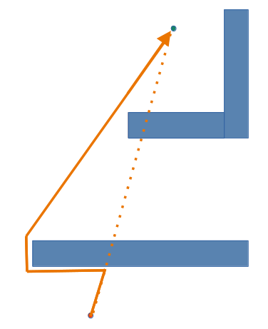
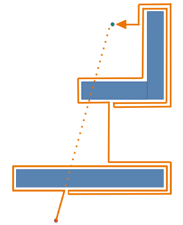
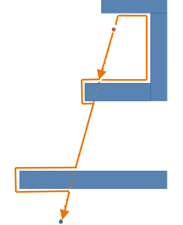
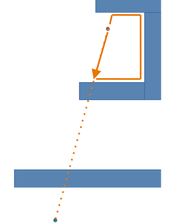
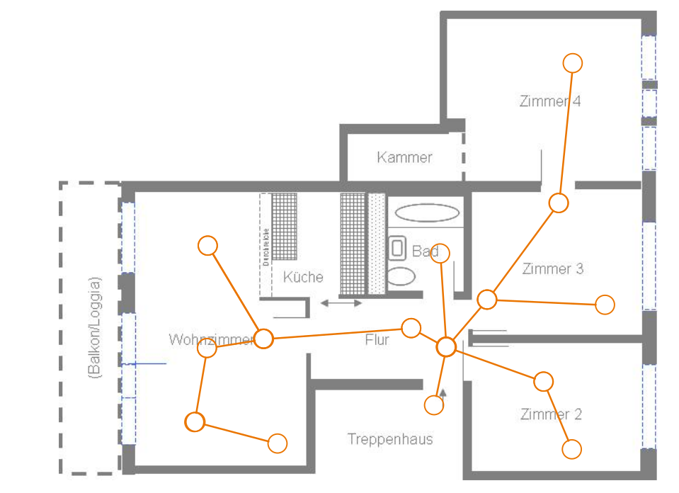

<!--

author:   Sebastian Zug & Georg Jäger
email:    sebastian.zug@informatik.tu-freiberg.de & Georg.Jaeger@informatik.tu-freiberg.de
version:  1.0.1
language: de
comment:  Diese Veranstaltung fokussiert die Grundkonzepte der Pfadplanung
narrator: Deutsch Female
attribute: thx

import: https://github.com/liascript/CodeRunner

-->

[](https://liascript.github.io/course/?https://raw.githubusercontent.com/SebastianZug/VL_SoftwareprojektRobotik/master/14_Pfadplanung.md#1)


# Datenfusion

| Parameter            | Kursinformationen                                                                                                                                                                                                     |
| -------------------- | --------------------------------------------------------------------------------------------------------------------------------------------------------------------------------------------------------------------- |
| **Veranstaltung:**   | `Softwareprojekt Robotik`                                                                                                                                                                   |
| **Semester**         | `Wintersemester 2022/23`                                                                                                                                                                    |
| **Hochschule:**      | `Technische Universität Freiberg`                                                                                                                                                                                     |
| **Inhalte:**         | `Pfadplanung in Karten`                                                                                                                                                                                             |
| **Link auf GitHub:** | [https://github.com/TUBAF-IfI-LiaScript/VL_Softwareentwicklung/blob/master/14_Pfadplanung.md](https://github.com/TUBAF-IfI-LiaScript/VL_SoftwareprojektRobotik/blob/master/14_Pfadplanung.md) |
| **Autoren**          | @author                                                                                                                                                                                                               |


--------------------------------------------------------------------------------

**Zielstellung der heutigen Veranstaltung**

+ Vermittlung eines Grundverständnisses für die Datenfusion
+ Einführung eines Bayes basierten Schätzers als diskreten Filter

--------------------------------------------------------------------------------

## Wie weit waren wir gekommen?

... wir generieren ein "rohes" Distanzmessignal und haben es gefiltert.

<!--
style="width: 70%; max-width: 720px; display: block; margin-left: auto; margin-right: auto;"
-->
```ascii
                       +----------------------+
                       | Handlungsplanung     |   Strategie
                       +----------------------+
                                ^ ^ ^
                                | | |                  
                                v v v
                       +----------------------+
                       | Ausführung           |   Taktik
                       +----------------------+
                                ^ ^ ^
                                | | |
                                v v v
                       +----------------------+
                       | Reaktive Überwachung |   Ausführung
                       +----------------------+
 Sensordatenerfassung    ^ ^ ^          | | |    
 Aktuatoroperationen     | | |          v v v     
                       .-----------------------.
                       | Umgebung              |
                       .-----------------------.                                .
```

Im weiteren Verlauf der Veranstaltung werden wir uns auf den letzte Ebene fokussieren
und die elementare Verarbeitungskette verschiedener Sensorsysteme analysieren.

## Definitionen 

> __Umgebung__ ... umfasst die relevanten Aspekte/Bereiche des Operationsgebietes. Dabei ist wichtig, ob wir von einer statischen oder einer dynamischen Umgebung ausgehen.

> __Navigation__ ... Umfasst die Prozesse, die für die Bewegungsplanung und -durchführung eines Roboters notwendig sind:  
> - Selbstlokalisierung – _Wo bin ich?_
> - ggf. Karteerstellung
> - Wegplanung – _Wie gelange ich zum Ziel?_

> __Karte__ ... ist eine abstrakte Repräsentation der Umgebung, die zur Beschreibung der eignen Position und des Zieles geeignet ist. Dabei wird zwischen Grid- und Graph-basierten Repräsentationen unterschieden.

> __Wegplanung__ ... umfasst die Identifikation kollisionsfreier Wege von einer Start- zu einer Zielposition. Im Fall alternativer Pfade wird die Auswahl anhand gewisser Optimalitätskriterien definiert.


## Reaktive Navigation

                              {{0-1}}
***********************************************************************

> Sofern keine Karte genutzt wird, erfolgt die Navigation allein anhand reaktiver Verhaltensweisen. 

> __Aufgabe:__ Recherchieren Sie die verschiedenen Varianten der Braitenberg Vehicles und erklären Sie die regelungstechnischen Konzepte.

!?[](https://www.youtube.com/watch?v=9WvTXxPwaY0)


***********************************************************************

                              {{1-2}}
***********************************************************************

Die Bug_X Algorithmen basieren auf 2 Grundannahmen:

+ die Richtung zum Ziel ist bekannt
+ der Roboter ist in der Lage Hindernissen zu folgen

-----------------------------


<div>
 Algorithmus
 <ul>
  <li>Folge der Linie die Start und Ziel verbindet</li>
  <li>wenn ein Hindernis im Weg ist, folgen dessen Außenkontur, bis die Verbindungslinie wieder erreicht wird - dann verlasse die Konturline und bewege dich Richtung Ziel </li>
</ul> 
</div>

> Unter welchen Bedingungen scheitert der Ansatz?

***********************************************************************

                              {{2-3}}
***********************************************************************

> Wir brauchen ein Gedächtnis!


<div>
Algorithmus
 <ul>
  <li>Folge der Linie die Start und Ziel verbindet</li>
  <li>wenn ein Hindernis im Weg ist, umrunde es und suche den Punkt, der dem Zielpunkt am nächsten liegt, bewege dich zu diesem - dann verlasse die Konturline und bewege dich Richtung Ziel </li>
</ul> 
</div>

Die kürzeste Trajektorie wird durch die Länge $D$ der unmittelbaren Verbindungslinie beschrieben, die obere Schranke ergibt sich durch die Konturen $K_i$ der Hindernisse. Diese werden im schlimmsten Fall $1.5x$ umrundet. 

***********************************************************************

                              {{3-4}}
***********************************************************************


<div>
Algorithmus
 <ul>
  <li>Folge der Linie die Start und Ziel verbindet</li>
  <li>wenn ein Hindernis im Weg ist, folge der Kontur bis zur ursprünglichen Verbindungslinie, sofern dieser Schnittpunkt dichter am Ziel liegt verlasse die Konturline und bewege dich Richtung Ziel 
 </li>
</ul> 
</div>

Was passiert mit einer komplexeren Kontur - im folgenden drehen wir die Richtung der Bewegung um.




***********************************************************************

                              {{4-5}}
***********************************************************************

> Weitere Herausforderungen ...

+ Für welche Richtung entscheiden wir uns bei der Umrundung des Hindernisses?
+ Wann verlassen wir die Objektkontur?


***********************************************************************

## Kartengebundene Pfadplanung 

Welche Kartenformate müssen wir unterscheiden?

__1. Zellbasierte Ansätze__

Eine Rasterkarte bildet die Umgebung auf Formen (Kacheln/Tiles) ab. Übliche Formate dafür sind quadratisch, dreieckig und sechseckig, wobei erstgenannte als einheitliche unterteilte regelmäßige Gitter/Grids in der ROS-Standardimplementierung Verwendung finden. 


_Darstellung einer (simulierten) Umgebung in Form eines regelmäßigen Grids (Autor [lukovicaleksa](https://github.com/lukovicaleksa/grid-mapping-in-ROS))_

> Die Griddarstellung umfasst die Information zur Besetztheit der Zelle.

Quadtrees erlauben eine adaptive Konfiguration der Auflösung in zentralen Bereichenn


_Quadtree Darstellung der Küste Australiens entsprechend der Einwohnerschaft (Autor [Vince](https://gis.stackexchange.com/questions/317198/quadtree-based-polygon-indexing-python-java))_

> Verwendung im Robotik-Kontext siehe [Elfes 1989](https://www.cs.cmu.edu/~motionplanning/papers/sbp_papers/integrated4/elfes_occup_grids.pdf).

__2. Topologische Ansätze__

Graphenrepräsentationen fokussieren sich auf die Abstände zwischen ausgewählte Landmarken und bilden die potentiellen Bewegungspfade auf die Kanten dazwischen ab. 



### Zielstellungen 

Das Pfadplanungsproblem lässt sich als Algorithmus verstehen der als Input 

+ die Start Pose (Position + Orientierung)
+ die Ziel Pose 
+ eine geometrische Beschreibung des Roboters 
+ die Repräsentation der Umgebung 

erhält, um daraus eine Folge von Posen ohne Kollisionen mit den Elementen der Umgebung zu erzeugen.

> Vor dem Hintergrund mehrerer gültiger Trajektorien soll ein optimaler Pfad mit minimalen Aufwand erzeugt werden.

Optimalitätskriterien der Trajektorie:

- kürzester Pfad 
- Pfad mit geringster Unsicherheit (geringe Zahl von Richtungsänderungen)
- Erfassbarkeit dynamischer Objekte
- ... 

Performance des Algorithmus 

- Vollständligkeit 
- Optimalität 
- Zeitkomplexität
- Komplexität des Suchraumes


### Beispiel 1 Breadth-first search (Wavefront)

```
initialize:
  graph := {nodes}, {edges}
  fringe := {root}
  visited := empty

breadth-first-search (graph, fringe, visited):
  while fringe not empty
     node := first element of fringe
     // goal reached
     if node is what we are searching for
        return success
     endif
     // continue wavefront 
     children := find children of node in graph
     add children not in visited to back of fringe
     add node to visited
     remove node from fringe
  end while
  return failure
```


```
Ausgangspunkt              Schritt 1                  Schritt 2 
S 0 0 0 0 0 0 0 0 0 0 0    S 0 0 0 0 0 0 0 0 0 0 0    S 0 0 0 0 0 0 0 0 0 0 0
0 0 0 0 0 0 0 0 0 0 0 0    0 0 0 0 0 0 0 0 0 0 0 0    0 0 0 0 0 0 0 0 0 0 0 0
0 0 0 1 1 1 1 1 1 0 0 0    0 0 0 1 1 1 1 1 1 0 0 0    0 0 0 1 1 1 1 1 1 0 0 0
0 0 0 1 1 1 1 1 1 0 0 0    0 0 0 1 1 1 1 1 1 0 0 0    0 0 0 1 1 1 1 1 1 4 4 4   ...
0 0 0 0 0 0 0 0 0 0 0 0    0 0 0 0 0 0 0 0 0 0 3 3    0 0 0 0 0 0 0 0 0 4 3 3
0 0 0 0 0 0 0 0 0 0 0 G    0 0 0 0 0 0 0 0 0 0 3 2    0 0 0 0 0 0 0 0 0 4 3 2
```

Die "Welle" breitet sich mit jedem weiteren Schritt auf die Kinder aus, denen noch kein >1 zugewiesen wurde. Zum Zeitschritt 13 sind keine Zellen mehr zu explorieren. Zu diesem Zeitpunkt wird den unerreichbaren Teilen des Raums (falls vorhanden) der Wert 0 zugewiesen. Der Beispielraum sieht wie folgt aus:

```
 14 13 12 11 10  9  8  7  7  7  7  7
 13 13 12 11 10  9  8  7  6  6  6  6
 13 12 12  1  1  1  1  1  1  5  5  5
 13 12 11  1  1  1  1  1  1  4  4  4
 13 12 11 10  9  8  7  6  5  4  3  3
 13 12 11 10  9  8  7  6  5  4  3  2
```

In diesem Diagramm hat die Startposition den Wert 14 und das Ziel den Wert 2. Um einen optimalen Pfad zu planen, beginnt man am Ziel und wählt an jedem Punkt, bis man das Ziel erreicht hat, die nächste Zelle, die den geringsten Wert aller benachbarten Zellen hat. Zum Beispiel ein guter Weg von S nach G (wobei jede Zelle durch ihre kartesischen x,y-Koordinaten dargestellt wird, beginnend bei 0,0 in der unteren linken Ecke):

    (0,5)->(1,5)->(2,5)->(3,5)->(4,5)->(5,5)->(6,5)->(7,4)->(8,4)->(9,3)->(9,2)->(10,1)->(11,0)

> Nach welchen Kriterien können wir einen Pfad auswählen?

> Im Unterschied zur Breitensuche kann auch eine Tiefensuche ausgeführt werden - der Vorteil ist, dass das Ziel ggf. schneller erreicht wird, die Performance steigt in diesem Fall.

### Beispiel 2 A*

Der A$*$-Algorithmus gehört zur Klasse der informierten Suchalgorithmen (im Unterschied zur zuvor beschriebenen Breitensuche). Er kann zur Berechnung eines kürzesten Pfades zwischen zwei Knoten in einem Graphen mit __positiven Kantengewichten__ genutzt werden. A* wurde erstmals von 1968 von Peter Hart, Nils J. Nilsson und Bertram Raphael beschrieben. 

Der Algorithmus gilt als Verallgemeinerung und Erweiterung des Dijkstra-Algorithmus, in vielen Fällen kann aber umgekehrt A* auch auf Dijkstra reduziert werden. 

)")

Der A*-Algorithmus untersucht immer die Knoten zuerst, die wahrscheinlich schnell zum Ziel führen. Um den vielversprechendsten Knoten zu ermitteln, wird allen bekannten Knoten $x$ jeweils durch eine Metrik ein Wert $f(x)$ zugeordnet, der eine Abschätzung angibt, wie lang der Pfad vom Start zum Ziel unter Verwendung des betrachteten Knotens im günstigsten Fall ist. Der Knoten mit dem niedrigsten $f$-Wert wird als nächster untersucht.

$$
f(x) = g(x) + h(x) 
$$

$h$ repräsentiert die Heuristik, die den noch verbliebenen Weganteil zum Ziel ausmacht. Dabei muss sichergestellt werden, dass $h(x)$ den tatsächlichen Wert überschätzt.

Zunächst werden die Knoten in 3 Klassen eingeteilt 

+ unbekannte Knoten: Diese Knoten wurden während der Suche noch nicht gefunden. Zu ihnen ist noch kein Weg bekannt. Jeder Knoten (außer dem Startknoten) ist zu Beginn des Algorithmus unbekannt.
+ bekannte Knoten: Zu diesen Knoten ist ein (möglicherweise suboptimaler) Weg bekannt. Alle bekannten Knoten werden zusammen mit ihrem f f-Wert in der sogenannten Open List gespeichert. Aus dieser Liste wird immer der vielversprechendste Knoten ausgewählt und untersucht. Die Implementierung der Open List hat großen Einfluss auf die Laufzeit und wird oft als einfache Prioritätswarteschlange (z. B. binärer Heap) realisiert. Zu Beginn ist nur der Startknoten bekannt.
+ abschließend untersuchte Knoten: Zu diesen Knoten ist der kürzeste Weg bekannt. Die abschließend untersuchten Knoten werden in der sogenannten Closed List gespeichert, damit sie nicht mehrfach untersucht werden. Um effizient entscheiden zu können, ob sich ein Element auf der Closed List befindet, wird diese oft als Menge implementiert. Die Closed List ist zu Beginn leer.

> Jeder bekannte oder abschließend besuchte Knoten enthält einen Zeiger auf seinen (bisher besten) Vorgängerknoten. Mit Hilfe dieser Zeiger kann der Pfad bis zum Startknoten rückverfolgt werden. 

!?[](https://www.youtube.com/watch?v=D_T7vwwd2T4)

## ROS2 - Navigation Stack


!?[](https://www.youtube.com/watch?v=QB7lOKp3ZDQ&t=9s)

## Wettbewerb

[AutoRace](https://emanual.robotis.com/docs/en/platform/turtlebot3/autonomous_driving/#turtlebot3-autorace-2020) Wettbewerb auf der Grundlage der Turtlebots.

+ Traffic Light 
+ Intersection 
+ Construction Site 
+ Parking 
+ Level Crossing 
+ Tunnel

!?[](https://www.youtube.com/watch?v=QtBx_MKLsPs&t=26s)

> Was ist das besondere dabei?

+ [Kooperatives Lehrformat mit der HS Stralsund](https://raw.githubusercontent.com/TUBAF-IfI-LiaScript/VL_SoftwareprojektRobotik/master/material/Antrag_IEEE_Stralsund.pdf)
+ Projektbezogene Arbeit in Mini-Teams


