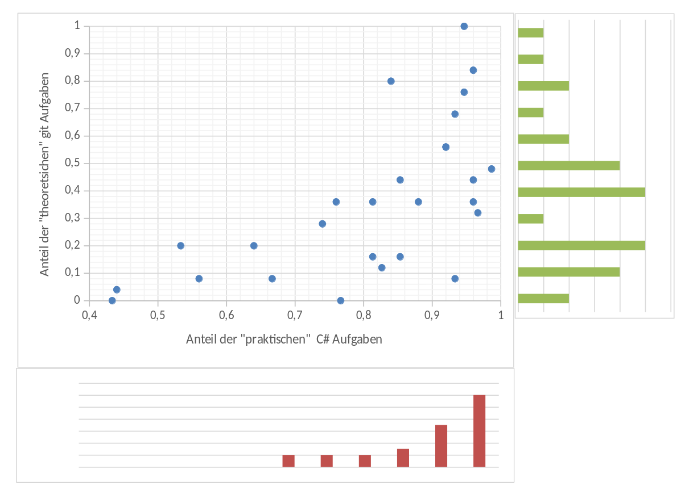
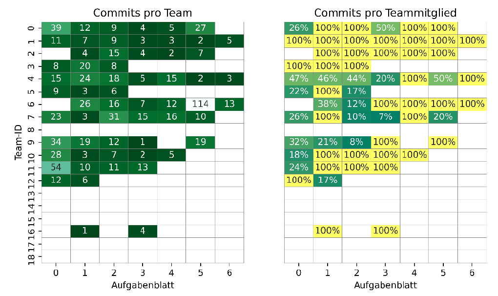
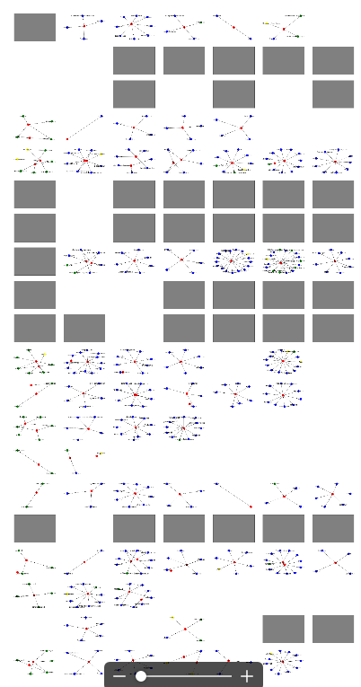
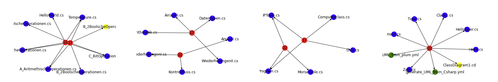
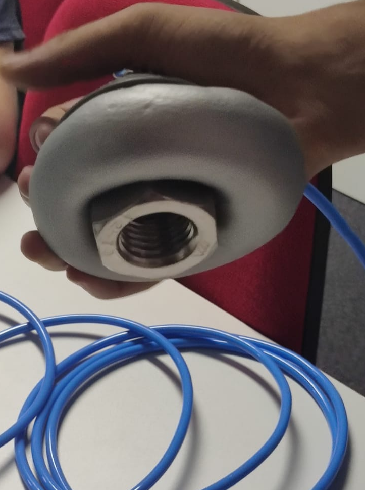

<!--

author:   Sebastian Zug & Georg Jäger
email:    sebastian.zug@informatik.tu-freiberg.de & Georg.Jaeger@informatik.tu-freiberg.de
version:  0.0.1
language: de
narrator: Deutsch Female

import: https://raw.githubusercontent.com/LiaTemplates/Rextester/master/README.md

-->

# Vorlesung Robotik Projekt

Der vorliegende Kurs realisiert die Vorlesung "Softwareprojekt" an der TU Bergakademie
Freiberg auf der Basis von LiaScript. Eine interaktive Darstellung der Inhalte ist unter

[LiaScripLink](https://liascript.github.io/course/?https://raw.githubusercontent.com/SebastianZug/SoftwareprojektRobotik/master/README.md#1)

zu finden.

| Datum      | Titel                              | LiaScript Link                                                                               |
|:---------- |:---------------------------------- | -------------------------------------------------------------------------------------------- |
| 22.10.2019 | Einführung                         | [Link](https://github.com/SebastianZug/SoftwareprojektRobotik/blob/master/00_Einfuehrung.md) |
| 29.10.2019 | Klassen und Strukturen             |                                                                                              |
| 05.11.2019 | Speicher und Pointer               |                                                                                              |
| 04.11.2019 | Templates                          |                                                                                              |
| 12.11.2019 | Standardbibliothek                 |                                                                                              |
| 19.11.2019 | Entwurfsmodelle                    |                                                                                              |
| 26.11.2019 | Einführung ROS2                    |                                                                                              |
| 03.12.2019 | ROS2 Entwicklungsprozess           |                                                                                              |
| 10.12.2019 | ROS2 Entwicklungsprozess Beispiele |                                                                                              |
| 17.12.2019 | ROS2 Kommunikation                 |                                                                                              |
| 07.01.2020 | Sensoren                           |                                                                                              |
| 14.01.2020 | Ausfall                            |                                                                                              |
| 21.01.2020 | Sensordatenverarbeitung            |                                                                                              |
| 28.01.2020 | Regelungstechnik                   |                                                                                              |
| 04.02.2020 | Datenfusion                        |                                                                                              |
| 11.02.2020 | Zusammenfassung                    |                                                                                              |

## Organisatorisches (WS 2020/21)

**Dozenten**

| Name          | Email                                   |
|:--------------|:----------------------------------------|
| Sebastian Zug | sebastian.zug@informatik.tu-freiberg.de |
| Georg Jäger   | georg.jaeger@informatik.tu-freiberg.de  |


**Zielstellung der Veranstaltung**

Die
Veranstaltung richtet sich an Informatiker und Mathematiker und adressiert die folgenden Punkte:

+ aufbauend auf dem vorangegangenen Kurs Softwareentwicklung werden die Konzepte von C++ erläutert
+ Einführung in das Robot Operating System (ROS)
+ Gegenüberstellung von ROS1 und ROS2
+ Elemente von Robotersystemen und deren Implementierung wie

  + Grundlagen der Sensoren und deren Einbettung in ROS
  + Sensordatenverarbeitung und Fusion
  + Aktoren und deren Regelung

> Vorbereitung auf die praktischen Aufgaben im Sommersemester.

**Prüfungsleistungen**

Die Veranstaltung ist in zwei Teile gegliedert. Im Wintersemester werden Sie
zunächst mit den Grundlagen vertraut gemacht, um :

* als Informatiker am Ende eine mündliche Prüfung zu absolvieren und im Sommersemester eine praktische Aufgabe umzusetzen. Diese wird separat bewertet.
* als Mathematiker mit einer kleineren Aufgabe am Ende des Semester die Veranstaltung abzuschließen.

**Zeitaufwand und Engagement**

Die Veranstaltung wird mit 9 CP in Ihrem Studienverlauf abgebildet. Entsprechend beträgt der Zeitaufwand insgesamt 270 Stunden und setzt sich aus 105h Präsenzzeit und 165h Selbststudium zusammen.

**Die eigene Beschäftigung mit der C++ Programmierung und den Konzepten von ROS ist für das erfolgreiche Bestehen der Veranstaltung unabdingbar!**

**Ablaufplan Übungen**

Übungstermine

| Nr. | Datum         | Inhalt                      |
|:--- | ------------- |:--------------------------- |
| 1.  | nächste Woche | Einführung                  |
| 2.  |               | Diskussion 1. Aufgabenblatt |
| 3.  |               |                             |
| 4.  |               |                             |
| 5.  |               |                             |
| 6.  |               |                             |

Tragen Sie sich bitte in den Kurs [Softwaretechnologie-Projekt (Prototyp)](https://bildungsportal.sachsen.de/opal/auth/RepositoryEntry/18593513489/CourseNode/98504809493283) im e-learning System OPAL ein.

**Jedes Aufgabenblatt beinhaltet Vorbereitungsaufgaben die eigenständig bearbeitet und in der Übung lediglich verglichen werden!**

## Literaturempfehlungen

**Vorlesungen**

+ Vorlesung "Objektorientierte Programmierung mit C++ " der Universität Ulm (Dr. Andreas F. Borchert) [Link](https://www.uni-ulm.de/mawi/mawi-numerik/lehrenumerik/vergangene-semester/sommersemester-2018/vorlesung-objektorientierte-programmierung-mit-c/)
+ Vorlesung "Programmieren in C++" der Universität Freiburg (Frau Prof. Dr. Hannah Bast) [Link](https://ad-wiki.informatik.uni-freiburg.de/teaching/ProgrammierenCplusplusSS2018)

**Videotutorials**

+ Youtube Kanal von "The Cherno", [Link](https://www.youtube.com/playlist?list=PLlrATfBNZ98dudnM48yfGUldqGD0S4FFb)
+ Wikibooks "C++-Programmierung", [Link](https://de.wikibooks.org/wiki/C%2B%2B-Programmierung/_Inhaltsverzeichnis)

**Talks**

+ Stroustrup, Bjarne - "The Essence of C++" , [Link](https://www.youtube.com/watch?v=86xWVb4XIyE)
+ Stroustrup, Bjarne - "Learning and Teaching Modern C++", [Link](https://www.youtube.com/watch?v=fX2W3nNjJIo)

**Bücher**

+ Torsten T. Will, "C++ - Das umfassende Handbuch", Rheinwerk Computing 2019

## Ok, womit soll ich anfangen?

1. Legen Sie sich ein Repository an, mit dem Sie arbeiten!
2. Entscheiden Sie sich für Linux als Betriebssystem auf Ihrem Rechner :-), in diesem Fall sind alle Tools die Sie im Laufe des Semesters benötigen, sofort greifbar.
3. Starten Sie mit kleinen Beispielen, um Ihre algorithmischen Fähigkeiten zu schulen und sich zum anderen mit der Semantik von C++ vertraut zu machen.

Wenn Sie Punkt 2. nicht uneingeschränkt folgen wollen, hätten Sie zumindest für die Einführung zu C++ unter Windows folgende Möglichkeiten:

| Toolchain       | Link                                                                                  | Bemerkung |
|:--------------- |:------------------------------------------------------------------------------------- |:--------- |
| Visual Studio   |                                                                                       |           |
| MinGW           | [MinGW Webseite](http://www.mingw.org/)                                               |           |
| Cygwin          | [Cygwin Webseite](https://cygwin.com/)                                                |           |
| Linux-Subsystem | [Microsoft Dokumentation](https://docs.microsoft.com/de-de/windows/wsl/install-win10) | zu empfehlen          |
|                 | [WSL Vergleich](https://docs.microsoft.com/de-de/windows/wsl/install-win10)           |           |

Unter cygwin muss zunächst der Compiler `gcc-g++` installiert werden. Für Rekonfigurationen und neues Pakete führen Sie einfach den Installer nochmals aus. Zudem sollten Sie in Ihrem Home einen symbolischen Link anlegen, der auf Ihren Arbeitsordner verweist.

```
$ ln -s /cygdrive/c/Users/Sebas/OneDrive/Desktop/Softwareprojekt/ mySoftware
```

<!-- width="100%" -->

<!-- width="100%" -->


Hinsichtlich Ihres Lieblingseditors haben Sie sicher schon eine Wahl getroffen :-)

## Wie können Sie zum Gelingen der Veranstaltung beitragen?

* Stellen Sie Fragen, seinen Sie kommunikativ!
* Organisieren Sie sich in Arbeitsgruppen!
* Experimentieren Sie mit verschiedenen Entwicklungsumgebung um "Ihren Editor"
  zu finden
* Machen Sie Verbesserungsvorschläge für die Vorlesungsfolien!

<!-- width="100%" -->

## Wie sieht es um Ihre Teamkompetenz aus?

      {{0-1}}
********************************************************************************
Sie erinnern sich noch an das Sommersemester?

<!-- width="70%" -->

********************************************************************************

     {{1-2}}
********************************************************************************

Woher kommt das?

<!-- width="100%" -->

********************************************************************************


     {{2-3}}
********************************************************************************

Woher kommt das?

<!-- width="50%" -->

<!-- width="100%" -->

********************************************************************************

## Sie wollen gleich starten?

Das RoboCup-Team der TU Bergakademie sucht noch Mitstreiter. Auch wenn Sie noch keine Erfahrung in der Programmierung haben sind Sie gern willkommen.

<!-- width="100%" -->

Im vergangen Jahr zielten die praktischen Projekte der Veranstaltung auf

+ die Realsierung der Objektlokalisation und -identifikation
+ die Umsetzung der Arm-Kinematik
+ die Entwicklung eines neuen Greifmechanismus

<!-- width="50%" -->

## Los gehts ...

... mit dem Thema
