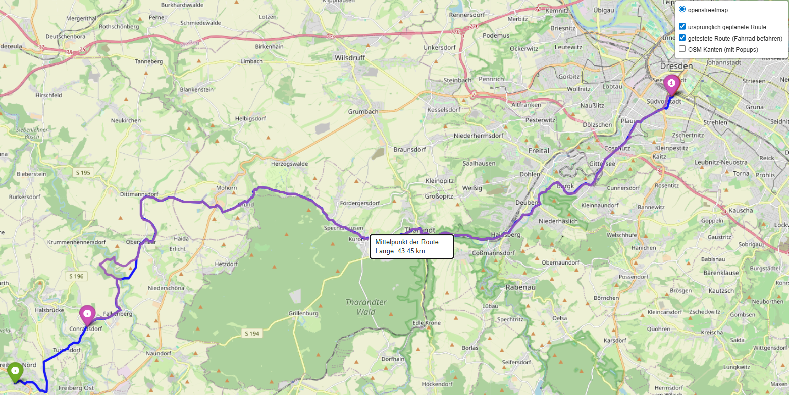

<!--

author:   Sebastian Zug & Georg Jäger
email:    sebastian.zug@informatik.tu-freiberg.de & Georg.Jaeger@informatik.tu-freiberg.de
version:  0.0.4
language: de
narrator: Deutsch Female

import: https://raw.githubusercontent.com/LiaTemplates/Rextester/master/README.md

-->

# Herzlich willkommen!

-------------------------------------------------------------------------------

>  ... zum Semesterbeginn und zur Vorlesung Robotik Projekt 

-------------------------------------------------------------------------------

Prof. Dr. Sebastian Zug, Technische Universität Bergakademie Freiberg

-------------------------------------------------------------------------------

# Vorlesung Robotik Projekt

Zielstellung der Veranstaltung im Wintersemester
============================

Die
Veranstaltung richtet sich an Informatiker und Mathematiker und adressiert die folgenden Punkte:

+ Einführung in das Robot Operating System (ROS)
+ Gegenüberstellung von ROS1 und ROS2
+ Elemente von Robotersystemen und deren Implementierung wie

  + Grundlagen der Sensoren und deren Einbettung in ROS
  + Sensordatenverarbeitung und Fusion
  + zentrale Algorithmen in Robotikanwendungen
  + Aktoren und deren Regelung
  + Verhaltensplanung für Roboter

+ Softwareengineering für Robotikanwendungen

Zielstellung der Veranstaltung im Sommersemester
============================

Die Vorlesungen und Übungen dienen der Vorbereitung auf die praktischen Aufgaben im Sommersemester 2026.

!?

> Ich möchte eigentlich mit Ihnen mit einem großen Roboter arbeiten - Ziel wäre, dass wir unsere ROSEE in einem Probebetrieb bringen.

## Organisatorisches (WS 2025/26)

**Dozenten**

| Name          | Email                                   |
| :------------ | :-------------------------------------- |
| Sebastian Zug | sebastian.zug@informatik.tu-freiberg.de |
| -             |                                         |

### Phase I – Grundlagen (VL 1–5)

| Woche | Datum      | VL    | Thema                                       | Schwerpunkt                                                       |
| :---- | :--------- | :---- | :------------------------------------------ | :---------------------------------------------------------------- |
| 1     | 07.11.2025 | **1** | **Einführung in die mobile Robotik**        | Begriffe, Autonomie, Systemarchitekturen, Anwendungsbeispiele     |
| 1     | 07.11.2025 | **2** | **Sensorik mobiler Roboter**                | Odometrie, IMU, GPS, Lidar, Kamera – Prinzipien und Fehlerquellen |
| 2     | 14.11.2025 | **3** | **Koordinatensysteme und Transformationen** | Homogene Transformationen, Frames, tf2-Konzept, URDF-Grundlagen   |
| 3     | 21.11.2025 | **4** | **ROS 2 Grundlagen I: Architektur**         | Nodes, Topics, Messages, Parameter, Kommunikationsmodell          |
| 4     | 28.11.2025 | **5** | **ROS 2 Grundlagen II: Pakete & Tools**     | Paketstruktur, Services, ros2 bag, rviz2, rqt_graph               |

### Phase II – Wahrnehmung & Bildverarbeitung (VL 6–8)

| Woche | Datum      | VL    | Thema                                     | Schwerpunkt                                                | Übung       |
| :---- | :--------- | :---- | :---------------------------------------- | :--------------------------------------------------------- | :---------- |
| 5     | 05.12.2025 | **6** | **Bildverarbeitung Grundlagen**           | Pixel, Filter, Kanten, Farbräume, Kameramodelle            | **Übung 1** |
| 6     | 12.12.2025 | **7** | **Kamerakalibrierung & Stereo-Geometrie** | Pinhole-Modell, Disparität, Triangulation, Tiefenschätzung |             |
| 7     | 19.12.2025 | **8** | **Objekterkennung und Tracking**          | Feature-Detektion, ML/DL (YOLO), Bounding Boxes, ROS 2     | -           |
| -     | (Pause)    | -     | **Weihnachtspause**                       | -                                                          | -           |

### Phase III – Sensordatenfusion & Navigation (VL 9–12)

| Woche | Datum      | VL     | Thema                                     | Schwerpunkt                                                    | Übung       |
| :---- | :--------- | :----- | :---------------------------------------- | :------------------------------------------------------------- | :---------- |
| 8     | 09.01.2026 | **9**  | **Sensordatenfusion I: Grundlagen**       | Diskrete Bayes-Filter, Komplementärfilter, Fehlerfortpflanzung | **Übung 2** |
| 9     | 16.01.2026 | **10** | **Sensordatenfusion II: Kalman-Filter**   | Kalman-Filter, Extended KF, robot_localization in ROS 2        |             |
| 10    | 23.01.2026 | **11** | **Kinematik, Dynamik & Regelungstechnik** | Differential-Drive, Kinematik-Modelle, PID-Regler              | -           |
| 11    | 30.01.2026 | **12** | **Navigation Stack & Systemintegration**  | nav2-Architektur, Pfadplanung (A*), Costmaps, Evaluation       | **Übung 3** |
| 12    | 06.02.2026 | -      | *(Reserve/Projektbesprechung)*            | Vertiefung/Fragen/Projektberatung                              |             |

### Übungsplan (3 × 180 min)

| Übung       | Start nach | Thema                                             | Inhalte                                                     |
| :---------- | :--------- | :------------------------------------------------ | :---------------------------------------------------------- |
| **Übung 1** | VL 5       | **GNSS-Datenanalyse & ROS 2-Bags**                | Bagfiles lesen, GNSS-Trajektorie plotten, Drift analysieren |
| **Übung 2** | VL 8       | **Personendetektion & Stereo-Positionsschätzung** | Objekterkennung, 2D→3D-Projektion, Fehlervergleich          |
| **Übung 3** | VL 12      | **Pfadverfolgung & Regelgüte-Evaluation**         | Soll-Ist-Vergleich, Parametertuning, Systemanalyse          |

Tragen Sie sich bitte in den Kurs [Softwaretechnologie-Projekt (Prototyp)](https://bildungsportal.sachsen.de/opal/auth/RepositoryEntry/18593513489/CourseNode/98504809493283) im e-learning System OPAL ein.

### Prüfungsleistungen

Die Veranstaltung ist in zwei Teile gegliedert. Im Wintersemester werden Sie
zunächst mit den Grundlagen vertraut gemacht, um :

* als Informatikstudierende schließen Sie die Veranstaltung am Ende des Sommersemesters mit der praktischen Arbeit ab,
* als Mathematikstudierende mit einer kleineren Aufgabe am Ende des Wintersemesters

> Die Bewertung erfolgt anhand der erbrachten praktischen Leistungen.

**Zeitaufwand und Engagement**

Die Veranstaltung wird mit 9 CP in Ihrem Studienverlauf abgebildet. Entsprechend beträgt der Zeitaufwand insgesamt 270 Stunden und setzt sich aus 105h Präsenzzeit und 165h Selbststudium zusammen.

**Die eigene Beschäftigung mit der Programmierung unter Linux und den Konzepten von ROS ist für das erfolgreiche Bestehen der Veranstaltung unabdingbar!**

## Python oder C++?

**Warum sollten wir uns nun mit einer weiteren Programmiersprache beschäftigen? Welche Möglichkeiten eröffnen sich draus?**

<!-- data-type="none" -->
| Merkmal                     | **C#**                                      | **C++**                                    | **Python**                                    |
|-----------------------------|---------------------------------------------|--------------------------------------------|-----------------------------------------------|
| **Typisierung**              | Statisch typisiert                          | Statisch typisiert                         | Dynamisch typisiert                           |
| **Syntax**                   | Einfacher als C++, strenger als Python      | Komplex und streng                        | Sehr einfach und lesbar                       |
| **Kompilierung**             | Kompiliert in Intermediate Language (IL), läuft auf der .NET-Plattform | Direkt in Maschinencode (plattformabhängig)| Interpretiert, keine Kompilierung notwendig   |
| **Leistung**                 | Hoch, aber etwas langsamer als C++          | Sehr hoch, direkte Hardwarezugriffe        | Langsamer als C++ und C#, aber gut für Prototyping |
| **Speicherverwaltung**       | Automatisch (Garbage Collection)            | Manuell (mit `new` und `delete`)           | Automatisch (Garbage Collection)              |
| **Plattform**                | Primär für Windows, .NET Core erlaubt Cross-Platform | Plattformabhängig, muss neu kompiliert werden | Plattformunabhängig (Python-Interpreter erforderlich) |
| **Anwendungsbereiche**       | Desktop-, Web- und Unternehmensanwendungen  | Systemprogrammierung, Spiele, Echtzeitanwendungen | Webentwicklung, Datenanalyse, KI, Skripting   |
| **Leistungsoptimierung**     | Möglich, aber eingeschränkter als C++       | Hohe Optimierung durch direkten Speicherzugriff | Eingeschränkte Leistung, eher für hohe Entwicklungsproduktivität geeignet |
| **Bibliotheken**             | Umfassende .NET-Bibliotheken                | Große Auswahl, besonders für Systeme nahe an der Hardware | Sehr umfangreich, insbesondere für Datenanalyse, KI, Webentwicklung |
| **Speicherzugriff**          | Abstrakt, wenig direkte Speicherverwaltung  | Direkter Speicherzugriff (Zeiger, Referenzen) | Keine direkte Speicherverwaltung              |
| **Lernkurve**                | Moderat                                     | Steil, vor allem wegen Speicherverwaltung   | Einfach, oft als Einstiegssprache verwendet   |
| **Parallelität/Multithreading**| Unterstützt durch das .NET Framework        | Komplexere Implementierung, aber möglich    | Unterstützt, jedoch durch den GIL (Global Interpreter Lock) eingeschränkt |
| **Garbage Collection**       | Ja                                          | Nein                                       | Ja                                            |
| **OOP-Unterstützung**        | Vollständig objektorientiert                | Unterstützt OOP, aber auch prozedural      | Vollständig objektorientiert, aber flexibel   |
| **Echtzeitanwendungen**      | Weniger geeignet                            | Sehr gut geeignet                          | Selten verwendet                              |

## Ausgangspunkt für die kooperative Arbeit

**Wie weit waren wir noch gekommen ... ein Rückblick auf die Veranstaltung Softwareentwicklung?**

Ausgehend von der Einführung in C# haben wir uns mit:

+ den Grundlagen der Objektorientierten Programmierung
+ der Modellierung von konkreten Anwendungen
+ der Koordination des Entwicklungsprozesses - Testen von Software, Versionsmanagement
+ einer Einführung in die nebenläufige Programmierung

beschäftigt.

**Worin unterscheidet sich diese Projektarbeit von unserem Softwareentwicklungsprojekt**

+ Teamgröße und Koordinationsaufwand (!)
+ Laufzeit des Projektes
+ Komplexität der Aufgaben
+ ...

> Ich möchte in dieser Veranstaltung eine intensive Nutzung der Möglichkeiten der versionsmanagementsysteme sehen. 

## Ok, womit soll ich anfangen?

1. Legen Sie sich ein Repository an, mit dem Sie gemeinsam mit Kommilitonen arbeiten!
2. Entscheiden Sie sich für Linux als Betriebssystem auf Ihrem Rechner :-), in diesem Fall sind alle Tools die Sie im Laufe des Semesters benötigen, sofort greifbar.
3. Starten Sie mit kleinen Beispielen, um Ihre algorithmischen Fähigkeiten zu schulen und sich zum anderen mit der Semantik von C++ vertraut zu machen.

Wenn Sie Punkt 2. nicht uneingeschränkt folgen wollen, hätten Sie zumindest für die Einführung zu C++ unter Windows folgende Möglichkeiten:

| Toolchain          | Link                                                                                  | Bemerkung                 |
|:------------------ |:------------------------------------------------------------------------------------- |:------------------------- |
| Visual Studio Code | [Tutorial](https://code.visualstudio.com/docs/languages/cpp)                          | für C++ Teil zu empfehlen |
| Linux-Subsystem    | [Microsoft Dokumentation](https://www.ionos.de/digitalguide/server/knowhow/wsl2-vorgestellt/) | zu empfehlen              |

Hinsichtlich Ihres Lieblingseditors haben Sie sicher schon eine Wahl getroffen.

## LLMs 

> Experimentieren Sie mit Large Language Models (LLMs) wie ChatGPT, um Ihre Programmierfähigkeiten zu verbessern und Unterstützung bei der Codeentwicklung zu erhalten. Nutzen Sie diese Tools verantwortungsbewusst und kritisch, um Ihre eigenen Fähigkeiten zu erweitern. 

!?[Video-Link](https://www.youtube.com/watch?v=zeKc7FFSSv0)

> Das vido ist nicht ganz aktuell, geht aber systematisch durch die Nutzung von LLMs beim Programmieren.

## Los gehts ...

... mit dem Thema
